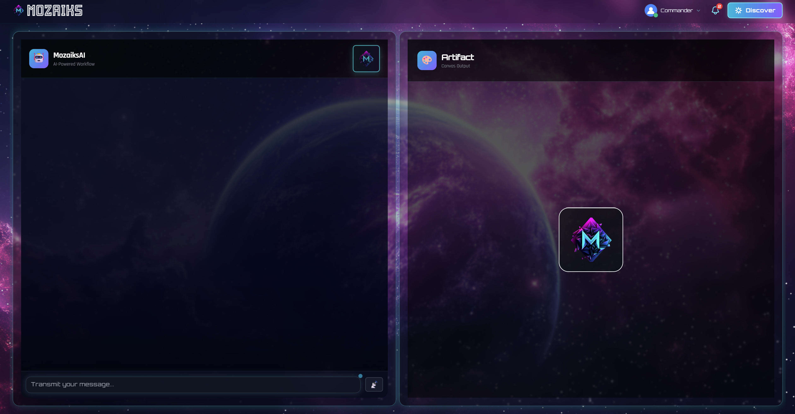
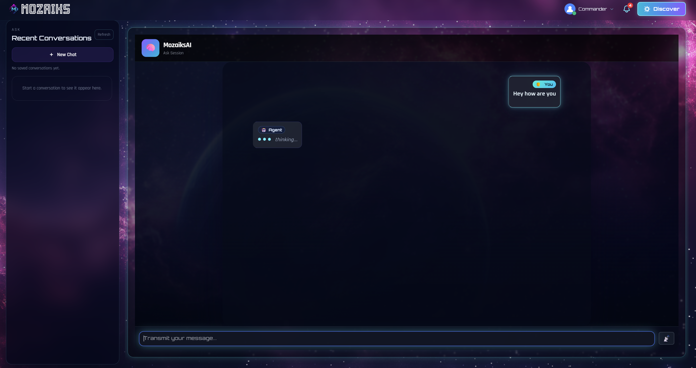
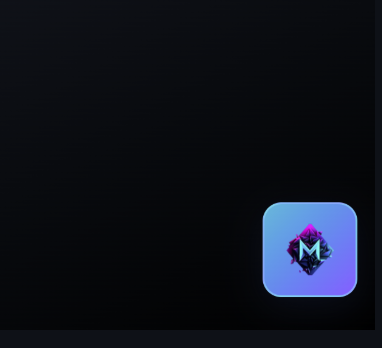
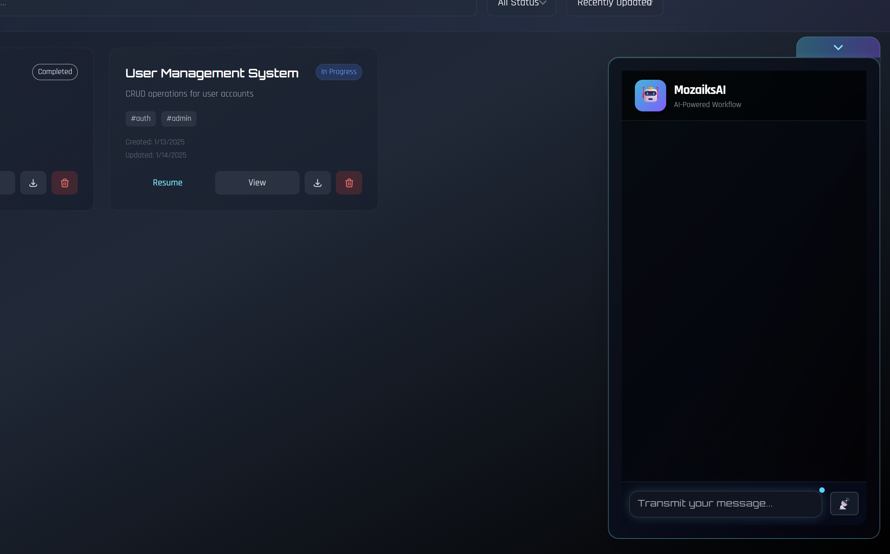

# 🚀 mozaiks-core

<div align="center">


[](LICENSE)
[-blue?style=for-the-badge)](https://github.com/ag2ai/ag2)

**The Missing Layer Between AI Agents and Real Users**

*Production-grade runtime for multi-agent workflows with native UI integration*

[📚 Full Documentation](./docs/) • [🚀 Quick Start](#-quick-start) • [💡 Why mozaiks-core?](#-why-mozaiks-core)

</div>

---

## 😤 The Problem

Every agentic framework (LangChain, AutoGen, CrewAI, Swarm) ends the same way:

```python
result = crew.kickoff()
print(result)  # Hope users understand this wall of text 🤷
```

**You're left building:**
- Interactive UIs from scratch
- Session persistence manually  
- Token tracking with third-party tools
- Multi-tenant isolation yourself

---

## ✨ What mozaiks-core Gives You

| Feature | Other Frameworks | mozaiks-core |
|---------|-----------------|--------------|
| **Interactive UI Tools** | ❌ `print(result)` | ✅ Rich components (code editors, forms, charts) |
| **Session Persistence** | ❌ DIY | ✅ Auto-persisted to MongoDB |
| **Resume Workflows** | ❌ Start over | ✅ Restore exact state + artifacts |
| **Token Tracking** | ❌ Surprise bills | ✅ Real-time, per-agent, streamed |
| **Multi-tenant** | ❌ Manual scoping | ✅ Built-in `app_id`/`user_id` isolation |
| **Dual-Mode Chat** | ❌ N/A | ✅ Ask ↔ Workflow with context switching |
| **Floating Widget** | ❌ N/A | ✅ AI follows user across pages |

---

## 🏆 Exclusive Capabilities

These features **don't exist** in any other open-source agentic framework:

```
1️⃣  ARTIFACT-TRIGGERED WORKFLOWS    → User clicks button IN artifact → Agent activates
2️⃣  DUAL-MODE CONTEXT SWITCHING     → Ask ↔ Workflow, separate caches, instant switch
3️⃣  PAGE-AWARE FLOATING ASSISTANT   → Widget knows current page context
4️⃣  UI COMPLETION STATE SURVIVAL    → Buttons remember they were clicked after reconnect
5️⃣  ARTIFACT PANEL SNAPSHOT         → Switch modes → state preserved → switch back → restored
```

---

## 🎨 See It In Action

<div align="center">

### 🔀 Dual-Mode Interface

| Workflow Mode | Ask Mode |
|:---:|:---:|
|  |  |
| *Chat + Artifact split view for complex workflows* | *Full chat with conversation history sidebar* |

---

### 💬 Floating Widget

| Minimized | Expanded |
|:---:|:---:|
|  |  |
| *Unobtrusive floating button* | *Opens anywhere in your app* |

</div>

---

**What you're seeing:**
- 🔀 **Dual-Mode**: Workflow (split view) ↔ Ask (full chat) — instant toggle
- 🎯 **Artifact Panel**: Agents render interactive UI (forms, charts, editors)
- 💬 **Floating Widget**: Embeddable assistant that knows page context
- 📜 **Conversation History**: Resume any session from the sidebar
- ✨ **Cosmic Theme**: Built-in design system with customizable tokens

---

## 🚀 Quick Start

```bash
# Clone & configure
git clone https://github.com/your-org/mozaiks-core.git
cd mozaiks-core
cp .env.example .env

# Set your keys
MONGO_URI=mongodb://localhost:27017
OPENAI_API_KEY=sk-...

# Run
pip install -r requirements.txt
python -m runtime.ai.main
```

**That's it.** MongoDB auto-creates collections. Sessions persist automatically. Token tracking works out of the box.

---

## 📊 At a Glance

```
┌──────────────────────────────────────────────────────────────────────┐
│                       mozaiks-core                                    │
│                 "The Production Runtime Layer"                        │
├──────────────────────────────────────────────────────────────────────┤
│   ┌─────────────┐   ┌─────────────┐   ┌─────────────────────────┐  │
│   │  AG2 Engine │ + │  UI Tools   │ + │  Persistence & Resume   │  │
│   └─────────────┘   └─────────────┘   └─────────────────────────┘  │
│   ┌─────────────┐   ┌─────────────┐   ┌─────────────────────────┐  │
│   │  WebSocket  │   │  Token      │   │  Multi-tenant           │  │
│   │  Streaming  │   │  Tracking   │   │  Isolation              │  │
│   └─────────────┘   └─────────────┘   └─────────────────────────┘  │
└──────────────────────────────────────────────────────────────────────┘
```

---

## 💡 Why mozaiks-core?

**Use mozaiks-core if you're:**
- ✅ Building AI-powered SaaS products
- ✅ Need human-in-the-loop with rich UIs
- ✅ Want persistence without building it
- ✅ Planning multi-tenant deployments
- ✅ Self-hosting with full control

**Consider alternatives if you're:**
- ⚠️ Just experimenting (use Swarm/CrewAI)
- ⚠️ Need max LLM flexibility (LangChain)
- ⚠️ Building pure backend automation

---

## 📖 Learn More

- 🏗️ [Architecture Overview](./docs/architecture/overview.md)
- 🎯 [Interactive Artifacts Guide](./docs/concepts/interactive-artifacts/)
- 🔄 [Persistence & Resume](./docs/ai-runtime/persistence-and-resume.md)

---

<div align="center">

**Built with ❤️ by developers who were tired of rebuilding the same infrastructure.**

*Because AI agents deserve better than `print(result)`*

</div>
