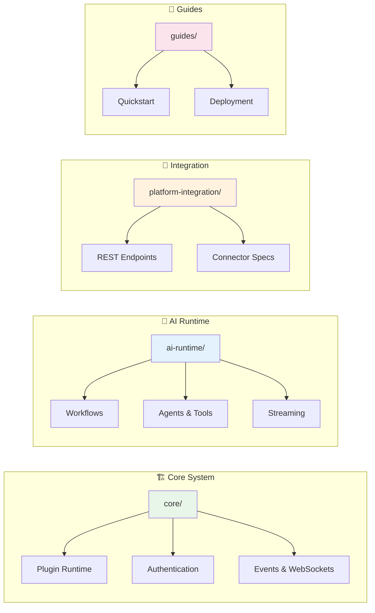
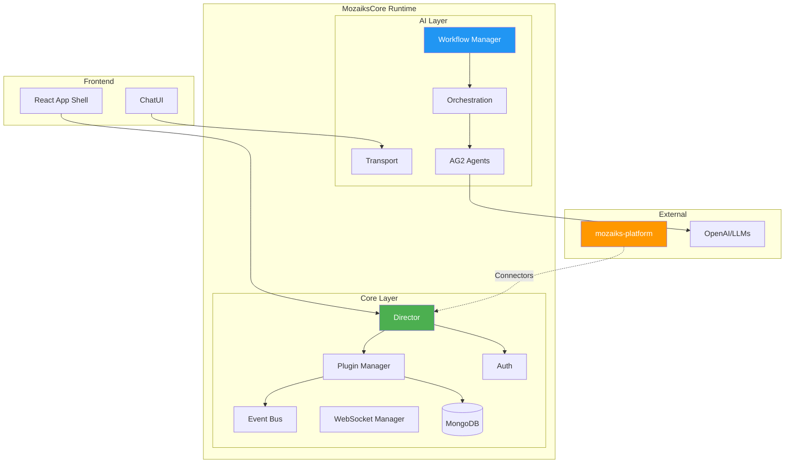

# 📚 MozaiksCore Documentation

> **The open-source tenant runtime core** — Build apps with plugins, AI agents, and real-time features.

---

## 🗂️ Documentation Map

---

## 🚀 Quick Links

| Section | Description | Start Here |
|---------|-------------|------------|
| 🏗️ **[Core System](./core/)** | Plugin runtime, auth, events, database | [Architecture](./core/architecture.md) |
| 🤖 **[AI Runtime](./ai-runtime/)** | Agent orchestration, workflows, streaming | [Overview](./ai-runtime/architecture.md) |
| 🌐 **[Platform Integration](./platform-integration/)** | Connector specs for mozaiks-platform | [Overview](./platform-integration/overview.md) |
| 📖 **[Guides](./guides/)** | Step-by-step tutorials | [Quickstart](./guides/quickstart.md) |

---

## 🏛️ Architecture at a Glance

---

## 📦 What's in Each Section

### 🏗️ Core System (`/core`)

The **plugin runtime** — how apps are built on MozaiksCore:

| Doc | What You'll Learn |
|-----|-------------------|
| [architecture.md](./core/architecture.md) | System design, request flow, boundaries |
| [plugins.md](./core/plugins.md) | Plugin lifecycle, contracts, patterns |
| [database.md](./core/database.md) | MongoDB collections, queries, indexing |
| [authentication.md](./core/authentication.md) | JWT flow, Keycloak integration |
| [events.md](./core/events.md) | Event bus pub/sub patterns |
| [notifications.md](./core/notifications.md) | Multi-channel notification system |
| [websockets.md](./core/websockets.md) | Real-time updates to clients |

### 🤖 AI Runtime (`/ai-runtime`)

The **agent orchestration engine** — powered by AG2:

| Doc | What You'll Learn |
|-----|-------------------|
| [architecture.md](./ai-runtime/architecture.md) | AI runtime design, layers |
| [workflows/](./ai-runtime/workflows/) | Workflow configs, agents, tools |
| [transport.md](./ai-runtime/transport.md) | WebSocket streaming protocol |
| [persistence.md](./ai-runtime/persistence.md) | Chat session storage |
| [observability.md](./ai-runtime/observability.md) | Metrics, tracing, debugging |

### 🔌 API Reference (`/api`)

All the endpoints:

| Doc | What You'll Learn |
|-----|-------------------|
| [core-api.md](./api/core-api.md) | `/api/execute`, auth, settings |
| [ai-api.md](./api/ai-api.md) | Chat, streaming, workflows |
| [admin-api.md](./api/admin-api.md) | Internal admin endpoints |

### 🌐 Platform Integration (`/platform-integration`)

For **mozaiks-platform** developers building connectors:

| Doc | What You'll Learn |
|-----|-------------------|
| [overview.md](./platform-integration/overview.md) | How platform ↔ core communicate |
| [identity-api.md](./platform-integration/identity-api.md) | User management, roles, permissions |
| [billing-api.md](./platform-integration/billing-api.md) | Subscriptions, payment status |

---

## 🎯 By Role

| You Are | Start With |
|---------|------------|
| 🔌 **Plugin Developer** | [Plugin Contract](./core/plugins.md) → [Core API](./api/core-api.md) |
| 🤖 **Workflow Creator** | [AI Architecture](./ai-runtime/architecture.md) → [Workflows](./ai-runtime/workflows/) |
| 🌐 **Platform Integrator** | [Platform Overview](./platform-integration/overview.md) → [Identity API](./platform-integration/identity-api.md) |
| 🚀 **Deploying** | [Quickstart](./guides/quickstart.md) → [Deployment](./guides/deployment.md) |

---

## 🔗 Related Repositories

| Repo | Purpose |
|------|---------|
| **mozaiks-core** (this) | Open-source tenant runtime |
| **mozaiks-platform** | Platform services (hosting, discovery, etc.) |
| **mozaiks-ui** | Shared UI components |

---

**Built with ❤️ by BlocUnited**

[Website](https://blocunited.com) · [Discord](https://discord.gg/blocunited) · [Twitter](https://twitter.com/blocunited)

