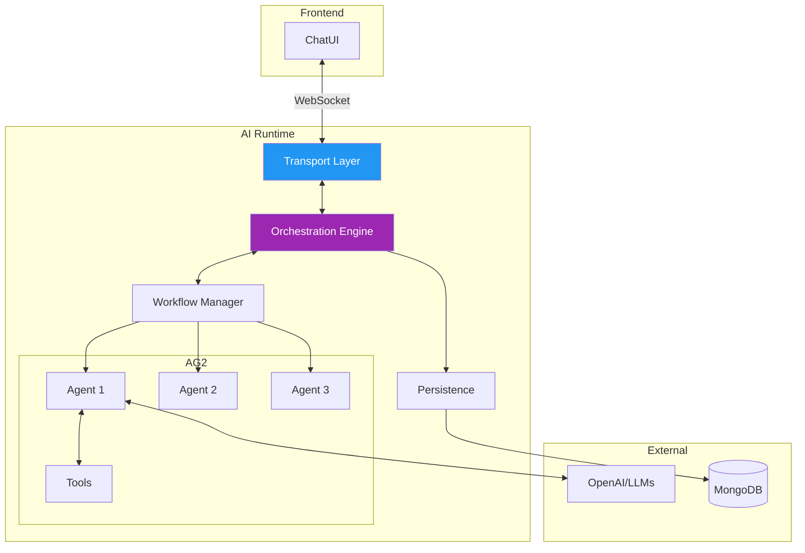
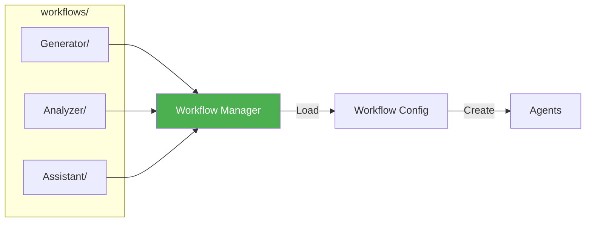
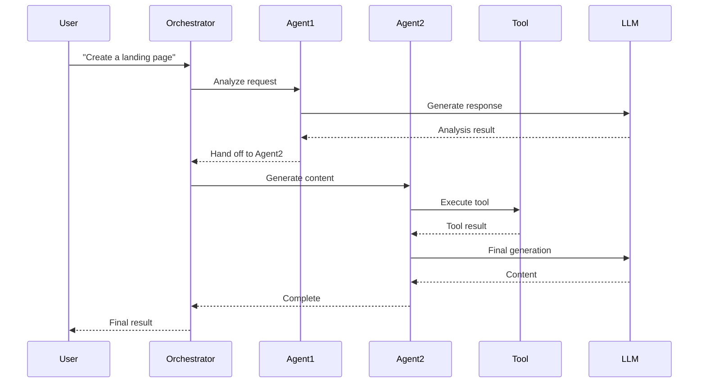
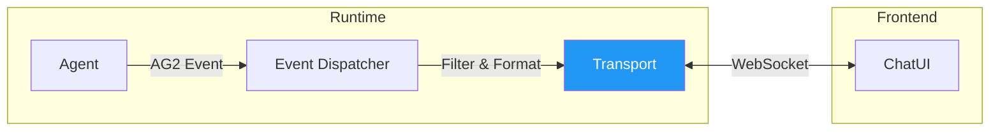
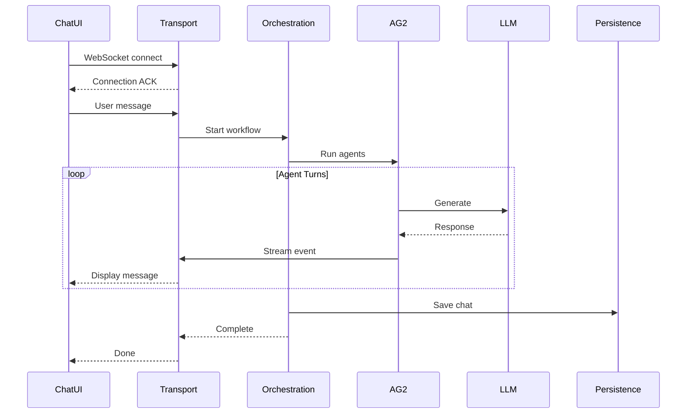

# 🤖 AI Runtime Architecture
> **Doc Status:** reference (not contract-critical)

> The AI Runtime is the **agent orchestration engine** — built on AG2 (Autogen), it manages workflows, agents, tools, and real-time streaming.

---

## 🎯 What is the AI Runtime?



**The AI Runtime handles:**
- ✅ Loading workflow configurations
- ✅ Creating and configuring AG2 agents
- ✅ Executing multi-agent orchestration
- ✅ Streaming responses to the frontend
- ✅ Persisting chat history
- ✅ Observability and metrics

---

## 🧱 Core Components

### 1️⃣ Workflow Manager

Discovers and loads workflow configurations from JSON manifests.



**Workflow structure:**
```
workflows/
└── Generator/
    ├── workflow.json       # Main config
    ├── agents.json         # Agent definitions
    ├── tools.json          # Tool registrations
    ├── context_variables.json
    └── prompts/
        ├── orchestrator.md
        └── generator.md
```

### 2️⃣ Orchestration Engine

Executes AG2 multi-agent patterns.



**Orchestration Patterns:**
| Pattern | Description |
|---------|-------------|
| `Default` | Sequential handoffs |
| `Auto` | Automatic tool execution |
| `RoundRobin` | Rotate through agents |
| `Random` | Random agent selection |

### 3️⃣ Transport Layer

Real-time WebSocket streaming between runtime and ChatUI.



**Key features:**
- Agent visibility filtering (hide internal agents)
- Event envelope construction
- Pre-connection buffering
- Heartbeat management

### 4️⃣ Persistence Layer

Stores chat sessions and messages in MongoDB.

```javascript
// chat_sessions collection
{
    "_id": ObjectId("..."),
    "chat_id": "uuid",
    "app_id": "my_app",
    "user_id": "user_123",
    "workflow": "Generator",
    "created_at": "...",
    "updated_at": "...",
    "message_count": 15,
    "messages": [
        {
            "role": "user",
            "content": "Create a landing page",
            "timestamp": "..."
        },
        {
            "role": "assistant",
            "agent": "Generator",
            "content": "I'll help you create...",
            "timestamp": "..."
        }
    ]
}
```

---

## 📂 Directory Structure

```
runtime/ai/
├── main.py                     # FastAPI entry point
├── shared_app.py               # AI runtime FastAPI app
├── core/
│   ├── workflow/
│   │   ├── workflow_manager.py     # Load workflows
│   │   ├── orchestration_patterns.py
│   │   └── agent_factory.py        # Create agents
│   ├── transport/
│   │   └── simple_transport.py     # WebSocket streaming
│   ├── events/
│   │   └── unified_event_dispatcher.py
│   ├── persistence/
│   │   └── ag2_persistence_manager.py
│   └── observability/
│       └── performance_manager.py
├── workflows/                  # Workflow definitions
│   ├── Generator/
│   ├── Analyzer/
│   └── ...
└── tools/                      # Tool implementations
    ├── web_tools.py
    ├── file_tools.py
    └── ...
```

---

## 🔄 Request Flow



---

## ⚙️ Configuration

### Environment Variables

```env
# AI Runtime
OPENAI_API_KEY=sk-...
OPENAI_MODEL=gpt-4o
MOZAIKS_AI_ENABLED=true

# Workflow paths
MOZAIKS_WORKFLOWS_PATH=/app/workflows

# Persistence
DATABASE_URI=mongodb://...
```

### Workflow Configuration

**`workflow.json`**
```json
{
    "name": "Generator",
    "description": "Content generation workflow",
    "orchestration_pattern": "Auto",
    "max_turns": 20,
    "visual_agents": ["Generator", "Reviewer"],
    "entry_agent": "Orchestrator"
}
```

**`agents.json`**
```json
{
    "agents": [
        {
            "name": "Orchestrator",
            "type": "orchestrator",
            "llm_config": {
                "model": "gpt-4o",
                "temperature": 0.7
            },
            "system_message_file": "prompts/orchestrator.md"
        },
        {
            "name": "Generator",
            "type": "assistant",
            "tools": ["web_search", "generate_content"],
            "system_message_file": "prompts/generator.md"
        }
    ]
}
```

---

## 📊 Observability

### Metrics Endpoints

| Endpoint | Description |
|----------|-------------|
| `GET /metrics/perf/aggregate` | Overall AI metrics |
| `GET /metrics/perf/chats` | Per-chat metrics |
| `GET /metrics/perf/chat/{id}` | Single chat metrics |

### Available Metrics

- Agent turns count
- Tool calls count
- Token usage
- Cost tracking
- Response latency

---

## 🔗 Related

- 📖 [Core Architecture](../core/architecture.md) — Core system overview
- 📡 [WebSockets](../core/websockets.md) — WebSocket streaming
- 🗄️ [Database](../core/database.md) — MongoDB persistence

