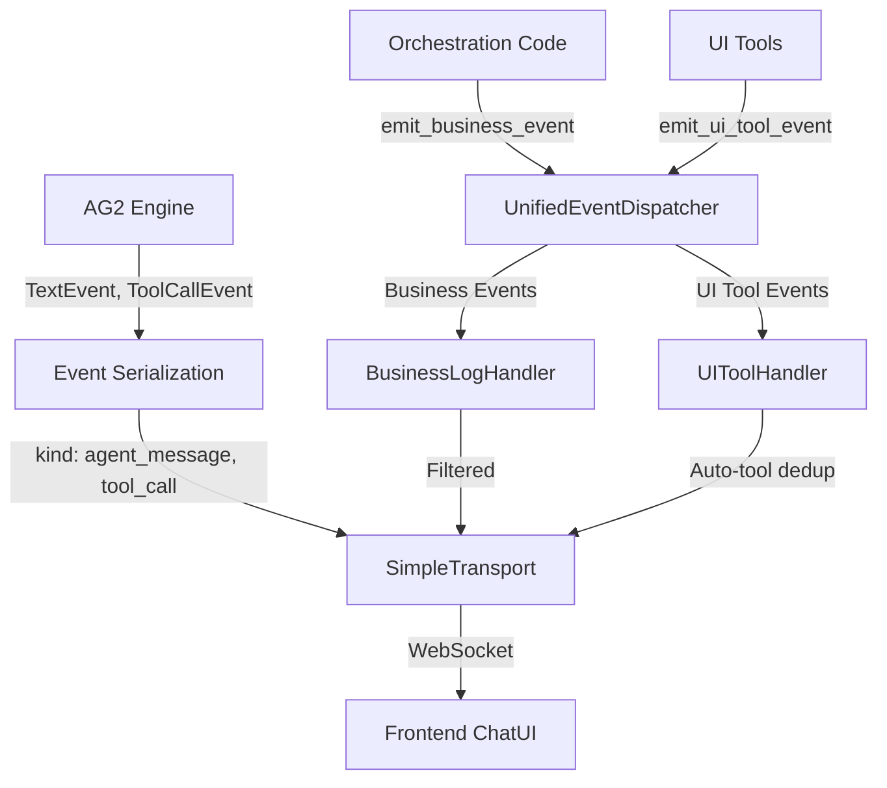

# Event Pipeline Deep Dive

**Purpose:** Document the UnifiedEventDispatcher—MozaiksAI's central event routing system that handles Business, UI Tool, and AG2 Runtime events.

---

## Event Architecture Overview

MozaiksAI uses a **three-layer event system** to separate concerns:

1. **Business Events** - Monitoring, logging, and operational telemetry
2. **UI Tool Events** - Agent-to-frontend interactive component requests
3. **AG2 Runtime Events** - Core orchestration messages, agent turns, tool calls



---

## Event Categories

### 1. Business Events

**Purpose:** Operational telemetry, monitoring, and logging (not user-facing).

**Dataclass:**
```python
@dataclass
class BusinessLogEvent:
    category: str = "business"
    log_event_type: str  # e.g., "WORKFLOW_STARTED", "TOKEN_UPDATE"
    level: str = "info"  # "debug", "info", "warning", "error"
    message: str
    timestamp: str = field(default_factory=lambda: datetime.now(UTC).isoformat())
    app_id: Optional[str] = None
    workflow_name: Optional[str] = None
    chat_id: Optional[str] = None
    metadata: Dict[str, Any] = field(default_factory=dict)
```

**Example Usage:**
```python
from core.events.unified_event_dispatcher import get_event_dispatcher

dispatcher = get_event_dispatcher()

await dispatcher.emit_business_event(
    log_event_type="WORKFLOW_STARTED",
    level="info",
    message="Starting Generator workflow",
    app_id="acme_corp",
    workflow_name="Generator",
    chat_id="chat_abc123",
    metadata={"user_id": "user_456"}
)
```

**Routing:** Processed by `BusinessLogHandler`, optionally forwarded to transport if relevant for frontend observability.

---

### 2. UI Tool Events

**Purpose:** Agent-initiated UI component interactions (input requests, confirmations, file uploads, etc.).

**Dataclass:**
```python
@dataclass
class UIToolEvent:
    category: str = "ui_tool"
    ui_tool_id: str  # e.g., "user_input", "confirmation", "file_upload"
    action: str  # e.g., "request_input", "show_confirmation"
    workflow_name: str
    app_id: Optional[str] = None
    chat_id: Optional[str] = None
    agent_name: Optional[str] = None
    display: Optional[Dict[str, Any]] = None  # UI rendering hints
    metadata: Dict[str, Any] = field(default_factory=dict)
    timestamp: str = field(default_factory=lambda: datetime.now(UTC).isoformat())
```

**Example Usage:**
```python
await dispatcher.emit_ui_tool_event(
    ui_tool_id="user_input",
    action="request_input",
    workflow_name="Generator",
    app_id="acme_corp",
    chat_id="chat_abc123",
    agent_name="interviewer",
    display={
        "prompt": "What features should the app include?",
        "placeholder": "Enter features...",
        "required": True
    }
)
```

**Special Handling:**

1. **Auto-Tool Deduplication:**
   - If an agent uses `user_input` tool with `UI_HIDDEN` flag, the dispatcher suppresses duplicate UI requests
   - Tracks `(chat_id, ui_tool_id, agent_name)` tuples to prevent redundant prompts
   - Example: Interviewer agent calls `user_input` internally for resume logic but shouldn't render multiple identical input boxes

2. **UI_HIDDEN Trigger Suppression:**
   - Events with `metadata.get("trigger") == "UI_HIDDEN"` are not forwarded to transport
   - Used for backend-only tool invocations that shouldn't render UI components

**Routing:** Processed by `UIToolHandler` → Auto-tool deduplication → Transport forwarding (if not suppressed).

---

### 3. AG2 Runtime Events

**Purpose:** Core orchestration messages from AG2 engine (agent turns, tool calls, completions).

**Event Types (via AG2's BaseEvent system):**
- `TextEvent` - Agent sends message
- `ToolCallEvent` - Agent invokes tool
- `ToolCallResultEvent` - Tool execution result
- `InputRequestEvent` - User input required
- `SelectSpeakerEvent` - AG2 selects next speaker
- `RunCompletionEvent` - Workflow execution completed

**Handling:** These events are **not** routed through UnifiedEventDispatcher. Instead, they flow through:
```
AG2 Engine → Event Serialization (build_ui_event_payload) → SimpleTransport → WebSocket
```

**Event Serialization Module:** `core/events/event_serialization.py`
- Converts AG2 `BaseEvent` instances to frontend-ready JSON payloads
- Adds `kind` field (e.g., `"agent_message"`, `"tool_call"`, `"workflow_complete"`)
- Filters messages based on `visual_agents` configuration
- Correlates events with `chat_id`, `app_id`, `workflow_name`

**Example AG2 Event → Frontend Payload:**
```python
# AG2 TextEvent
event = TextEvent(
    source=agent,
    content="Here's the plan..."
)

# Serialized payload
{
    "kind": "agent_message",
    "agent": "planner",
    "content": "Here's the plan...",
    "chat_id": "chat_abc123",
    "workflow_name": "Generator",
    "timestamp": "2025-10-02T12:34:56.789Z"
}
```

**See:** `core/events/event_serialization.py` for complete AG2 event serialization logic.

---

## UnifiedEventDispatcher

**Module:** `core/events/unified_event_dispatcher.py`

### Singleton Access

```python
from core.events.unified_event_dispatcher import get_event_dispatcher

dispatcher = get_event_dispatcher()
```

### Core API

#### Emit Business Event
```python
await dispatcher.emit_business_event(
    log_event_type: str,
    level: str = "info",
    message: str,
    app_id: Optional[str] = None,
    workflow_name: Optional[str] = None,
    chat_id: Optional[str] = None,
    metadata: Dict[str, Any] = {}
) -> None
```

#### Emit UI Tool Event
```python
await dispatcher.emit_ui_tool_event(
    ui_tool_id: str,
    action: str,
    workflow_name: str,
    app_id: Optional[str] = None,
    chat_id: Optional[str] = None,
    agent_name: Optional[str] = None,
    display: Optional[Dict[str, Any]] = None,
    metadata: Dict[str, Any] = {}
) -> None
```

#### Register Custom Event Handler
```python
# Handler class
class MyHandler(EventHandler):
    def can_handle(self, event: EventType) -> bool:
        return isinstance(event, MyCustomEvent)
    
    async def handle(self, event: MyCustomEvent) -> bool:
        # Process event
        return True

dispatcher.register_handler(MyHandler())

# Or function-based handler
async def my_handler(payload: Dict[str, Any]) -> None:
    logger.info(f"Custom event received: {payload}")

dispatcher.register_handler("custom.event.type", my_handler)
```

#### Emit Custom Event
```python
await dispatcher.emit(
    event_type="custom.event.type",
    payload={"key": "value"}
)
```

#### Get Dispatcher Metrics
```python
metrics = dispatcher.get_metrics()
# Returns:
# {
#     "events_processed": 1250,
#     "events_failed": 3,
#     "events_by_category": {"business": 800, "ui_tool": 450},
#     "created": "2025-10-02T10:00:00Z",
#     "custom_events_emitted": 50,
#     "custom_events_by_type": {"custom.event.type": 50}
# }
```

---

## Event Handlers

### BusinessLogHandler

**Module:** `core/events/unified_event_dispatcher.py`

**Responsibilities:**
- Log business events to structured logger
- Optionally forward to transport for frontend observability (e.g., token updates)

**Implementation:**
```python
class BusinessLogHandler(EventHandler):
    def can_handle(self, event: EventType) -> bool:
        return isinstance(event, BusinessLogEvent)
    
    async def handle(self, event: BusinessLogEvent) -> bool:
        level_map = {
            "debug": logger.debug,
            "info": logger.info,
            "warning": logger.warning,
            "error": logger.error,
        }
        log_fn = level_map.get(event.level, logger.info)
        log_fn(
            f"[BUSINESS] type={event.log_event_type} msg={event.message}",
            extra={
                "app_id": event.app_id,
                "workflow_name": event.workflow_name,
                "chat_id": event.chat_id,
                "metadata": event.metadata,
            }
        )
        return True
```

**Log Output Example:**
```
2025-10-02 12:34:56 INFO [BUSINESS] type=WORKFLOW_STARTED msg=Starting Generator workflow app_id=acme_corp workflow_name=Generator chat_id=chat_abc123
```

---

### UIToolHandler

**Module:** `core/events/unified_event_dispatcher.py`

**Responsibilities:**
- Process UI tool events
- Apply auto-tool deduplication logic
- Suppress UI_HIDDEN triggers
- Forward to transport for frontend rendering

**Implementation Highlights:**

```python
class UIToolHandler(EventHandler):
    def can_handle(self, event: EventType) -> bool:
        return isinstance(event, UIToolEvent)
    
    async def handle(self, event: UIToolEvent) -> bool:
        # Check for UI_HIDDEN trigger suppression
        if event.metadata.get("trigger") == "UI_HIDDEN":
            logger.debug(f"Suppressing UI_HIDDEN event: {event.ui_tool_id}")
            return False
        
        # Log UI tool event
        logger.debug(
            f"[UI_TOOL] id={event.ui_tool_id} workflow={event.workflow_name} display={event.display}"
        )
        
        # Forward to transport (auto-tool deduplication happens downstream)
        return True
```

**Auto-Tool Deduplication:**
Handled by `AutoToolEventHandler` registered for `chat.structured_output_ready` events:

```python
class AutoToolEventHandler:
    def __init__(self):
        self._processed_auto_tools: Set[Tuple[str, str, str]] = set()
    
    async def handle_structured_output_ready(self, payload: Dict[str, Any]) -> None:
        chat_id = payload.get("chat_id")
        agent_name = payload.get("agent_name")
        ui_tool_id = payload.get("ui_tool_id")
        
        # Deduplication key
        key = (chat_id, ui_tool_id, agent_name)
        
        if key in self._processed_auto_tools:
            logger.debug(f"Auto-tool already processed: {key}")
            return
        
        self._processed_auto_tools.add(key)
        
        # Emit UI tool event (now guaranteed unique)
        dispatcher = get_event_dispatcher()
        await dispatcher.emit_ui_tool_event(
            ui_tool_id=ui_tool_id,
            action="request_input",
            workflow_name=payload["workflow_name"],
            app_id=payload["app_id"],
            chat_id=chat_id,
            agent_name=agent_name,
            display=payload.get("display", {})
        )
```

---

## Event Flow Examples

### Example 1: Workflow Startup

```python
# Step 1: Emit business event
await dispatcher.emit_business_event(
    log_event_type="WORKFLOW_STARTED",
    level="info",
    message="Generator workflow starting",
    app_id="acme_corp",
    workflow_name="Generator",
    chat_id="chat_abc123"
)

# Step 2: BusinessLogHandler logs to structured logger
# [BUSINESS] type=WORKFLOW_STARTED msg=Generator workflow starting

# Step 3: Optional frontend notification (not typical for WORKFLOW_STARTED)
```

---

### Example 2: Agent Requests User Input

```python
# Step 1: Agent calls user_input tool (AG2 ToolCallEvent)
# AG2 event serialization converts to:
{
    "kind": "tool_call",
    "agent": "interviewer",
    "tool_name": "user_input",
    "arguments": {
        "prompt": "What features should the app include?",
        "ui_tool_id": "user_input"
    }
}

# Step 2: Tool execution emits UI tool event
await dispatcher.emit_ui_tool_event(
    ui_tool_id="user_input",
    action="request_input",
    workflow_name="Generator",
    app_id="acme_corp",
    chat_id="chat_abc123",
    agent_name="interviewer",
    display={
        "prompt": "What features should the app include?",
        "placeholder": "Enter features..."
    }
)

# Step 3: UIToolHandler processes event
# - Check UI_HIDDEN: No (not present)
# - Check deduplication: First occurrence → proceed
# - Forward to transport

# Step 4: Frontend receives event and renders input component
```

---

### Example 3: Auto-Tool Deduplication

```python
# Agent "interviewer" has structured_output configured with user_input tool

# First turn: Agent calls user_input internally (UI_HIDDEN trigger)
await dispatcher.emit_ui_tool_event(
    ui_tool_id="user_input",
    action="request_input",
    workflow_name="Generator",
    chat_id="chat_abc123",
    agent_name="interviewer",
    metadata={"trigger": "UI_HIDDEN"}
)
# UIToolHandler suppresses (trigger == UI_HIDDEN) → No frontend event

# Agent completes turn, structured_output_ready event fires
await dispatcher.emit(
    event_type="chat.structured_output_ready",
    payload={
        "chat_id": "chat_abc123",
        "agent_name": "interviewer",
        "ui_tool_id": "user_input",
        "workflow_name": "Generator",
        "app_id": "acme_corp",
        "display": {"prompt": "What features?"}
    }
)

# AutoToolEventHandler checks deduplication key: (chat_abc123, user_input, interviewer)
# First occurrence → Emit UI tool event (without UI_HIDDEN)
# Frontend renders input component

# Agent calls user_input again on next turn (same chat, same agent)
# AutoToolEventHandler sees duplicate key → Suppresses duplicate emission
# Frontend does NOT render duplicate input box
```

---

## Performance Characteristics

| Operation | Latency | Notes |
|-----------|---------|-------|
| Emit business event | <5ms | In-memory logging only |
| Emit UI tool event | <10ms | Includes deduplication check |
| Dispatch to handler | <5ms | Synchronous routing |
| Custom event emit | <10ms | Async task creation for listeners |
| Get metrics | <1ms | In-memory counter access |

**Slow Event Warning:** If event dispatch takes >100ms, a warning is logged with category and duration.

---

## Metrics & Observability

**Metrics Endpoint:** Dispatcher metrics are included in PerformanceManager aggregates.

**Manual Inspection:**
```python
from core.events.unified_event_dispatcher import get_event_dispatcher

dispatcher = get_event_dispatcher()
metrics = dispatcher.get_metrics()

print(f"Events processed: {metrics['events_processed']}")
print(f"Events failed: {metrics['events_failed']}")
print(f"Business events: {metrics['events_by_category']['business']}")
print(f"UI tool events: {metrics['events_by_category']['ui_tool']}")
```

**Log Inspection:**
```powershell
# View dispatcher logs
tail -f logs/logs/mozaiks.log | grep "\[BUSINESS\]\|\[UI_TOOL\]"
```

---

## Extending the Event System

### Adding a New Event Category

1. **Define Event Dataclass:**
```python
from dataclasses import dataclass, field
from datetime import datetime, UTC

@dataclass
class MyCustomEvent:
    category: str = "custom"
    custom_field: str
    timestamp: str = field(default_factory=lambda: datetime.now(UTC).isoformat())
```

2. **Create Event Handler:**
```python
from core.events.unified_event_dispatcher import EventHandler, EventType

class MyCustomHandler(EventHandler):
    def can_handle(self, event: EventType) -> bool:
        return isinstance(event, MyCustomEvent)
    
    async def handle(self, event: MyCustomEvent) -> bool:
        logger.info(f"[CUSTOM] field={event.custom_field}")
        # Process event
        return True
```

3. **Register Handler:**
```python
from core.events.unified_event_dispatcher import get_event_dispatcher

dispatcher = get_event_dispatcher()
dispatcher.register_handler(MyCustomHandler())
```

4. **Emit Events:**
```python
event = MyCustomEvent(custom_field="value")
await dispatcher.dispatch(event)
```

---

## Troubleshooting

### Issue: Business events not showing in logs

**Check:**
1. Verify log level: Business events at `debug` level require `LOGS_AS_JSON=false` or verbose logging
2. Inspect `logs/logs/mozaiks.log` for `[BUSINESS]` prefix
3. Check dispatcher metrics: `dispatcher.get_metrics()` should show `events_by_category.business` > 0

---

### Issue: UI tool event not rendering in frontend

**Check:**
1. Verify event not suppressed by `UI_HIDDEN` trigger
2. Check auto-tool deduplication: Same `(chat_id, ui_tool_id, agent_name)` tuple may be deduplicated
3. Inspect WebSocket frames in browser DevTools: Look for `kind: "ui_tool_request"`
4. Verify transport connection established before event emission

---

### Issue: Duplicate UI component rendering

**Root Cause:** Auto-tool deduplication not working or agent calling tool multiple times with different parameters.

**Solution:**
1. Check if agent has `structured_output` configured in `agents.json`
2. Verify `ui_tool_id` consistency across calls
3. Add explicit deduplication key in tool implementation if needed

---

## Next Steps

- **[Synthetic Events](synthetic_events.md)** - Runtime event stream compensation for AG2 resume gaps
- **[Transport & Streaming](transport_and_streaming.md)** - How events are forwarded to frontend via WebSocket
- **[Observability](observability.md)** - Metrics collection, logging configuration, performance tracking
- **[Workflow Authoring](../workflows/workflow_authoring.md)** - Creating workflows that emit custom events
- **[API Reference](../reference/event_types.md)** - Complete event schema reference

---

**Questions?** See [Runtime Overview](runtime_overview.md) or [Troubleshooting Guide](../operations/troubleshooting.md).
