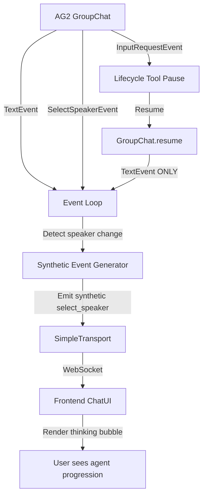

# Synthetic Events - Runtime Event Stream Compensation

## Overview

The MozaiksAI runtime emits **synthetic events** to fill gaps in AG2's native event stream, ensuring the frontend receives complete orchestration visibility. The primary use case is maintaining thinking bubble continuity when AG2 workflow execution resumes after pausing for user input (e.g., lifecycle tool execution).

**Key Problem Solved**: AG2's `GroupChat.resume()` does not re-emit `SelectSpeakerEvent` after resuming from a paused state (e.g., after `InputRequestEvent`), causing frontend thinking bubbles to disappear and breaking the user's sense of workflow progression.

## Architecture



### Event Flow Scenarios

#### Scenario 1: Normal Agent Turn (AG2 Native Events)
```
1. AG2 emits SelectSpeakerEvent(agent="PlannersAgent")
2. Runtime forwards to UI → Frontend shows thinking bubble
3. AG2 emits TextEvent(sender="PlannerAgent", content="...")
4. Runtime forwards to UI → Frontend hides thinking bubble, shows message
✅ No synthetic events needed (AG2 provides complete stream)
```

#### Scenario 2: Resume After Lifecycle Tool (Synthetic Event Required)
```
1. AG2 emits InputRequestEvent (lifecycle tool: collect_api_keys_from_action_plan)
2. Runtime pauses, waits for user input
3. User submits API keys → Runtime calls GroupChat.resume()
4. ❌ AG2 does NOT emit SelectSpeakerEvent (resume skips speaker selection)
5. AG2 emits TextEvent(sender="ContextVariablesAgent", content="...")
6. ✅ Runtime DETECTS speaker change: turn_agent="ProjectOverviewAgent" → sender="ContextVariablesAgent"
7. ✅ Runtime EMITS synthetic select_speaker event(agent="ContextVariablesAgent", _synthetic=True)
8. Runtime forwards synthetic event to UI → Frontend shows thinking bubble
9. Runtime forwards TextEvent to UI → Frontend hides thinking bubble, shows message
✅ Synthetic event fills gap, maintains continuity
```

## Implementation

### Location
**Module**: `core/workflow/orchestration_patterns.py`  
**Function**: `_stream_events()` (main event loop)  
**Lines**: ~750-775

### Trigger Logic

Synthetic `select_speaker` events are generated when:

1. **Event Type**: AG2 emits a `TextEvent`
2. **Speaker Change Detected**: `sender_name != turn_agent` (current speaker differs from previous turn)
3. **AG2 Silence**: No recent `SelectSpeakerEvent` was emitted (because AG2 resumed without re-selecting)

### Code Implementation

```python
# orchestration_patterns.py, TextEvent handler
if isinstance(ev, TextEvent):
    # ... persistence logic ...
    
    if transport:
        sender_name = _extract_agent_name(ev)
        
        # SYNTHETIC SELECT_SPEAKER: When AG2 doesn't emit SelectSpeakerEvent (e.g., after lifecycle resume),
        # we synthesize one to ensure thinking bubbles appear in the UI
        if sender_name and sender_name != turn_agent:
            try:
                # Check if this is a system resume signal (internal coordination message)
                message_content = _normalize_text_content(getattr(ev, 'content', None))
                is_internal_signal = (
                    isinstance(message_content, str)
                    and any(marker in message_content for marker in _SYSTEM_SIGNAL_MARKERS)
                )
                
                # Use 'system' instead of resume sender for internal coordination signals
                display_agent = 'system' if is_internal_signal else sender_name
                
                synthetic_select_event = {
                    "kind": "select_speaker",
                    "agent": display_agent,
                    "source": "synthetic",
                    "_synthetic": True,
                }
                await transport.send_event_to_ui(synthetic_select_event, chat_id)
                wf_logger.debug(f"🎭 [SYNTHETIC_SPEAKER] Emitted synthetic select_speaker for {display_agent}")
            except Exception as synth_err:
                wf_logger.warning(f"Failed to emit synthetic select_speaker event: {synth_err}")
```

### Special Cases

#### System Resume Signal Detection

When a lifecycle tool completes without explicit user text input (e.g., API key collection via UI form), the runtime generates a `[SYSTEM_RESUME_SIGNAL]` message to resume AG2's event stream. This is an **internal coordination message** and should not appear as a "user" agent in the UI.

**Detection Logic**:
```python
is_internal_signal = (
    isinstance(message_content, str)
    and any(marker in message_content for marker in _SYSTEM_SIGNAL_MARKERS)
)

# Use 'system' instead of resume sender for internal coordination signals
display_agent = 'system' if is_internal_signal else sender_name
```

**Why?**: Frontend thinking bubbles should show "system" (infrastructure coordination) rather than "user" (human interaction) for resume signals. This clarifies that the workflow is resuming internally, not responding to a new user message.

The `_SYSTEM_SIGNAL_MARKERS` tuple currently contains the `[SYSTEM_RESUME_SIGNAL]` marker emitted after lifecycle tool resumes. Extend that tuple as new internal coordination markers are added so the UI continues to label them as system activity.

## Event Schema

### Synthetic select_speaker Event

```json
{
  "kind": "select_speaker",
  "agent": "ContextVariablesAgent",
  "source": "synthetic",
  "_synthetic": true
}
```

**Fields**:

| Field | Type | Description |
|-------|------|-------------|
| `kind` | string | Always `"select_speaker"` (matches AG2 native event kind) |
| `agent` | string | Agent name selected for next turn (or "system" for resume signals) |
| `source` | string | Always `"synthetic"` (distinguishes from AG2 native events) |
| `_synthetic` | boolean | Always `true` (metadata flag for observability) |

### Frontend Transport Envelope

After passing through `SimpleTransport.send_event_to_ui()`, the event becomes:

```json
{
  "type": "chat.select_speaker",
  "data": {
    "kind": "select_speaker",
    "agent": "ContextVariablesAgent",
    "source": "synthetic",
    "_synthetic": true,
    "sequence": 42
  },
  "timestamp": "2025-10-21T16:54:14.465566+00:00"
}
```

## Frontend Integration

### ChatPage.js Handling

The frontend **does not distinguish** between native and synthetic `select_speaker` events. Both trigger the same thinking bubble rendering logic:

```javascript
// ChatPage.js
if (envelope.type === 'chat.select_speaker') {
    const agentName = envelope.data?.agent;
    
    // Add thinking bubble (no synthetic check needed)
    addThinkingBubble(agentName);
    
    console.log(`💭 [THINKING] Speaker selected: ${agentName} - adding thinking bubble`);
}
```

**Design Rationale**: Synthetic events are semantically equivalent to native events—they represent the same logical state transition (agent turn start). The frontend should not care about event provenance; it only cares about orchestration state.

## Lifecycle Tool Integration

### When Synthetic Events Are Needed

Synthetic events are required after **any lifecycle tool that pauses workflow execution** and waits for user input:

- `collect_api_keys_from_action_plan` (waits for API key submission)
- Custom `InputRequestEvent` tools (waits for user confirmation/input)
- File upload tools (waits for file submission)
- Any tool that calls `wait_for_ui_tool_response()` or `wait_for_user_input()`

### Why AG2 Doesn't Emit Events After Resume

AG2's `GroupChat.resume()` method restores the conversation state from persisted messages but **skips the speaker selection phase** because:

1. The next speaker is already determined (the agent that was selected before the pause)
2. Speaker selection is an expensive operation (LLM call or rule evaluation)
3. AG2 assumes the runtime has already notified the frontend (it hasn't, because the pause interrupted the flow)

**Result**: The frontend loses visibility into which agent is speaking next, breaking thinking bubble continuity.

### Runtime Compensation Strategy

The MozaiksAI runtime compensates by:

1. **Tracking State**: Maintains `turn_agent` variable (last known speaker)
2. **Detecting Transitions**: Compares `TextEvent.sender` with `turn_agent` on every message
3. **Filling Gaps**: Emits synthetic `select_speaker` when speaker changes without AG2 event
4. **Maintaining Continuity**: Frontend receives unbroken event stream regardless of pauses

## Observability

### Backend Logs

Synthetic event emissions are logged at **DEBUG** level:

```
2025-10-21T16:54:14.465Z [DEBUG] 🎭 [SYNTHETIC_SPEAKER] Emitted synthetic select_speaker for ContextVariablesAgent
2025-10-21T16:54:21.954Z [DEBUG] 🎭 [SYNTHETIC_SPEAKER] Emitted synthetic select_speaker for ToolsManagerAgent
2025-10-21T16:55:03.244Z [DEBUG] 🎭 [SYNTHETIC_SPEAKER] Emitted synthetic select_speaker for HookAgent
```

**Log Pattern**: `🎭 [SYNTHETIC_SPEAKER] Emitted synthetic select_speaker for {agent_name}`

### Frontend Console Logs

Frontend logs show **no distinction** between native and synthetic events:

```
ChatPage.js:694 💭 [THINKING] Speaker selected: ContextVariablesAgent - adding thinking bubble
ChatPage.js:694 💭 [THINKING] Speaker selected: ToolsManagerAgent - adding thinking bubble
ChatPage.js:694 💭 [THINKING] Speaker selected: HookAgent - adding thinking bubble
```

This is intentional—synthetic events are transparent to the user experience.

### Metrics & Telemetry

Synthetic events are **not counted separately** in workflow metrics. They represent the same logical orchestration state as native events and should not inflate event counts.

## Edge Cases & Failure Modes

### Edge Case 1: Multiple Consecutive Synthetic Events

**Scenario**: Multiple agents speak in rapid succession after resume, each requiring synthetic events.

**Behavior**: Each speaker change triggers a synthetic event. This is correct behavior—each agent turn should have a thinking bubble.

**Example**:
```
1. Resume → TextEvent(sender="ContextVariablesAgent") → Synthetic select_speaker
2. TextEvent(sender="ToolsManagerAgent") → Synthetic select_speaker
3. TextEvent(sender="HookAgent") → Synthetic select_speaker
```

### Edge Case 2: Synthetic Event Emission Failure

**Scenario**: `transport.send_event_to_ui()` raises an exception (e.g., WebSocket disconnected).

**Behavior**: Exception is caught, logged as **WARNING**, and event loop continues. The workflow does not crash, but frontend may miss thinking bubble.

**Mitigation**: Transport layer buffers events if WebSocket is temporarily disconnected (see `_pre_connection_buffers` in `SimpleTransport`).

### Edge Case 3: Resume Signal with User Content

**Scenario**: User submits actual text content (not empty/whitespace) when resuming after lifecycle tool.

**Behavior**: Runtime does NOT generate `[SYSTEM_RESUME_SIGNAL]`; uses user's actual message. Synthetic event uses user's agent name (not "system").

**Example**:
```python
# User submits "Here are my keys" after API key collection
# Runtime passes "Here are my keys" to AG2 (not resume signal)
# AG2 emits TextEvent(sender="user", content="Here are my keys")
# Synthetic event: agent="user" (correct, because user actually spoke)
```

### Edge Case 4: No Speaker Change

**Scenario**: Same agent speaks multiple times in a row (rare but possible).

**Behavior**: No synthetic event emitted (speaker didn't change). This is correct—thinking bubble should remain.

**Example**:
```
1. TextEvent(sender="PlannerAgent") → No synthetic (turn_agent already "PlannerAgent")
2. TextEvent(sender="PlannerAgent") → No synthetic (still same speaker)
```

## Best Practices

### For Runtime Developers

1. **Never suppress synthetic events**: They are critical for frontend UX continuity
2. **Log at DEBUG level**: Synthetic events are normal runtime behavior, not errors
3. **Preserve `turn_agent` state**: Speaker tracking must survive across pause/resume cycles
4. **Test with lifecycle tools**: Any new lifecycle tool that pauses execution should be tested for synthetic event emission

### For Workflow Authors

1. **No action required**: Synthetic events are automatic; workflows don't need to configure them
2. **Lifecycle tools work normally**: Any tool that pauses for user input will automatically trigger synthetic events on resume
3. **Trust the runtime**: Don't try to manually emit speaker events—the runtime handles it

### For Frontend Developers

1. **Treat all select_speaker events equally**: Don't check `_synthetic` flag—it's for observability only
2. **Don't suppress synthetic events**: They represent real orchestration state transitions
3. **Trust the event stream**: The runtime guarantees unbroken select_speaker → text event pairing

## Troubleshooting

### Issue: Thinking bubbles disappear after lifecycle tool

**Root Cause**: Synthetic event emission is failing or being suppressed.

**Debug Steps**:
1. Check backend logs for `🎭 [SYNTHETIC_SPEAKER]` entries (should appear after resume)
2. Verify `turn_agent` variable is set correctly before pause
3. Check for exceptions in TextEvent handler (look for "Failed to emit synthetic select_speaker event" warnings)
4. Inspect WebSocket frames in browser DevTools (synthetic events should be present)

**Solution**: If synthetic events are not being emitted, check `orchestration_patterns.py` for logic errors in speaker change detection.

---

### Issue: "user" agent shown instead of "system" after API key submission

**Root Cause**: Resume signal detection not working (content doesn't match `[SYSTEM_RESUME_SIGNAL]` pattern).

**Debug Steps**:
1. Check `_build_resume_signal()` output in `simple_transport.py`
2. Verify resume signal contains exact string `[SYSTEM_RESUME_SIGNAL]`
3. Check `is_resume_signal` logic in synthetic event generator

**Solution**: Ensure `_build_resume_signal()` returns expected format and detection regex is correct.

---

### Issue: Multiple thinking bubbles stacking up

**Root Cause**: Thinking bubble removal logic in frontend not working, not a synthetic event issue.

**Debug Steps**:
1. Check frontend `ChatPage.js` thinking bubble removal on TextEvent
2. Verify thinking bubble IDs are unique and correctly matched
3. Inspect DOM for orphaned thinking bubble elements

**Solution**: This is a frontend issue unrelated to synthetic events. Fix thinking bubble cleanup logic.

## Future Enhancements

### Planned Improvements

1. **Explicit Resume Event**: Add `chat.workflow_resumed` event to clearly signal resume point (separate from synthetic speaker events)
2. **Synthetic Event Metrics**: Track synthetic event count per workflow for observability dashboards
3. **AG2 Upstream Contribution**: Propose patch to AG2 to emit `SelectSpeakerEvent` on resume (eliminate need for synthetic events)

### Rejected Approaches

❌ **Manual Speaker Emission in Lifecycle Tools**: Too error-prone; tools shouldn't know about event stream details  
❌ **Frontend-Side Speaker Inference**: Would require duplicating runtime logic; violates single source of truth  
❌ **Persistent Thinking Bubbles**: Would hide agent transitions; breaks user's mental model of workflow progression

## Related Documentation

- **[Lifecycle Tools](lifecycle_tools.md)** - Tools that trigger synthetic events by pausing workflow execution
- **[Event Reference](../reference/event_reference.md)** - Complete event schema catalog (includes select_speaker)
- **[Event Pipeline](event_pipeline.md)** - How events flow from AG2 → Transport → Frontend
- **[Transport & Streaming](transport_and_streaming.md)** - WebSocket transport layer that delivers synthetic events

---

**Status**: Production-ready (v1.0)  
**Owner**: MozaiksAI Runtime Team  
**Last Updated**: 2025-10-21
