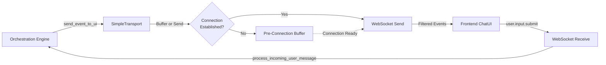

# Transport & Streaming Deep Dive

**Purpose:** Document SimpleTransport—MozaiksAI's bidirectional communication layer that manages WebSocket connections, message filtering, and event streaming between backend and frontend.

---

## Transport Architecture

**Module:** `core/transport/simple_transport.py`

**Current Implementation:** WebSocket-only (bidirectional, real-time)

**Future Consideration:** SSE (Server-Sent Events) for unidirectional headless workflows (no human in loop)

**Responsibilities:**
1. Manage WebSocket connections for interactive chat workflows
2. Buffer events before WebSocket connection established
3. Filter messages based on `visual_agents` configuration
4. Forward events to frontend with correlation IDs
5. Handle bidirectional communication (backend → frontend, frontend → backend)
6. Manage input request/response lifecycle



---

## Core Concepts

### Singleton Pattern

SimpleTransport uses a singleton pattern to ensure a single transport instance per server process:

```python
from core.transport.simple_transport import get_transport

transport = await get_transport()
```

**Thread Safety:** Access controlled via `asyncio.Lock` to prevent race conditions during initialization.

---

### Connection Registry

Each chat session has an associated WebSocket connection entry:

```python
self.connections[chat_id] = {
    "websocket": websocket,  # WebSocket instance
    "app_id": app_id,
    "workflow_name": workflow_name,
    "chat_id": chat_id,
    "connected_at": datetime.now(UTC).isoformat(),
    "context": context  # AG2 context variables (optional)
}
```

**Lifecycle:**
1. WebSocket connects → `handle_websocket(websocket, chat_id, ...)`
2. Connection registered in `self.connections`
3. Pre-connection buffer flushed to client
4. Connection active for event streaming
5. WebSocket closes → Connection removed from registry

---

### Pre-Connection Buffering

**Problem:** Events emitted before WebSocket connection (e.g., during HTTP `/start` endpoint processing).

**Solution:** SimpleTransport buffers events in memory until connection established:

```python
self._preconnection_buffers[chat_id] = [
    {"kind": "chat_meta", "cache_seed": 2847561923},
    {"kind": "workflow_started", "workflow_name": "Generator"}
]
```

**Flush on Connect:**
```python
async def handle_websocket(self, websocket, chat_id, app_id, workflow_name):
    # ... register connection ...
    
    # Flush buffered events
    buffered = self._preconnection_buffers.pop(chat_id, [])
    for event in buffered:
        await websocket.send_json(event)
```

**Buffer Limits:**
- Max events: 100 (prevents unbounded memory growth)
- Oldest events dropped if limit exceeded

---

## Message Filtering (visual_agents)

**Purpose:** Show only relevant agent messages to the user, hiding internal orchestration chatter.

**Configuration:** `workflows/{workflow}/workflow.json`
```json
{
  "visual_agents": ["interviewer", "planner", "architect"]
}
```

**Filtering Logic:**
```python
def should_show_to_user(self, agent_name: Optional[str], chat_id: Optional[str] = None) -> bool:
    if not agent_name:
        return True  # System messages always shown
    
    # Get workflow configuration
    workflow_name = self.connections[chat_id].get("workflow_name")
    config = workflow_manager.get_config(workflow_name)
    visual_agents = config.get("visual_agents")
    
    if not isinstance(visual_agents, list):
        return True  # No filtering if visual_agents not defined
    
    if not visual_agents:
        return True  # Empty list = show all
    
    # Normalize agent names for comparison
    def normalize_agent(name):
        return str(name).lower().replace('agent', '').replace(' ', '').strip()
    
    normalized_agent = normalize_agent(agent_name)
    normalized_visual_agents = [normalize_agent(va) for va in visual_agents]
    
    return normalized_agent in normalized_visual_agents
```

**Normalization Examples:**
- `"Interviewer Agent"` → `"interviewer"`
- `"PlannerAgent"` → `"planner"`
- `"user_proxy"` → `"userproxy"`

**Applied During Event Send:**
```python
async def send_event_to_ui(self, event: Dict[str, Any], chat_id: str) -> None:
    agent_name = event.get("agent") or event.get("name")
    
    if not self.should_show_to_user(agent_name, chat_id):
        logger.debug(f"Filtered out message from {agent_name} (not in visual_agents)")
        return
    
    # Send event to WebSocket
    await self._send_to_connection(chat_id, event)
```

---

## Event Streaming API

### Send Event to UI

**Primary Method:**
```python
async def send_event_to_ui(
    self,
    event: Dict[str, Any],
    chat_id: str,
    *,
    skip_filter: bool = False
) -> None:
    """Send event to frontend via WebSocket.
    
    Args:
        event: Event payload (must include 'kind' field)
        chat_id: Target chat session
        skip_filter: Bypass visual_agents filtering (default: False)
    """
```

**Usage Example:**
```python
await transport.send_event_to_ui({
    "kind": "agent_message",
    "agent": "planner",
    "content": "Here's the plan...",
    "timestamp": datetime.now(UTC).isoformat()
}, chat_id="chat_abc123")
```

---

### Wait for Response

**Purpose:** Pause orchestration until frontend provides user input or confirmation.

**Method:**
```python
async def wait_for_response(
    self,
    event_id: str,
    timeout: float = 60.0
) -> Optional[Dict[str, Any]]:
    """Wait for frontend response matching event_id.
    
    Args:
        event_id: Correlation ID (matches 'corr' field in frontend response)
        timeout: Max wait time in seconds
    
    Returns:
        Response payload or None if timeout
    """
```

**Orchestration Example:**
```python
# Send input request
event_id = f"input_{uuid.uuid4().hex[:8]}"
await transport.send_event_to_ui({
    "kind": "input_request",
    "request_id": event_id,
    "prompt": "Enter your name:",
    "corr": event_id
}, chat_id)

# Wait for response
response = await transport.wait_for_response(event_id, timeout=120.0)

if response:
    user_input = response.get("value")
    logger.info(f"User provided: {user_input}")
else:
    logger.warning("Input request timed out")
```

**Response Queue Mechanism:**
```python
# Create future for this event_id
self._response_futures[event_id] = asyncio.Future()

# Wait with timeout
try:
    response = await asyncio.wait_for(
        self._response_futures[event_id],
        timeout=timeout
    )
except asyncio.TimeoutError:
    response = None
finally:
    self._response_futures.pop(event_id, None)
```

---

### Process Incoming User Message

**Purpose:** Handle user messages from WebSocket or HTTP input endpoint.

**Method:**
```python
async def process_incoming_user_message(
    self,
    *,
    chat_id: str,
    user_id: Optional[str],
    content: str,
    source: str = 'ws'
) -> None:
    """Persist and forward user message to orchestration.
    
    Args:
        chat_id: Target chat session
        user_id: User identifier
        content: Message text
        source: 'ws' (WebSocket) or 'http' (API endpoint)
    """
```

**Flow:**
1. Append message to MongoDB `chat_sessions` collection
2. Find active orchestration input registry
3. Surface message to UserProxyAgent's `a_get_human_input` callback
4. Resume AG2 execution

**Persistence:**
```python
await coll.find_one_and_update(
    {"_id": chat_id},
    {
        "$inc": {"last_sequence": 1},
        "$push": {
            "messages": {
                "role": "user",
                "name": "user",
                "content": content,
                "sequence": index,
                "timestamp": now_dt.isoformat()
            }
        }
    }
)
```

**Orchestration Handoff:**
```python
registry = self._input_request_registries.get(chat_id)
if registry and registry.get("respond_cb"):
    respond_cb = registry["respond_cb"]
    if asyncio.iscoroutinefunction(respond_cb):
        await respond_cb(content)
    else:
        respond_cb(content)
```

---

## WebSocket Message Handling

### Connection Lifecycle

**Connect:**
```python
@app.websocket("/ws/chat/{chat_id}")
async def websocket_endpoint(websocket: WebSocket, chat_id: str):
    transport = await get_transport()
    await transport.handle_websocket(
        websocket=websocket,
        chat_id=chat_id,
        app_id=app_id,
        workflow_name=workflow_name
    )
```

**Handle WebSocket:**
```python
async def handle_websocket(self, websocket, chat_id, app_id, workflow_name):
    await websocket.accept()
    
    # Register connection
    self.connections[chat_id] = {
        "websocket": websocket,
        "app_id": app_id,
        "workflow_name": workflow_name,
        "chat_id": chat_id,
        "connected_at": datetime.now(UTC).isoformat()
    }
    
    # Flush pre-connection buffer
    buffered = self._preconnection_buffers.pop(chat_id, [])
    for event in buffered:
        await websocket.send_json(event)
    
    # Listen for incoming messages
    try:
        async for message in websocket.iter_json():
            await self._handle_incoming_ws_message(message, chat_id)
    except WebSocketDisconnect:
        logger.info(f"WebSocket disconnected: {chat_id}")
    finally:
        self.connections.pop(chat_id, None)
```

---

### Incoming Message Types

**1. User Input Submit (Free-Form)**
```json
{
  "type": "user.input.submit",
  "content": "Hello, agent!"
}
```

**Handler:**
```python
if msg_type == "user.input.submit":
    content = message.get("content", "")
    await self.process_incoming_user_message(
        chat_id=chat_id,
        user_id=None,  # Extracted from session if needed
        content=content,
        source='ws'
    )
```

---

**2. User Input Response (Correlated)**
```json
{
  "type": "user.input.response",
  "request_id": "input_abc123",
  "value": "User's answer"
}
```

**Handler:**
```python
if msg_type == "user.input.response":
    request_id = message.get("request_id")
    value = message.get("value")
    
    # Resolve waiting future
    if request_id in self._response_futures:
        self._response_futures[request_id].set_result({
            "value": value,
            "request_id": request_id
        })
    
    # Send acknowledgment
    await self.send_event_to_ui({
        "kind": "input_ack",
        "request_id": request_id,
        "corr": request_id
    }, chat_id)
```

---

**3. Ping/Pong (Keepalive)**
```json
{
  "type": "ping"
}
```

**Response:**
```json
{
  "type": "pong",
  "timestamp": "2025-10-02T12:34:56.789Z"
}
```

---

## Future: SSE (Server-Sent Events) Support

**Status:** Not currently implemented (future enhancement)

**Use Case:** SSE would enable **unidirectional streaming** for headless/backend-only workflows where there's no human in the loop:

- **Workflow monitoring dashboards** - Server pushes status updates
- **Automated batch processing** - Progress notifications without user interaction  
- **Agent-to-agent orchestration** - Backend workflows with observability
- **Restrictive network environments** - Fallback when WebSockets are blocked by firewalls

**Implementation Considerations:**

**Pros of SSE:**
- ✅ Simpler protocol than WebSocket (HTTP-based)
- ✅ Automatic reconnection built into browser EventSource API
- ✅ Works through HTTP proxies that block WebSocket upgrades
- ✅ Perfect for unidirectional server → client streaming

**Cons of SSE:**
- ❌ Unidirectional only (server → client; no client → server without separate HTTP requests)
- ❌ No binary data support (text-only)
- ❌ Limited browser support for custom headers

**When to Use SSE (Future):**
- Headless workflows that only need status/progress updates
- Environments with WebSocket restrictions
- Simple monitoring/observability dashboards
- Non-interactive agent orchestration

**When to Use WebSocket (Current):**
- Interactive chat workflows (bidirectional required)
- User input collection (frontend → backend)
- Real-time tool responses
- Multi-turn conversations

**Potential Implementation:**

```python
# Future SSE endpoint (not currently implemented)
@app.get("/sse/chat/{chat_id}")
async def sse_endpoint(request: Request, chat_id: str, app_id: str, workflow_name: str):
    """Stream workflow events via SSE for headless monitoring."""
    queue = asyncio.Queue()
    
    # Register SSE connection (different from WebSocket registry)
    transport.register_sse_connection(chat_id, queue, app_id, workflow_name)
    
    async def event_generator():
        try:
            while True:
                event = await queue.get()
                yield {
                    "event": "workflow_event",
                    "data": json.dumps(event)
                }
        except asyncio.CancelledError:
            transport.unregister_sse_connection(chat_id)
    
    return EventSourceResponse(event_generator())
```

**Note:** For now, **WebSocket remains the only transport**. Headless workflows can still use WebSocket connections from backend services (e.g., Python clients, background jobs) without requiring a browser frontend.

---

## Input Request/Response Lifecycle

**Scenario:** Agent requests user input, pauses execution, waits for response.

### Step-by-Step Flow

**1. Agent Calls Tool (e.g., `user_input`)**
```python
# In tool implementation
async def user_input(prompt: str, ui_tool_id: str = "user_input") -> str:
    transport = await get_transport()
    
    # Generate correlation ID
    request_id = f"input_{uuid.uuid4().hex[:8]}"
    
    # Send input request to frontend
    await transport.send_event_to_ui({
        "kind": "input_request",
        "request_id": request_id,
        "ui_tool_id": ui_tool_id,
        "prompt": prompt,
        "corr": request_id
    }, chat_id)
    
    # Wait for response
    response = await transport.wait_for_response(request_id, timeout=120.0)
    
    if not response:
        raise TimeoutError("User did not respond in time")
    
    return response.get("value", "")
```

**2. Frontend Receives Event**
```javascript
// ChatUI receives WebSocket message
{
  "kind": "input_request",
  "request_id": "input_abc123",
  "prompt": "Enter your name:",
  "corr": "input_abc123"
}

// Render input component
<InputComponent
  requestId="input_abc123"
  prompt="Enter your name:"
  onSubmit={handleSubmit}
/>
```

**3. User Submits Input**
```javascript
// User types "Alice" and clicks Submit
ws.send(JSON.stringify({
  type: "user.input.response",
  request_id: "input_abc123",
  value: "Alice"
}));
```

**4. Backend Resolves Future**
```python
# SimpleTransport receives message
if msg_type == "user.input.response":
    request_id = message.get("request_id")
    value = message.get("value")
    
    # Resolve future (unblocks wait_for_response)
    if request_id in self._response_futures:
        self._response_futures[request_id].set_result({
            "value": value,
            "request_id": request_id
        })
```

**5. Tool Returns Value**
```python
# user_input tool resumes
response = await transport.wait_for_response(request_id, timeout=120.0)
# response = {"value": "Alice", "request_id": "input_abc123"}

return response.get("value", "")  # Returns "Alice" to agent
```

---

## Performance Characteristics

| Operation | Latency | Notes |
|-----------|---------|-------|
| WebSocket send | <10ms | Direct send if connected |
| Pre-connection buffer | <5ms | In-memory queue operation |
| visual_agents filter check | <1ms | Config lookup + string normalization |
| Wait for response (user present) | 1-120s | Depends on user interaction time |
| SSE event delivery | <20ms | Queue put + event encoding |
| Incoming message processing | 10-50ms | Includes persistence and orchestration handoff |

---

## Configuration

**Environment Variables:**

| Variable | Purpose | Default |
|----------|---------|---------|
| `WS_PING_INTERVAL` | WebSocket ping interval (seconds) | 30 |
| `WS_TIMEOUT` | WebSocket timeout (seconds) | 300 |
| `MAX_PRECONNECTION_BUFFER_SIZE` | Max events to buffer | 100 |

**Workflow Configuration (visual_agents):**
```json
{
  "visual_agents": ["interviewer", "planner"],
  "max_turns": 20,
  ...
}
```

---

## Troubleshooting

### Issue: Events not reaching frontend

**Check:**
1. WebSocket connection established: Inspect browser DevTools Network tab
2. Pre-connection buffer overflow: Check logs for "Pre-connection buffer overflow" warnings
3. visual_agents filtering: Verify agent name in `visual_agents` list
4. Event `kind` field: Must be present and valid

**Debug Commands:**
```python
# Check active connections
transport = await get_transport()
print(transport.connections)

# Check pre-connection buffers
print(transport._preconnection_buffers)
```

---

### Issue: Input request timeout

**Causes:**
1. Frontend not rendering input component (check React component registration)
2. User not responding within timeout period
3. WebSocket disconnected before response sent

**Mitigation:**
```python
# Increase timeout for complex inputs
response = await transport.wait_for_response(request_id, timeout=300.0)

# Handle timeout gracefully
if not response:
    await transport.send_event_to_ui({
        "kind": "error",
        "message": "Input request timed out. Please try again."
    }, chat_id)
    return None  # Or default value
```

---

### Issue: Duplicate events

**Causes:**
1. Multiple event emissions in code (check orchestration logic)
2. Auto-tool deduplication not working (see Event Pipeline docs)
3. WebSocket reconnection replaying buffer

**Solutions:**
1. Add idempotency keys to events: `"event_id": uuid.uuid4().hex`
2. Frontend deduplication: Track seen `event_id` values
3. Clear buffer on intentional reconnect

---

## AG2 Streaming Integration

**Current Implementation:** MozaiksAI uses AG2's native streaming capabilities for token-by-token LLM response delivery.

### How AG2 Streaming Works

When agents are configured with `stream=True` in their `llm_config`, AG2 automatically enables token-by-token streaming:

```
LLM API (OpenAI/Anthropic)
    ↓ [streams tokens in real-time]
AG2 ConversableAgent (llm_config with stream=True)
    ↓ [receives and processes tokens]
SimpleTransport 
    ↓ [forwards via WebSocket as chat.print events]
Frontend ChatUI
    ↓ [displays progressive text]
User sees ChatGPT-like streaming ✨
```

### Configuring Streaming Per Agent

**Via `get_llm_config()` helper** (`core/workflow/llm_config.py`):

```python
from core.workflow.llm_config import get_llm_config

# Streaming enabled (for interactive agents)
llm_config = await get_llm_config(
    stream=True,  # ⭐ Enable token-by-token streaming
    cache=True
)

interviewer_agent = ConversableAgent(
    name="Interviewer",
    system_message="Ask clarifying questions.",
    llm_config=llm_config
)
```

**For structured output agents** (disable streaming to receive complete JSON):

```python
# Streaming disabled (for structured output agents)
llm_config = await get_llm_config(
    response_format=WorkflowDefinition,  # Pydantic model
    stream=False,  # ❌ Disable streaming for clean JSON
    cache=True
)

workflow_agent = ConversableAgent(
    name="WorkflowBuilder",
    system_message="Generate workflow JSON.",
    llm_config=llm_config
)
```

### When to Enable Streaming

**✅ Streaming Enabled (Interactive UX):**
- **Chat/Conversational Agents** - Real-time back-and-forth with users
- **Interviewer/Clarification Agents** - Asking follow-up questions
- **Explanation/Tutorial Agents** - Long-form explanations benefit from progressive display
- **Support/Help Agents** - Customer support scenarios

**❌ Streaming Disabled (Structured Output):**
- **JSON Generation Agents** - Workflow definitions, agent configurations, context variables
- **Code Generation Agents** - Complete code blocks (avoid partial syntax)
- **YAML/Config Agents** - Structured configuration files
- **Validation Agents** - Binary yes/no or structured validation results

### Frontend Event Handling

**Streaming Event Flow:**

1. **`chat.print`** - Individual tokens/chunks (progressive display):
   ```json
   {
     "type": "chat.print",
     "data": {
       "kind": "print",
       "agent": "Interviewer",
       "content": "What ",  // Single token
       "sequence": 5
     }
   }
   ```

2. **`chat.text`** - Complete message (finalization):
   ```json
   {
     "type": "chat.text",
     "data": {
       "kind": "text",
       "agent": "Interviewer",
       "content": "What is your primary use case?",  // Full message
       "sequence": 6
     }
   }
   ```

**Frontend Accumulation Pattern** (`ChatPage.js`):

```javascript
// Accumulate streaming chunks
case 'print': {
  const agentName = extractAgentName(data);
  const chunk = data.content || '';
  
  setMessages(prev => {
    const updated = [...prev];
    const lastMsg = updated[updated.length - 1];
    
    // If last message is streaming from same agent, append chunk
    if (lastMsg && lastMsg.isStreaming && lastMsg.sender === 'agent' && lastMsg.agentName === agentName) {
      lastMsg.content += chunk;
    } else {
      // New streaming message
      updated.push({
        id: `msg-${Date.now()}`,
        sender: 'agent',
        agentName,
        content: chunk,
        isStreaming: true  // ⭐ Mark as streaming
      });
    }
    return updated;
  });
  break;
}

// Finalize streaming message
case 'text': {
  const agentName = extractAgentName(data);
  const content = data.content || '';
  
  setMessages(prev => {
    const lastMsg = prev[prev.length - 1];
    
    // If last message was streaming from same agent, finalize it
    if (lastMsg && lastMsg.isStreaming && lastMsg.sender === 'agent' && lastMsg.agentName === agentName) {
      return [...prev.slice(0, -1), { ...lastMsg, content, isStreaming: false }];
    }
    
    // Otherwise, add as new message
    return [...prev, { id: `msg-${Date.now()}`, sender: 'agent', agentName, content, isStreaming: false }];
  });
  break;
}
```

### Streaming Performance

**Benefits:**
- ✅ **Perceived responsiveness** - Users see output immediately
- ✅ **Lower latency to first token** - Start displaying before completion
- ✅ **Better UX for long responses** - Progress indicator built-in
- ✅ **Reduced abandonment** - Users stay engaged during generation

**Trade-offs:**
- ❌ **More WebSocket messages** - Each token is a separate event
- ❌ **Frontend rendering overhead** - React re-renders on each chunk
- ❌ **Not suitable for structured output** - JSON/code needs complete response

**Performance Metrics:**
- **Token delivery latency:** <50ms per token (from LLM to frontend)
- **Frontend render overhead:** ~2-5ms per `chat.print` event
- **Typical streaming duration:** 1-10 seconds for conversational responses

### Testing & Validation

**Streaming Agent Checklist:**

✅ **Agent Configuration:**
- [ ] Agent created with `llm_config = await get_llm_config(stream=True)`
- [ ] Agent purpose is interactive/conversational (not structured output)
- [ ] `human_input_mode` is NOT `"ALWAYS"` (prevents streaming display issues)

✅ **Event Validation:**
- [ ] Backend emits `chat.print` events during generation (check browser DevTools → Network → WS)
- [ ] Each `chat.print` contains incremental `content` chunk
- [ ] Final `chat.text` event emitted with complete message
- [ ] Events include correct `agent` name

✅ **Frontend Display:**
- [ ] ChatUI shows progressive text updates (ChatGPT-like effect)
- [ ] No rendering lag or dropped chunks
- [ ] Final message displays correctly after streaming completes
- [ ] Message marked as finalized (`isStreaming: false`)

✅ **Error Handling:**
- [ ] Streaming interruption (disconnect) doesn't lose partial message
- [ ] Timeout during streaming triggers graceful error message
- [ ] Agent errors mid-stream emit `chat.error` event

**Structured Output Agent Checklist:**

✅ **Agent Configuration:**
- [ ] Agent created with `llm_config = await get_llm_config(response_format=ModelClass, stream=False)`
- [ ] Agent purpose is JSON/code generation (not conversational)

✅ **Event Validation:**
- [ ] Backend emits **only** `chat.text` event (no `chat.print` chunks)
- [ ] `chat.text.content` contains complete valid JSON or code
- [ ] Response parseable as expected Pydantic model

✅ **Frontend Display:**
- [ ] Message appears all at once (not progressive)
- [ ] JSON/code rendered with proper syntax highlighting
- [ ] No partial JSON fragments displayed

**Common Issues:**

| **Issue** | **Cause** | **Fix** |
|-----------|-----------|---------|
| No streaming (full message at once) | `stream=False` in `llm_config` | Set `stream=True` in `get_llm_config()` |
| Partial JSON displayed progressively | `stream=True` for structured output agent | Set `stream=False` for JSON agents |
| `chat.print` events not received | WebSocket connection dropped | Check connection health, reconnect logic |
| Rendering lag with many chunks | Frontend re-render overhead | Debounce rendering (update every N chunks) |
| Final message duplicated | Both `chat.print` and `chat.text` rendered separately | Finalize streaming message instead of creating new one |

### AG2 Reference Documentation

- [AG2 WebSocket Guide](https://docs.ag2.ai/latest/docs/use-cases/notebooks/notebooks/agentchat_websockets/)
- [AG2 Streaming Blog](https://docs.ag2.ai/latest/docs/_blogs/2025-01-10-WebSockets/)
- [AG2 IOStream API](https://docs.ag2.ai/latest/docs/api-reference/autogen/io/IOStream/)

### AG2 Official WebSocket Patterns (Future Reference)

**Note:** MozaiksAI currently uses a custom `SimpleTransport` implementation. AG2 provides official WebSocket patterns that could be considered for future enhancements.

**AG2 Native WebSocket Server Pattern:**

```python
from autogen.io import IOWebsockets

# AG2's official WebSocket server (runs in background thread)
async def on_connect(iostream):
    """Called when client connects."""
    # Configure agents with iostream for WebSocket transport
    agent.iostream = iostream
    
    # Start AG2 chat
    await agent.initiate_chat(
        recipient=manager,
        message="Begin workflow"
    )

# Start AG2 WebSocket server (official pattern)
IOWebsockets.run_server_in_thread(
    on_connect=on_connect,
    port=8080
)
```

**Benefits of AG2 Native Pattern:**
- ✅ Official AG2 support and updates
- ✅ Built-in stream handling and event routing
- ✅ Automatic `chat.print` and `chat.text` event generation
- ✅ Less custom code to maintain

**MozaiksAI Custom Pattern (Current):**
- ✅ Full control over event structure and routing
- ✅ Integration with FastAPI routes and middleware
- ✅ Custom persistence and observability hooks
- ✅ Multi-tenant app scoping built-in

**When to Consider AG2 Native:**
- Single-tenant or simple deployments
- Minimal custom event requirements
- Prioritize upstream AG2 compatibility
- Reduce maintenance burden

**When MozaiksAI Custom Makes Sense:**
- Multi-tenant SaaS with app isolation
- Complex event pipeline (persistence, observability, token tracking)
- Custom transport requirements (future SSE support)
- Tight integration with FastAPI ecosystem

---

## Security Considerations

**1. App Isolation:**
- All WebSocket connections scoped by `app_id`
- Events only routed to correct chat session
- No cross-chat event leakage

**2. Input Validation:**
- Message content sanitized before persistence
- Request IDs validated (must be string, non-empty)
- Timeout enforcement prevents indefinite blocking

**3. Connection Limits:**
- One WebSocket per chat session (duplicate connections rejected)
- Pre-connection buffer size limit prevents memory exhaustion

---

## Next Steps

- **[Event Pipeline](event_pipeline.md)** - Event types, dispatcher routing, handlers
- **[Persistence & Resume](persistence_and_resume.md)** - Message storage, chat resume
- **[Observability](observability.md)** - Transport metrics, logging
- **[Frontend Integration](../frontend/chatui_architecture.md)** - ChatUI transport client

---

**Questions?** See [Runtime Overview](runtime_overview.md) or [API Reference](../reference/api_endpoints.md).
