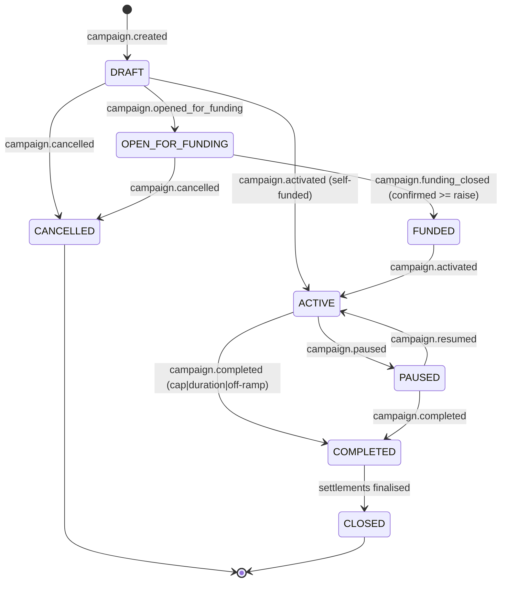
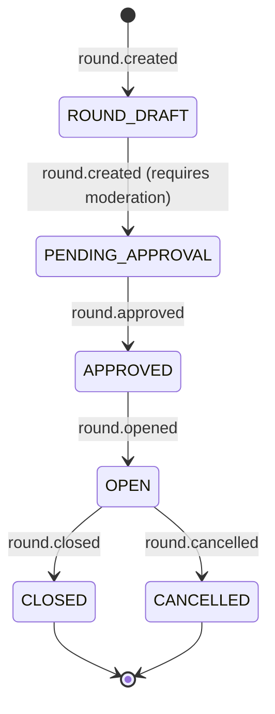

# Economic Protocol (v1) — Event Schema + State Machines

Last updated: 2025-12-23

This document defines the **Economic Protocol**: a versioned, idempotent event stream that makes money-moving decisions deterministic, enables reconciliation, and captures high-signal growth + finance data (the “data moat”) for training Mozaiks agents.

It maps directly to the founder journey:
- **Self-funded campaign**: create campaign → activate spend → track KPIs → settle (creator-only).
- **Offering-funded campaign**: create campaign → configure offering terms → open funding → confirm commitments → activate spend → attribute revenue → accrue/settle investor returns → close.

---

## 0) Non-negotiable protocol principles

1) **Event-sourced truth for economics**
- We append facts; we do not “edit balances”.
- Derived state (campaign status, commitments, ledgers, settlements) is a projection.

2) **Idempotent**
- Every event has a globally unique `event_id`.
- Replays are safe: duplicates are ignored.

3) **Signed / authenticated**
- Runtime/growth events are authenticated (internal API key now; HMAC/mTLS later).

4) **Versioned**
- `schema_version` and per-event `event_version` are explicit.

5) **Separation of concerns**
- Runtime / ValidationEngine reports **facts** (spend executed, KPI snapshot, attribution assignment).
- Control plane adjudicates **economics** (eligibility, approvals, accrual, settlement).

---

## 1) Domain entities (minimal but complete)

### App
- `app_id`, `owner_user_id`, `environment`

### Campaign (execution)
- `campaign_id`, `app_id`, `status`, `created_by_user_id`
- **Owner**: ValidationEngine
- **Current model**: `ValidationEngine.API.Models.AdCampaign`

### Campaign Contract (terms produced by the wizard)
This is the structured “term sheet” the AI workflow outputs; execution systems don’t invent these fields:
- `raise_amount` (optional if self-funded)
- `purpose` (e.g., “paid acquisition”)
- `revenue_share_bps` (e.g., 2000 = 20.00%)
- `cap_multiple` and/or `cap_amount` (e.g., 1.4× or $28,000 max repayment)
- `duration_days` (e.g., 120–180)
- `off_ramps[]` (e.g., `qualified_financing`)
- `attribution_rules` (how revenue ties back to campaign)

### Offering / Round (fundraising)
- `round_id`, `campaign_id`, eligibility rules, offering terms
- **Owner**: Governance (gatekeeping + lifecycle) + Payment (money capture)
- **Current model** (closest): `Governance.API.Models.FundingRound` (add campaign/terms fields in a later phase)

### Commitment / Investment (pledge + payment)
- `commitment_id`, `round_id`, `investor_id`, `amount`
- **Owner**: Governance for the commitment intent, Payment for capture confirmation
- **Current model** (closest): `Governance.API.Models.Investment`

### Allocation (spend authorization)
- `allocation_id`, maps commitments → spend wallet/authorization
- **Owner**: ValidationEngine
- **Current model**: `ValidationEngine.API.Models.BudgetAllocation`

### Attribution
- mapping of `user_id` → `campaign_id` (+ optional channel/ad identifiers)
- **Owner**: Runtime / app instrumentation (emit facts), Control plane consumes

### Revenue Ledger (accruals)
- append-only accrual entries per beneficiary (creator + investors + platform)
- **Owner**: Payment
- **Current model**: `Payment.API.Models.LedgerEntryModel` + `Payment.API.Models.TransactionModel`

### Settlement
- payout batches + receipts (Stripe transfers, etc.)
- **Owner**: Payment
- **Current code**: `Payment.API.Services.SettlementService` + `SettlementWorker`

---

## 2) Event envelope (canonical schema)

Every event uses the same envelope. Payload varies by `event_type`.

```json
{
  "schema_version": "1.0",
  "event_id": "uuid",
  "event_type": "campaign.created",
  "event_version": 1,
  "occurred_at": "2025-12-22T12:34:56Z",
  "source": {
    "producer": "control_plane|runtime",
    "service": "validationengine|governance|payment|insights|runtime_shell",
    "app_id": "app_123",
    "environment": "prod|staging|dev",
    "request_id": "trace_or_correlation_id",
    "ip": "optional"
  },
  "actor": {
    "actor_type": "user|system|app",
    "actor_id": "user_456"
  },
  "correlation": {
    "campaign_id": "camp_789",
    "round_id": "round_111",
    "commitment_id": "comm_222",
    "allocation_id": "alloc_333",
    "transaction_id": "txn_444",
    "user_id": "enduser_555"
  },
  "payload": {}
}
```

Notes:
- `correlation.*` fields are optional but strongly recommended when applicable.
- Payload should avoid raw PII. Prefer stable IDs and coarse descriptors (e.g., audience segment labels, not emails).

---

## 3) Event taxonomy (v1)

### A) Campaign lifecycle (control plane + ValidationEngine)
- `campaign.created`
- `campaign.updated` (terms changes only before funding opens)
- `campaign.opened_for_funding`
- `campaign.funding_closed`
- `campaign.activated` (spend authorized)
- `campaign.paused`
- `campaign.resumed`
- `campaign.completed` (cap hit OR duration ended OR off-ramp triggered)
- `campaign.cancelled`

### B) Funding / governance
- `round.created`
- `round.approved`
- `round.opened`
- `round.closed`
- `round.cancelled`

### C) Commitments / capture
- `commitment.created`
- `commitment.confirmed` (money captured / verified)
- `commitment.cancelled`

### D) Allocation (spend authorization)
- `allocation.created`
- `allocation.deployed` (budget becomes available for spend)

### E) Spend & performance (runtime/ValidationEngine)
- `spend.authorized` (control plane → growth)
- `spend.executed` (growth → control plane)
- `spend.refunded`
- `kpi.reported` (batch KPI snapshots)
- `creative.generated`
- `creative.launched`

### F) Attribution (runtime)
- `attribution.assigned`
- `attribution.updated` (rare; only if you allow corrections)

### G) Revenue facts (runtime/payment processor)
- `revenue.invoice_paid`
- `revenue.refund_issued`
- `revenue.chargeback`
- `revenue.subscription_cancelled`

### H) Ledger & payouts (control plane)
- `ledger.accrued`
- `ledger.adjusted` (refund/chargeback reconciliation)
- `settlement.initiated`
- `settlement.paid`
- `settlement.failed`

### I) App economics / fee policy (control plane)
- `app.economic_terms_set` (explicitly snapshots fee policy changes)
- `app.royalty_enabled` / `app.royalty_disabled` (convenience toggles; `royalty_fee_bps` is typically 300 when enabled)

---

## 4) State machines (v1)

### 4.1 Campaign funding + execution



### 4.2 Offering / round lifecycle (gatekeeper + open/close)



---

## 5) Investor return mechanics (v1)

## 5.0 Platform fees (Marketplace + Offering Royalty)

We treat platform fees as **first-class economics** (they affect “shareable revenue” and reconciliation) but they are **not part of the investor revenue share pool**.

### Fee policy (v1)
- **Marketplace fee**: **3%** on *all* MozaiksPay revenue (app purchases + Mozaiks platform subscriptions/hosting/tokens/etc).
- **Offering royalty fee**: **+3%** on apps that opt into / complete an offering.
  - This is an additional platform take on top of the marketplace fee (total **6%**).
  - Scope: **perpetual** once enabled for that app (confirm/adjust if you later want “only until repaid”).

Represented as basis points (bps):
- `marketplace_fee_bps = 300`
- `royalty_fee_bps = 0 | 300`
- `platform_fee_bps_total = marketplace_fee_bps + royalty_fee_bps`

### Shareable revenue definition (v1)

For any paid purchase/subscription:
- `gross_revenue` = amount paid by the user (after payment succeeds)
- `platform_fee` = `gross_revenue * platform_fee_bps_total`
- `shareable_revenue` = `gross_revenue - platform_fee`

Then investor revenue share is applied on `shareable_revenue` (not on `gross_revenue`).

Example:
- Gross: `$100.00`
- Marketplace fee 3%: `$3.00`
- Offering royalty 3% (if enabled): `$3.00`
- Shareable revenue: `$94.00`

Refunds/chargebacks:
- `revenue.refund_issued` / `revenue.chargeback` must reverse prior accruals (via `ledger.adjusted`) and, if applicable, reverse platform fees in the same proportions.

**Accrual, not promises**: the UI can show “expected 120–180 days”, but the protocol must be deterministic.

Accrual rule (simple v1):
1) On each `revenue.invoice_paid`:
   - resolve `campaign_id` via attribution
   - compute `shareable_revenue = gross_revenue - platform_fee` (see 5.0)
   - compute `investor_pool_share = shareable_revenue * revenue_share_pct`
2) Append `ledger.accrued` entries (creator vs investor pool vs platform).
3) Stop accruing once cap reached (`cap_amount` or implied from `cap_multiple`).
4) Emit `campaign.completed` with reason `cap_reached` when hit.

Settlement:
- Periodically (weekly/monthly), aggregate payable balances → issue Stripe transfers → emit `settlement.*`.

---

## 6) Data moat: capture tiers

Default collection should capture Tier 1 + Tier 2. Tier 3 is opt-in (privacy + cost).

Implementation note (ValidationEngine): the concrete minimum Tier 2 payload expectations (creative descriptors, experiment/variant IDs, pacing decision IDs, coarse KPI segmentation) are defined in `docs/workflows/VALIDATIONENGINE_SPECIFICATION.md` under **"Data Moat (Minimum Capture for Optimization)"**. Keep those payloads aligned with the `creative.*`, `spend.*`, and `kpi.reported` events in this protocol.

### Tier 1 — Must-have economics data
- all economic events above (A–H)
- attribution mapping (IDs + coarse segments)
- CAC/payback/churn/refunds (computed or ingested)
- ledger + settlement outcomes
- campaign contract variants and outcomes

### Tier 2 — Growth execution data
- creative metadata (format/hook/CTA descriptors)
- audience targeting descriptors (no raw PII)
- spend pacing decisions
- experiment variants and results
- platform performance snapshots (impressions/clicks/conversions/spend + derived metrics)

### Tier 3 — Optional
- raw clickstream
- full creative assets
- per-session interaction traces

---

## 7) Implementation mapping (this repo)

### Event store (v1)
- **Owner**: `Payment.API`
- Collection: `EconomicEvents` (append-only, idempotent)
- Endpoint (internal): `POST /api/economic/events/ingest`

### KPI store (v1)
- **Owner**: `Insights.API`
- Endpoints (internal): `POST /api/insights/ingest/kpis` + `POST /api/insights/ingest/events`

### Producers (v1)
- ValidationEngine emits:
  - `campaign.*`, `allocation.*`, `spend.*`, `kpi.reported`, `creative.*`
- Governance emits:
  - `round.*`, `commitment.*` (and moderation decisions)
- Payment emits:
  - `revenue.*`, `ledger.*`, `settlement.*`
  - Platform fee policy is applied here (3% marketplace + optional +3% royalty for offering-enabled apps).

### Consumers / projections (v1)
- Payment:
  - consumes `revenue.*` + attribution facts → writes ledger + triggers settlements
- Insights:
  - consumes everything → supports dashboards + training datasets (read-only)

---

## 8) What we build next (concrete deliverables)

1) Event catalog: names + payload schemas + examples (this doc evolves into the catalog)
2) Campaign & round state machines enforced in code (explicit transitions)
3) Idempotent ingest endpoint (runtime/growth → control plane) + signature verification
4) Derived ledger writer (revenue events → ledger entries)
5) Settlement worker wiring (ledger balances → transfers → settlement events)
