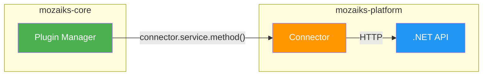
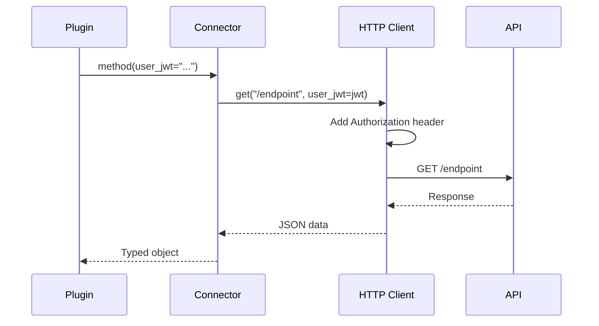

# 🔌 Connector Contract

> Technical contract for writing platform connectors in **mozaiks-platform**.

---

## 📜 Overview

Connectors are Python modules that bridge the Core plugin runtime with platform .NET APIs. They must follow this contract for consistency and proper integration.



---

## 📐 Structure

Every connector follows this pattern:

```
runtime/connectors/
├── base.py           # Shared HTTP client
├── loader.py         # Bundle loader + registry
└── {service}.py      # One file per service
```

### File Template

```python
# runtime/connectors/{service}.py
"""
{Service} Connector
==================

Connects to {Service}.API for {description}.

Endpoints:
- GET /api/{service}/items
- POST /api/{service}/items
- ...
"""
from __future__ import annotations
from dataclasses import dataclass, field
from typing import Protocol, Any
from datetime import datetime
from .base import PlatformHttpClient


# ============================================================================
# DATA MODELS
# ============================================================================

@dataclass
class ServiceItem:
    """Represents an item from the service."""
    id: str
    name: str
    status: str
    created_at: datetime | None = None
    metadata: dict[str, Any] = field(default_factory=dict)


@dataclass
class ServiceItemCreate:
    """Request model for creating an item."""
    name: str
    config: dict[str, Any] = field(default_factory=dict)


@dataclass
class ServiceItemUpdate:
    """Request model for updating an item."""
    name: str | None = None
    status: str | None = None


# ============================================================================
# CONNECTOR INTERFACE (Protocol)
# ============================================================================

class ServiceConnector(Protocol):
    """
    Abstract interface for {Service} operations.
    
    Implement this for both managed (real API) and mock (self-hosted) modes.
    """
    
    async def list_items(
        self,
        *,
        user_jwt: str | None = None,
        correlation_id: str = ""
    ) -> list[ServiceItem]:
        """List all items for the current user."""
        ...
    
    async def get_item(
        self,
        item_id: str,
        *,
        user_jwt: str | None = None,
        correlation_id: str = ""
    ) -> ServiceItem:
        """Get a single item by ID."""
        ...
    
    async def create_item(
        self,
        request: ServiceItemCreate,
        *,
        user_jwt: str | None = None,
        correlation_id: str = ""
    ) -> ServiceItem:
        """Create a new item."""
        ...
    
    async def update_item(
        self,
        item_id: str,
        request: ServiceItemUpdate,
        *,
        user_jwt: str | None = None,
        correlation_id: str = ""
    ) -> ServiceItem:
        """Update an existing item."""
        ...
    
    async def delete_item(
        self,
        item_id: str,
        *,
        user_jwt: str | None = None,
        correlation_id: str = ""
    ) -> bool:
        """Delete an item. Returns True if successful."""
        ...


# ============================================================================
# MANAGED IMPLEMENTATION (Real API calls)
# ============================================================================

class ManagedServiceConnector:
    """
    Production connector that calls the real {Service}.API.
    
    Used when MOZAIKS_MANAGED=true.
    """
    
    def __init__(self, http: PlatformHttpClient):
        self._http = http
    
    async def list_items(
        self,
        *,
        user_jwt: str | None = None,
        correlation_id: str = ""
    ) -> list[ServiceItem]:
        response = await self._http.get(
            "/api/service/items",
            user_jwt=user_jwt,
            correlation_id=correlation_id
        )
        return [ServiceItem(**item) for item in response.get("items", [])]
    
    async def get_item(
        self,
        item_id: str,
        *,
        user_jwt: str | None = None,
        correlation_id: str = ""
    ) -> ServiceItem:
        response = await self._http.get(
            f"/api/service/items/{item_id}",
            user_jwt=user_jwt,
            correlation_id=correlation_id
        )
        return ServiceItem(**response)
    
    async def create_item(
        self,
        request: ServiceItemCreate,
        *,
        user_jwt: str | None = None,
        correlation_id: str = ""
    ) -> ServiceItem:
        response = await self._http.post(
            "/api/service/items",
            json_body={
                "name": request.name,
                "config": request.config
            },
            user_jwt=user_jwt,
            correlation_id=correlation_id
        )
        return ServiceItem(**response)
    
    async def update_item(
        self,
        item_id: str,
        request: ServiceItemUpdate,
        *,
        user_jwt: str | None = None,
        correlation_id: str = ""
    ) -> ServiceItem:
        body = {}
        if request.name is not None:
            body["name"] = request.name
        if request.status is not None:
            body["status"] = request.status
        
        response = await self._http.put(
            f"/api/service/items/{item_id}",
            json_body=body,
            user_jwt=user_jwt,
            correlation_id=correlation_id
        )
        return ServiceItem(**response)
    
    async def delete_item(
        self,
        item_id: str,
        *,
        user_jwt: str | None = None,
        correlation_id: str = ""
    ) -> bool:
        response = await self._http.delete(
            f"/api/service/items/{item_id}",
            user_jwt=user_jwt,
            correlation_id=correlation_id
        )
        return response.get("success", False)


# ============================================================================
# MOCK IMPLEMENTATION (Self-hosted mode)
# ============================================================================

class MockServiceConnector:
    """
    Mock connector for self-hosted mode.
    
    Returns sensible defaults or no-ops.
    Used when MOZAIKS_MANAGED=false.
    """
    
    def __init__(self):
        self._items: dict[str, ServiceItem] = {}
    
    async def list_items(
        self,
        *,
        user_jwt: str | None = None,
        correlation_id: str = ""
    ) -> list[ServiceItem]:
        return list(self._items.values())
    
    async def get_item(
        self,
        item_id: str,
        *,
        user_jwt: str | None = None,
        correlation_id: str = ""
    ) -> ServiceItem:
        if item_id in self._items:
            return self._items[item_id]
        return ServiceItem(id=item_id, name="Mock Item", status="active")
    
    async def create_item(
        self,
        request: ServiceItemCreate,
        *,
        user_jwt: str | None = None,
        correlation_id: str = ""
    ) -> ServiceItem:
        import uuid
        item = ServiceItem(
            id=str(uuid.uuid4()),
            name=request.name,
            status="active",
            created_at=datetime.utcnow()
        )
        self._items[item.id] = item
        return item
    
    async def update_item(
        self,
        item_id: str,
        request: ServiceItemUpdate,
        *,
        user_jwt: str | None = None,
        correlation_id: str = ""
    ) -> ServiceItem:
        item = self._items.get(item_id) or ServiceItem(
            id=item_id, name="Unknown", status="active"
        )
        if request.name:
            item.name = request.name
        if request.status:
            item.status = request.status
        self._items[item_id] = item
        return item
    
    async def delete_item(
        self,
        item_id: str,
        *,
        user_jwt: str | None = None,
        correlation_id: str = ""
    ) -> bool:
        self._items.pop(item_id, None)
        return True
```

---

## 📋 Rules

### ✅ DO

1. **Use dataclasses** for all request/response models
2. **Use Protocol** for connector interface
3. **Keyword-only args** for optional parameters (`*, user_jwt=None`)
4. **Return typed objects** not raw dicts
5. **Handle None** for optional fields
6. **Include correlation_id** for tracing
7. **Docstrings** on all public methods

### ❌ DON'T

1. **Don't raise exceptions** in mock connectors
2. **Don't hardcode URLs** - use `self._http` client
3. **Don't store state** across requests in managed connectors
4. **Don't access env vars directly** - use injected config

---

## 🔄 Loader Integration

Register your connector in `loader.py`:

```python
# runtime/connectors/loader.py
from dataclasses import dataclass
from .service import ServiceConnector, ManagedServiceConnector, MockServiceConnector


@dataclass
class ConnectorBundle:
    """All available platform connectors."""
    hosting: HostingConnector
    discovery: DiscoveryConnector
    identity: IdentityConnector
    billing: BillingConnector
    service: ServiceConnector  # ← Add yours


def load_connectors(config: ConnectorConfig) -> ConnectorBundle:
    """Load appropriate connector implementations based on mode."""
    
    if config.managed_mode:
        http = PlatformHttpClient(
            base_url=config.gateway_base_url,
            api_key=config.api_key
        )
        return ConnectorBundle(
            hosting=ManagedHostingConnector(http),
            discovery=ManagedDiscoveryConnector(http),
            identity=ManagedIdentityConnector(http),
            billing=ManagedBillingConnector(http),
            service=ManagedServiceConnector(http)  # ← Add yours
        )
    else:
        return ConnectorBundle(
            hosting=MockHostingConnector(),
            discovery=MockDiscoveryConnector(),
            identity=MockIdentityConnector(),
            billing=MockBillingConnector(),
            service=MockServiceConnector()  # ← Add yours
        )
```

---

## 🔐 Authentication Flow



The HTTP client automatically handles:
- JWT token forwarding
- API key injection
- Correlation ID propagation
- Error wrapping

---

## 🧪 Testing

```python
# tests/connectors/test_service.py
import pytest
from runtime.connectors.service import MockServiceConnector, ServiceItemCreate


@pytest.mark.asyncio
async def test_mock_create_item():
    connector = MockServiceConnector()
    
    result = await connector.create_item(
        ServiceItemCreate(name="Test Item")
    )
    
    assert result.name == "Test Item"
    assert result.status == "active"
    assert result.id is not None


@pytest.mark.asyncio
async def test_mock_list_items_empty():
    connector = MockServiceConnector()
    
    items = await connector.list_items()
    
    assert items == []
```

---

## 🔗 Related

- 📖 [Platform Integration Overview](./overview.md)
- 📖 [Identity API Spec](./identity-api.md)
- 📖 [Billing API Spec](./billing-api.md)
- 🔌 [Plugin System](../core/plugins.md)
