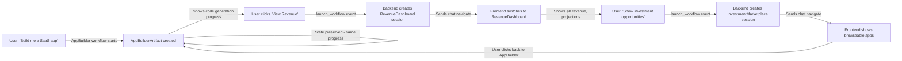

# Interactive Artifacts System

**Status**: ✅ Implemented (Backend + Tests Complete)  
**Version**: 1.0.0  
**Date**: November 2025

---

## 🎯 What Is This?

**The Big Idea**: MozaiksAI is the world's first AI-driven startup foundry AND investment platform. With one prompt, you can:
- **Build** multiple AI-powered apps simultaneously
- **Invest** in apps created by others on the platform
- **Earn** revenue from your app portfolio
- **Compete** in challenges and competitions
- **Navigate** everything through AI chat that intuitively knows where you are

**Interactive Artifacts** makes this possible by transforming chat from a text generator into a **persistent application platform**. Each "artifact" is a living app (app builder, revenue dashboard, investment portfolio, challenge tracker, etc.) and chat is your intelligent navigator between them.

Instead of:
- Chat generates text → User copies → Context lost → Repeat

We now have:
- Chat creates **living artifact apps** → User interacts directly → AI knows which app you're in → Everything persists → Navigate seamlessly between apps

---

## 🚀 Why This Is A Big Deal for MozaiksAI

### The Platform Vision:
```
User: "Build me a task management SaaS app"
AI: [Creates AppBuilder artifact - live UI showing architecture, features, progress]
AI: [Generates code, deploys automatically]
User: [Clicks "View Revenue Dashboard" button in artifact]
AI: [Navigates to RevenueDashboard artifact - shows $0 today, projected earnings]
User: "Show me apps I can invest in"
AI: [Navigates to InvestmentMarketplace artifact - live list of apps built by others]
User: [Clicks "Invest $100" on someone's e-commerce app]
AI: [Updates InvestmentPortfolio artifact - shows your stake, ROI tracking]
User: "How's my task app doing?"
AI: [Navigates back to RevenueDashboard - now shows $47 revenue from your app]
```

**The Magic**: 
- Chat **knows** whether you're building an app, checking revenue, browsing investments, or tracking a challenge
- You can have **unlimited apps** in progress simultaneously (like browser tabs)
- Each artifact maintains **persistent state** (your app builder progress, revenue history, investment portfolio)
- Navigate between contexts **seamlessly** - AI guides you intelligently
- Apps trigger **new workflows** automatically (build → deploy → revenue tracking → marketplace listing)

---

## 📁 Documentation Structure

```
docs/interactive-artifacts/
├── README.md                          (You are here - Overview)
├── 01-CONCEPTS.md                     (Core concepts & terminology)
├── 02-ARCHITECTURE.md                 (System design & data flow)
├── 03-BACKEND-INTEGRATION.md          (How to use session_manager)
├── 04-FRONTEND-INTEGRATION.md         (How to wire React UI)
├── 05-EXAMPLES.md                     (Real-world use cases)
├── 06-TROUBLESHOOTING.md              (Common issues & debugging)
└── diagrams/
    ├── session-lifecycle.svg          (Session pause/resume flow)
    ├── artifact-navigation.svg        (Multi-workflow navigation)
    └── data-model.svg                 (Collections & relationships)
```

---

## 🎓 Quick Start (5-Minute Version)

### What You Need to Know:

1. **WorkflowSession** = A chat conversation in a specific context (building an app, checking revenue, browsing investments)
   - Status: IN_PROGRESS or COMPLETED
   - Multiple IN_PROGRESS sessions can coexist (like browser tabs)

2. **ArtifactInstance** = A persistent app/UI component with state
   - Examples: AppBuilderArtifact (shows code generation progress), RevenueDashboard (shows earnings)
   - InvestmentPortfolio (shows your stakes), ChallengeTracker (shows competition progress)
   - State persists across sessions (your app builder doesn't reset when you check revenue)

3. **Session Manager** = Backend service managing session lifecycle and artifact persistence
   - Creates new sessions when AI navigates you to a new context
   - Maintains artifact state across workflow switches

4. **Artifact Actions** = Events from frontend that trigger navigation/state updates
   - `launch_workflow` - User clicks "View Revenue" button in app builder artifact
   - `update_state` - User marks a challenge step complete in challenge tracker artifact
   - Custom actions - "Invest $100", "Deploy App", "Start Challenge"

### The Flow (Real Platform Example):



**Key Insight**: Chat knows where you are. Say "How's my revenue?" and it understands you're asking about YOUR apps, not the marketplace.

### Files You'll Work With:

**Backend**:
- `core/workflow/session_manager.py` - Session/artifact CRUD (create sessions for app builder, revenue, investments, etc.)
- `core/transport/simple_transport.py` - `_handle_artifact_action()` routes navigation events
- `core/workflow/dependencies.py` - Validates prerequisites (e.g., can't view revenue until app is deployed)

**Frontend** (you'll need to add):
- Artifact components with menu/actions
- `sendArtifactAction()` function
- `chat.navigate` event handler
- Session switcher UI

---

## 📊 Key Metrics (What This Enables)

| Capability | Before | After |
|-----------|--------|-------|
| **Multi-App Management** | Build one app at a time | Build unlimited apps simultaneously |
| **Context Awareness** | AI forgets where you are | AI knows "you're in revenue dashboard" vs "building an app" |
| **State Persistence** | Lose progress on refresh | All apps maintain state permanently |
| **Navigation** | Manual context switching | AI guides you intelligently between apps |
| **Investment Flow** | N/A | Browse apps → invest → track ROI seamlessly |
| **Revenue Tracking** | N/A | Real-time earnings across your app portfolio |
| **Challenge Progress** | N/A | Multi-step challenges maintain progress state |

---

## 🔗 Collections (MongoDB)

### WorkflowSessions
Tracks each context the user is working in (building an app, checking revenue, browsing investments, etc.)

```json
{
  "_id": "chat_appbuilder_001",
  "app_id": "ent-001",  // User's account
  "user_id": "user-456",
  "workflow_name": "AppBuilder",  // AppBuilder | RevenueDashboard | InvestmentMarketplace | ChallengeTracker
  "status": "IN_PROGRESS",  // IN_PROGRESS | COMPLETED
  "artifact_instance_id": "artifact_taskapp_123",  // Links to the persistent app artifact
  "created_at": 1699564800.0,
  "updated_at": 1699568400.0
}
```

**Note**: Multiple sessions can be `IN_PROGRESS` simultaneously. Users can switch between them freely — no need for a "PAUSED" state!

### ArtifactInstances
The persistent apps themselves — each maintains its own state

```json
{
  "_id": "artifact_taskapp_123",
  "app_id": "ent-001",
  "workflow_name": "AppBuilder",
  "artifact_type": "AppBuilderArtifact",
  "state": {
    "app_name": "TaskMaster SaaS",
    "architecture": "Next.js + Supabase",
    "features": ["auth", "tasks", "teams"],
    "build_progress": 67,  // Percentage complete
    "deployment_status": "staging",
    "revenue_to_date": 47.32
  },
  "last_active_chat_id": "chat_appbuilder_001",
  "created_at": 1699564800.0,
  "updated_at": 1699568400.0
}
```

**Example Artifact Types**:
- `AppBuilderArtifact` - Shows code gen progress, architecture decisions, deployment status
- `RevenueDashboard` - Real-time earnings, costs, ROI across all your apps
- `InvestmentPortfolio` - Apps you've invested in, your stakes, returns
- `InvestmentMarketplace` - Browse/search apps built by others
- `ChallengeTracker` - Competition progress, leaderboard, submission status

### WorkflowDependencies
```json
{
  "_id": "ent-001",
  "app_id": "ent-001",
  "workflows": {
    "Generator": {
      "dependencies": null,
      "provides": {
        "context_vars": ["action_plan", "generated_files"],
        "artifacts": ["ActionPlan"]
      }
    },
    "Build": {
      "dependencies": {
        "required_workflows": [{"workflow": "Generator", "status": "COMPLETED"}],
        "required_context_vars": ["generated_files"],
        "required_artifacts": [{"artifact_type": "ActionPlan", "source_workflow": "Generator"}]
      },
      "provides": {
        "context_vars": ["build_output"],
        "artifacts": ["BuilderDashboard"]
      }
    }
  }
}
```

---

## 🎬 Next Steps

1. **Read the concepts** → [`01-CONCEPTS.md`](./01-CONCEPTS.md) - Understand sessions, artifacts, lifecycle
2. **Study the architecture** → [`02-ARCHITECTURE.md`](./02-ARCHITECTURE.md) - See how pieces fit together
3. **Backend integration** → [`03-BACKEND-INTEGRATION.md`](./03-BACKEND-INTEGRATION.md) - Use session_manager in your code
4. **Frontend integration** → [`04-FRONTEND-INTEGRATION.md`](./04-FRONTEND-INTEGRATION.md) - Wire up React components
5. **See examples** → [`05-EXAMPLES.md`](./05-EXAMPLES.md) - Real-world patterns

---

## 🧪 Testing Status

| Component | Tests | Status |
|-----------|-------|--------|
| **Session Manager** | 7 tests | ✅ All passing |
| **Dependency Graph Extraction** | 3 tests | ✅ All passing |
| **WebSocket Handler** | Integration tests | ⏳ Manual testing needed |
| **Frontend Integration** | E2E tests | ⏳ Not yet implemented |

---

## 🤝 Support

- **Questions?** → Check [`06-TROUBLESHOOTING.md`](./06-TROUBLESHOOTING.md)
- **Contributing?** → See backend integration guide for adding new artifact types
- **Issues?** → Check logs in `logs/` directory with filter `WS_PREREQS_NOT_MET`, `SESSION_CREATED`, `ARTIFACT_STATE_UPDATED`

---

## 📝 License & Credits

Part of MozaiksAI Runtime (AG2-based multi-agent execution layer)  
© 2025 BlocUnited LLC
