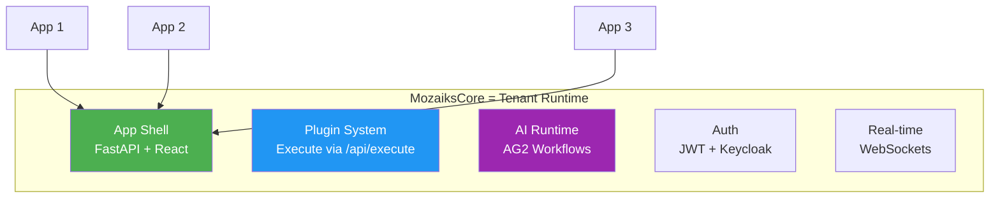
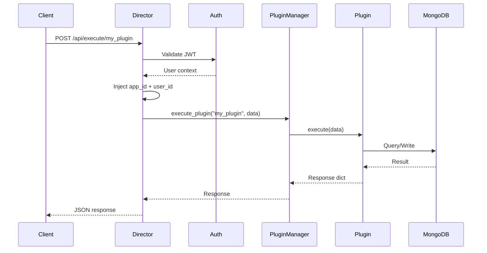
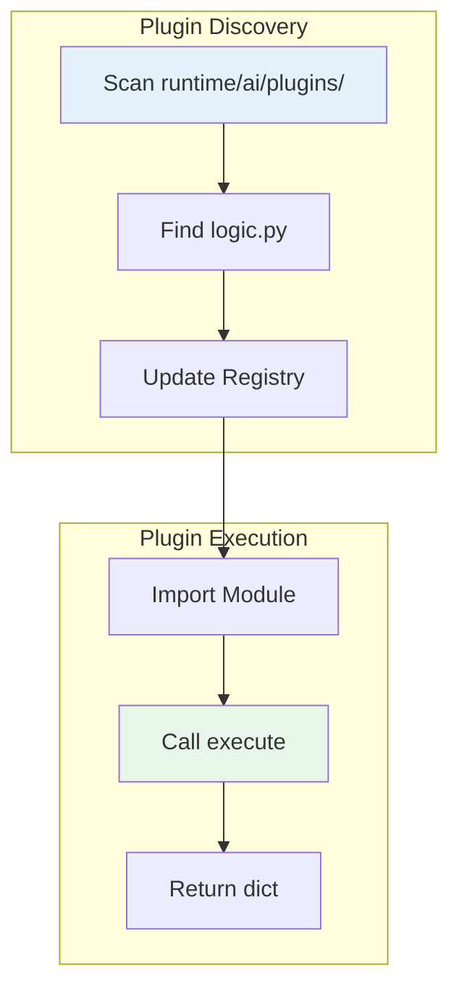
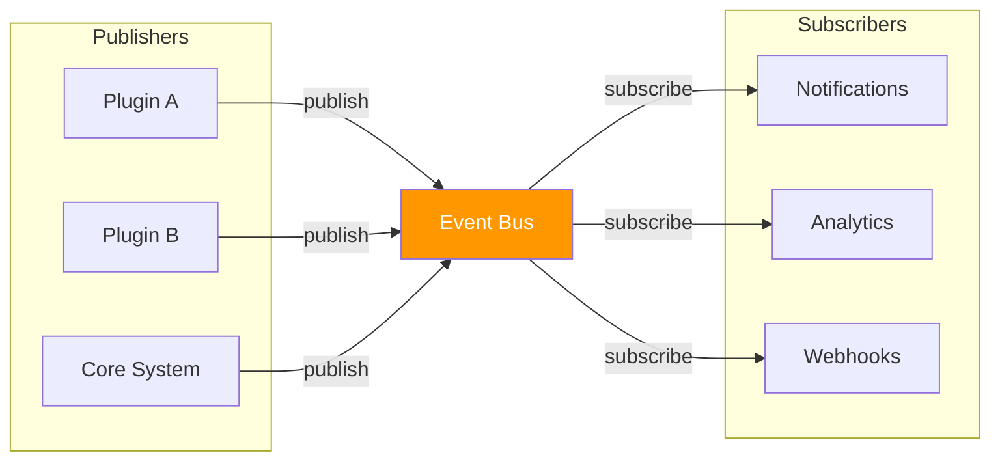
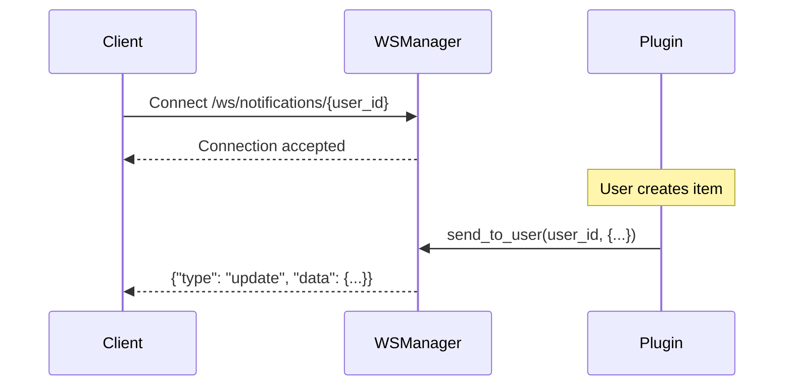
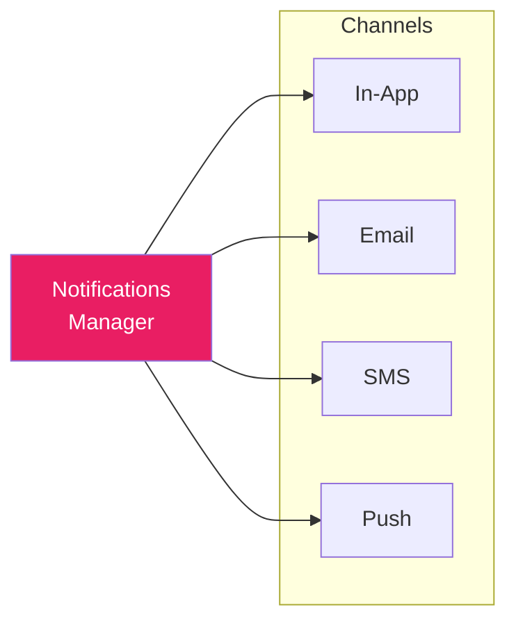
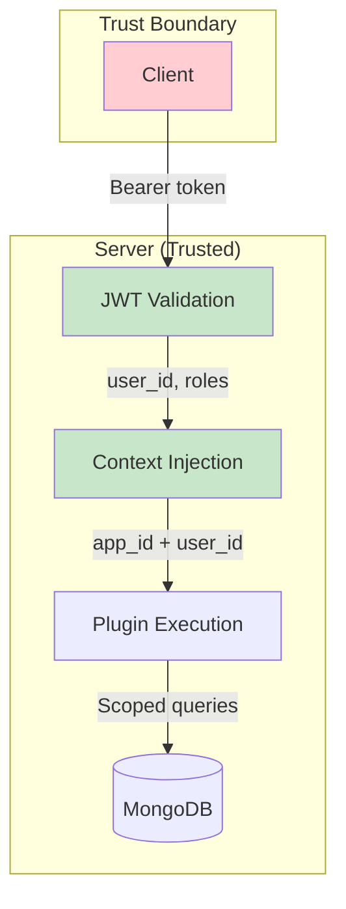

# 🏗️ Core System Architecture

> **MozaiksCore** is the open-source tenant runtime — an app scaffold with authentication, routing, subscriptions, plugins, and integrated AI.

---

## 📍 What is MozaiksCore?

MozaiksCore is what **apps are built on**. It provides:

- ✅ **App Shell** — FastAPI backend + React frontend skeletons
- ✅ **Plugin Runtime** — Sandboxed plugins register via JSON configs
- ✅ **AI Runtime** — AG2-based agent orchestration
- ✅ **Auth System** — JWT + Keycloak integration
- ✅ **Real-time** — WebSocket notifications
- ✅ **Multi-tenant** — Per-app isolation via `app_id`



---

## 🔀 Request Flow

Every request follows this path through the system:



### 🔐 Security Boundary

The **Director** injects server-derived context that clients **cannot override**:

```python
# This happens automatically - plugins receive:
data = {
    "action": "list",           # ← From client
    "user_id": "abc123",        # ← INJECTED by runtime (from JWT)
    "app_id": "my_app",         # ← INJECTED by runtime (from env)
    "_context": {
        "app_id": "my_app",
        "user_id": "abc123",
        "username": "john",
        "roles": ["user"],
        "is_superadmin": False
    }
}
```

---

## 🧱 Core Components

### 1️⃣ Director (`runtime/ai/core/director.py`)

The **orchestration hub** — routes requests, enforces auth, manages plugins.

```mermaid
graph LR
    REQ[Request] --> DIR[Director]
    DIR --> AUTH{Auth?}
    AUTH -->|Valid| SUB{Subscription?}
    AUTH -->|Invalid| R401[401 Unauthorized]
    SUB -->|Allowed| PM[Plugin Manager]
    SUB -->|Denied| R403[403 Forbidden]
    PM --> PLUGIN[Plugin]
    PLUGIN --> RESP[Response]
    
    style DIR fill:#4caf50,color:#fff
```

**Key Responsibilities:**
- Route `/api/execute/{plugin_name}` requests
- Validate JWT tokens
- Inject `app_id` and `user_id` into requests
- Check subscription access (when MONETIZATION=1)
- Refresh plugins automatically

### 2️⃣ Plugin Manager (`runtime/ai/core/plugin_manager.py`)

The **plugin lifecycle manager** — discovers, loads, executes plugins.



**Key Features:**
- Auto-discovery of plugins in `runtime/ai/plugins/` directory
- Hot-reload in development mode
- Async execution support
- Registry caching (5-minute refresh)

### 3️⃣ Event Bus (`runtime/ai/core/event_bus.py`)

The **pub/sub system** — decoupled communication between components.



**Usage:**
```python
from core.event_bus import event_bus

# Publish an event
event_bus.publish("task_manager:task_created", {
    "user_id": user_id,
    "task_id": task_id
})

# Subscribe to events
@event_bus.subscribe("user:registered")
def handle_new_user(data):
    # Initialize data for new user
    pass
```

### 4️⃣ WebSocket Manager (`runtime/ai/core/websocket_manager.py`)

**Real-time updates** to connected clients.



**Usage:**
```python
from core.websocket_manager import websocket_manager

# Send to specific user
await websocket_manager.send_to_user(user_id, {
    "type": "task_update",
    "action": "created",
    "data": {"task_id": "123", "title": "New task"}
})

# Broadcast to all
await websocket_manager.broadcast({
    "type": "system_announcement",
    "message": "Maintenance in 5 minutes"
})
```

### 5️⃣ Settings Manager (`runtime/ai/core/settings_manager.py`)

**Per-user plugin settings** storage.

```python
from core.settings_manager import settings_manager

# Get settings
settings = await settings_manager.get_plugin_settings(user_id, "my_plugin")

# Save settings
await settings_manager.save_plugin_settings(user_id, "my_plugin", {
    "theme": "dark",
    "notifications": True
})
```

### 6️⃣ Notifications Manager (`runtime/ai/core/notifications_manager.py`)

**Multi-channel notifications** — in-app, email, SMS, push.



**Usage:**
```python
from core.notifications_manager import notifications_manager

await notifications_manager.create_notification(
    user_id=user_id,
    notification_type="task_due",
    title="Task Due Tomorrow",
    message="Your task 'Review PR' is due tomorrow",
    metadata={"task_id": task_id}
)
```

---

## 📁 Directory Structure

```
mozaiks-core/
├── runtime/
│   ├── ai/                      # AI Runtime (FastAPI)
│   │   ├── main.py              # FastAPI entry point
│   │   ├── core/                # Core system modules
│   │   │   ├── director.py      # Request orchestration
│   │   │   ├── plugin_manager.py
│   │   │   ├── event_bus.py
│   │   │   ├── websocket_manager.py
│   │   │   ├── settings_manager.py
│   │   │   ├── notifications_manager.py
│   │   │   ├── subscription_manager.py
│   │   │   └── config/
│   │   │       ├── database.py  # MongoDB connection
│   │   │       └── config_loader.py
│   │   ├── plugins/             # Plugin directory
│   │   │   └── PLUGIN_CONTRACT.md
│   │   ├── app/
│   │   │   └── connectors/      # HTTP clients for external APIs
│   │   └── security/
│   │       └── auth.py          # JWT validation
│   ├── plugin-host/             # Plugin execution host (optional)
│   └── packages/
│       └── shell/               # React frontend
├── backend/                     # .NET services (Billing, Identity)
└── docs/                        # Documentation (you are here)
```

---

## 🔧 Configuration Files

All configs live in `MOZAIKS_CONFIGS_PATH` (defaults to `runtime/ai/core/config/`):

| File | Purpose |
|------|---------|
| `plugin_registry.json` | Auto-generated list of discovered plugins |
| `navigation_config.json` | Sidebar menu items |
| `subscription_config.json` | Tier → plugin access mapping |
| `settings_config.json` | User settings schema |
| `notifications_config.json` | Notification types & templates |
| `theme_config.json` | UI theme variables |

---

## 🌍 Environment Variables

| Variable | Required | Description |
|----------|----------|-------------|
| `MOZAIKS_APP_ID` | Production | Unique app identifier |
| `DATABASE_URI` | Yes | MongoDB connection string |
| `JWT_SECRET` | Yes | JWT signing key |
| `ENV` | No | `development` or `production` |
| `MONETIZATION` | No | `0` (free) or `1` (paid tiers) |
| `MOZAIKS_MANAGED` | No | `true` if hosted on Mozaiks platform |

---

## 🔒 Security Model



**Key Principles:**

1. **Never trust client-provided IDs** — `user_id` and `app_id` are always server-derived
2. **Scope all queries by user** — Plugins must include `user_id` in all database queries
3. **Validate input** — Check required fields before database operations
4. **Return errors, don't throw** — Plugins return `{"error": "..."}` instead of raising exceptions

---

## 🔗 Next Steps

- 📖 [Plugin System](./plugins.md) — How to create plugins
- 🗄️ [Database](./database.md) — MongoDB collections and patterns
- 🔐 [Authentication](./authentication.md) — JWT and Keycloak flow
- 📡 [Events](./events.md) — Event bus patterns
