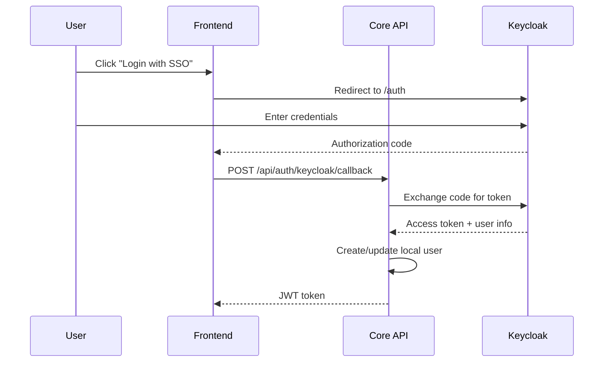

# 🔐 Authentication

> MozaiksCore uses **JWT tokens** for authentication, with optional **Keycloak** integration for enterprise SSO.

---

## 🔄 Auth Flow


---

## 🎫 JWT Token Structure

```json
{
  "header": {
    "alg": "HS256",
    "typ": "JWT"
  },
  "payload": {
    "user_id": "abc123",
    "username": "john_doe",
    "email": "john@example.com",
    "roles": ["user", "admin"],
    "app_id": "my_app",
    "iat": 1697356800,
    "exp": 1697443200
  }
}
```

### Key Claims

| Claim | Description |
|-------|-------------|
| `user_id` | Unique user identifier |
| `username` | Display username |
| `email` | User's email |
| `roles` | Array of role strings |
| `app_id` | App this token is valid for |
| `iat` | Issued at timestamp |
| `exp` | Expiration timestamp |

---

## 🔧 Configuration

### Environment Variables

```env
# JWT Configuration
JWT_SECRET=your-secret-key-min-32-chars
JWT_ALGORITHM=HS256
JWT_EXPIRATION_HOURS=24

# Keycloak (Optional)
KEYCLOAK_ENABLED=true
KEYCLOAK_SERVER_URL=https://auth.example.com
KEYCLOAK_REALM=my-realm
KEYCLOAK_CLIENT_ID=my-app
KEYCLOAK_CLIENT_SECRET=secret
```

---

## 📡 Auth Endpoints

### `POST /api/auth/login`

Login with username/password.

**Request:**
```json
{
    "username": "john_doe",
    "password": "secret123"
}
```

**Response:**
```json
{
    "access_token": "eyJhbGciOiJIUzI1NiIs...",
    "token_type": "bearer",
    "expires_in": 86400,
    "user": {
        "user_id": "abc123",
        "username": "john_doe",
        "email": "john@example.com",
        "roles": ["user"]
    }
}
```

### `POST /api/auth/register`

Register new user.

**Request:**
```json
{
    "username": "new_user",
    "email": "new@example.com",
    "password": "secret123"
}
```

**Response:**
```json
{
    "success": true,
    "user_id": "def456",
    "message": "Registration successful"
}
```

### `POST /api/auth/refresh`

Refresh expiring token.

**Request:**
```json
{
    "refresh_token": "..."
}
```

### `GET /api/auth/me`

Get current user info.

**Headers:**
```
Authorization: Bearer {token}
```

**Response:**
```json
{
    "user_id": "abc123",
    "username": "john_doe",
    "email": "john@example.com",
    "roles": ["user"],
    "subscription": {
        "tier": "premium",
        "expires_at": "2026-01-01"
    }
}
```

---

## 🛡️ Protecting Routes

### In FastAPI (Backend)

```python
from security.authentication import get_current_user
from fastapi import Depends

@app.get("/api/protected")
async def protected_route(user: dict = Depends(get_current_user)):
    return {"message": f"Hello, {user['username']}!"}
```

### How It Works


### The `get_current_user` Function

```python
# security/authentication.py

async def get_current_user(
    authorization: str = Header(None)
) -> dict:
    """Extract and validate user from JWT token."""
    
    if not authorization:
        raise HTTPException(401, "Missing authorization header")
    
    if not authorization.startswith("Bearer "):
        raise HTTPException(401, "Invalid token format")
    
    token = authorization[7:]  # Remove "Bearer "
    
    try:
        payload = jwt.decode(token, JWT_SECRET, algorithms=[JWT_ALGORITHM])
        
        return {
            "user_id": payload["user_id"],
            "username": payload.get("username"),
            "email": payload.get("email"),
            "roles": payload.get("roles", []),
            "is_superadmin": "superadmin" in payload.get("roles", [])
        }
        
    except jwt.ExpiredSignatureError:
        raise HTTPException(401, "Token expired")
    except jwt.InvalidTokenError:
        raise HTTPException(401, "Invalid token")
```

---

## 👥 Role-Based Access

### Available Roles

| Role | Description |
|------|-------------|
| `user` | Default role, basic access |
| `admin` | App admin, can manage users |
| `superadmin` | Platform admin, full access |

### Checking Roles in Plugins

```python
async def execute(data: dict) -> dict:
    context = data["_context"]
    
    # Check specific role
    if "admin" not in context["roles"]:
        return {"error": "Admin access required"}
    
    # Check superadmin
    if not context["is_superadmin"]:
        return {"error": "Superadmin access required"}
    
    # Proceed with action...
```

### Role Middleware (Optional)

```python
from functools import wraps

def require_role(role: str):
    def decorator(func):
        @wraps(func)
        async def wrapper(data: dict):
            if role not in data["_context"]["roles"]:
                return {"error": f"Role '{role}' required"}
            return await func(data)
        return wrapper
    return decorator

# Usage
@require_role("admin")
async def admin_action(data: dict) -> dict:
    # Only admins reach here
    pass
```

---

## 🔗 Keycloak Integration

For enterprise SSO:



### Keycloak Setup

1. Create realm in Keycloak admin
2. Create client with `confidential` access type
3. Configure redirect URIs
4. Set environment variables

---

## ⚠️ Security Best Practices

### ✅ Do

- Use HTTPS in production
- Set short token expiration (24h or less)
- Rotate `JWT_SECRET` periodically
- Validate token on every request
- Log auth failures for monitoring

### ❌ Don't

- Store tokens in localStorage (use httpOnly cookies)
- Include sensitive data in JWT payload
- Use weak secrets
- Trust client-provided user_id

---

## 🔗 Related

- 🏗️ [Architecture](./architecture.md) — System overview
- 📡 [Core API](../api/core-api.md) — All endpoints
- 🌍 [Environment Variables](../reference/environment-variables.md)
