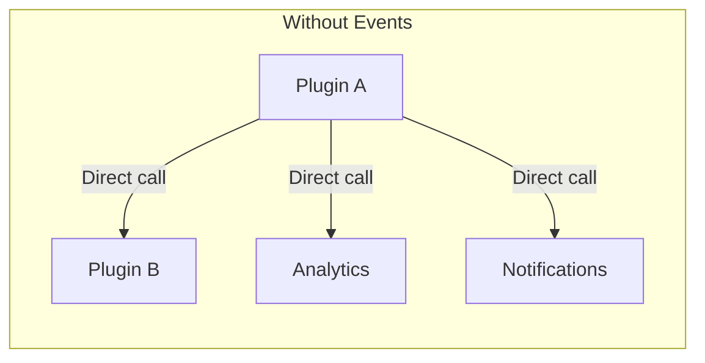
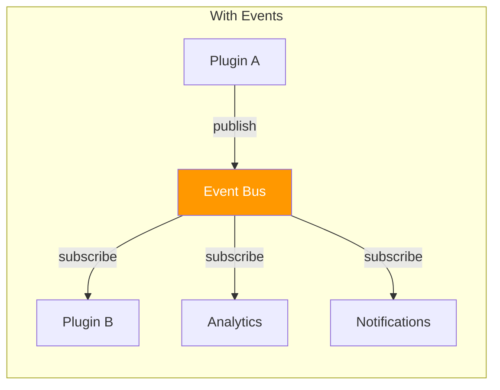
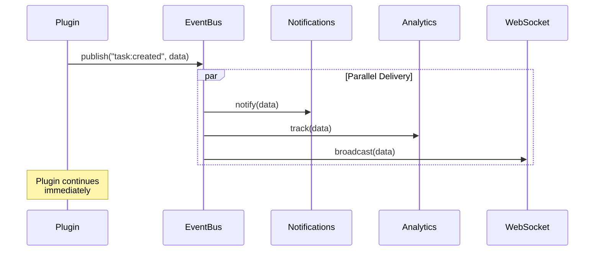

# 📡 Event Bus

> The Event Bus enables **decoupled communication** between plugins and core components via publish/subscribe patterns.

---

## 🎯 Why Events?





**Benefits:**
- ✅ Plugins don't need to know about each other
- ✅ Easy to add new subscribers
- ✅ Async processing doesn't block main flow
- ✅ Built-in retry and error handling

---

## 📤 Publishing Events

```python
from core.event_bus import event_bus

# Basic publish
event_bus.publish("task_manager:task_created", {
    "user_id": user_id,
    "task_id": task_id,
    "title": "New Task"
})
```

### Event Naming Convention

```
{source}:{action}
```

| Pattern | Example | Description |
|---------|---------|-------------|
| `plugin:action` | `task_manager:task_created` | Plugin-specific event |
| `core:action` | `user:registered` | Core system event |
| `system:action` | `system:startup` | Infrastructure event |

### Common Events

| Event | Payload | Description |
|-------|---------|-------------|
| `user:registered` | `{user_id, email}` | New user created |
| `user:login` | `{user_id}` | User logged in |
| `subscription:updated` | `{user_id, tier}` | Subscription changed |
| `plugin_executed` | `{plugin, user, time}` | Plugin was called |

---

## 📥 Subscribing to Events

### Function Decorator

```python
from core.event_bus import event_bus

@event_bus.subscribe("user:registered")
async def handle_new_user(data):
    user_id = data["user_id"]
    # Initialize default settings for new user
    await settings_manager.save_plugin_settings(
        user_id, 
        "my_plugin", 
        {"initialized": True}
    )
```

### Manual Subscribe

```python
def my_handler(data):
    print(f"Event received: {data}")

event_bus.subscribe("task_manager:task_created", my_handler)
```

### Unsubscribe

```python
event_bus.unsubscribe("task_manager:task_created", my_handler)
```

---

## 🔄 Event Flow



---

## 🎨 Practical Examples

### Example 1: Task Completion Notification

```python
# In task_manager/logic.py
async def complete_task(user_id: str, task_id: str):
    # Update task status
    await collection.update_one(
        {"_id": ObjectId(task_id), "user_id": user_id},
        {"$set": {"status": "done"}}
    )
    
    # Publish event (fire and forget)
    event_bus.publish("task_manager:task_completed", {
        "user_id": user_id,
        "task_id": task_id
    })
    
    return {"success": True}
```

```python
# In notifications handler (could be anywhere)
@event_bus.subscribe("task_manager:task_completed")
async def notify_task_complete(data):
    await notifications_manager.create_notification(
        user_id=data["user_id"],
        notification_type="task_complete",
        title="Task Completed! 🎉",
        message="Great job finishing your task!"
    )
```

### Example 2: Cross-Plugin Communication

```python
# Plugin A publishes
event_bus.publish("calendar:event_created", {
    "user_id": user_id,
    "event_id": event_id,
    "date": "2025-10-20"
})

# Plugin B (task_manager) subscribes
@event_bus.subscribe("calendar:event_created")
async def create_reminder_task(data):
    # Auto-create a task for calendar events
    await db["task_manager_tasks"].insert_one({
        "user_id": data["user_id"],
        "title": f"Prepare for event on {data['date']}",
        "source": "calendar",
        "source_id": data["event_id"]
    })
```

### Example 3: Analytics Tracking

```python
# Subscribe to all plugin executions
@event_bus.subscribe("plugin_executed")
async def track_usage(data):
    await db["analytics_events"].insert_one({
        "event": "plugin_executed",
        "plugin": data["plugin"],
        "user_id": data["user"],
        "execution_time": data["execution_time"],
        "timestamp": datetime.utcnow()
    })
```

---

## ⚙️ Advanced Features

### Event History

```python
# Get recent events of a type
history = event_bus.get_history("task_manager:task_created", limit=10)
# Returns: [{"timestamp": ..., "data": {...}}, ...]
```

### Statistics

```python
stats = event_bus.get_stats()
# Returns:
# {
#     "events_published": 1250,
#     "events_delivered": 3750,
#     "delivery_failures": 2,
#     "events_by_type": {
#         "task_manager:task_created": 100,
#         "user:login": 500,
#         ...
#     }
# }
```

### Async vs Sync Handlers

```python
# Async handler (recommended)
@event_bus.subscribe("my_event")
async def async_handler(data):
    await some_async_operation()

# Sync handler (also supported)
@event_bus.subscribe("my_event")
def sync_handler(data):
    some_sync_operation()
```

---

## ⚠️ Best Practices

### ✅ Do

```python
# ✅ Use descriptive event names
event_bus.publish("task_manager:task_marked_complete", {...})

# ✅ Include enough context
event_bus.publish("task:created", {
    "user_id": user_id,
    "task_id": task_id,
    "title": title,
    "created_at": datetime.utcnow().isoformat()
})

# ✅ Handle errors in subscribers
@event_bus.subscribe("my_event")
async def safe_handler(data):
    try:
        await do_something(data)
    except Exception as e:
        logger.error(f"Handler error: {e}")
```

### ❌ Don't

```python
# ❌ Don't use vague names
event_bus.publish("update", {...})

# ❌ Don't include sensitive data
event_bus.publish("user:login", {
    "user_id": user_id,
    "password": password  # ❌ NEVER!
})

# ❌ Don't block in handlers
@event_bus.subscribe("my_event")
def blocking_handler(data):
    time.sleep(10)  # ❌ Blocks event processing
```

---

## 🔗 Related

- 🔌 [Plugin System](./plugins.md) — Using events in plugins
- 🔔 [Notifications](./notifications.md) — Notification events
- 📡 [WebSockets](./websockets.md) — Real-time events
