# 🔔 Notifications

> Multi-channel notification system — in-app, email, SMS, and push notifications.

---

## 📊 Architecture

```mermaid
graph TB
    subgraph "Notification Sources"
        PLUGIN[Plugin]
        SYSTEM[System]
        SCHEDULE[Scheduler]
    end
    
    NM[Notifications<br/>Manager]
    
    subgraph "Channels"
        INAPP[📱 In-App]
        EMAIL[📧 Email]
        SMS[📱 SMS]
        PUSH[🔔 Push]
    end
    
    subgraph "Delivery"
        DB[(MongoDB)]
        WS[WebSocket]
        EXT[External Services]
    end
    
    PLUGIN --> NM
    SYSTEM --> NM
    SCHEDULE --> NM
    
    NM --> INAPP
    NM --> EMAIL
    NM --> SMS
    NM --> PUSH
    
    INAPP --> DB
    INAPP --> WS
    EMAIL --> EXT
    SMS --> EXT
    PUSH --> EXT
    
    style NM fill:#e91e63,color:#fff
```



---

## 🚀 Quick Start

```python
from core.notifications_manager import notifications_manager

# Send a simple notification
await notifications_manager.create_notification(
    user_id=user_id,
    notification_type="task_reminder",
    title="Task Due Soon! ⏰",
    message="Your task 'Review PR' is due in 1 hour",
    metadata={"task_id": task_id}
)
```

---

## 📤 Creating Notifications

### Basic Notification

```python
await notifications_manager.create_notification(
    user_id="user_123",
    notification_type="my_plugin_alert",
    title="Action Complete",
    message="Your request has been processed successfully.",
    metadata={
        "item_id": "abc123",
        "action": "created"
    }
)
```

### With Channel Selection

```python
await notifications_manager.create_notification(
    user_id="user_123",
    notification_type="urgent_alert",
    title="Urgent: Action Required",
    message="Please review immediately",
    channels=["in_app", "email", "push"],  # Specify channels
    metadata={"priority": "high"}
)
```

### Parameters

| Parameter | Type | Required | Description |
|-----------|------|----------|-------------|
| `user_id` | str | ✅ | Target user |
| `notification_type` | str | ✅ | Type (for templates/prefs) |
| `title` | str | ✅ | Notification title |
| `message` | str | ✅ | Notification body |
| `metadata` | dict | ❌ | Extra data (item IDs, etc.) |
| `channels` | list | ❌ | Override default channels |

---

## 📱 Channels

### In-App Notifications

Stored in MongoDB, delivered via WebSocket.


### Email Notifications

Sent via external email service.

```env
EMAIL_SERVICE_URL=https://email.yourservice.com/send
EMAIL_SERVICE_API_KEY=your-api-key
```

### SMS Notifications

Sent via Twilio.

```env
SMS_ACCOUNT_SID=your-twilio-sid
SMS_AUTH_TOKEN=your-twilio-token
SMS_FROM_NUMBER=+1234567890
```

### Push Notifications

Web push via VAPID.

```env
PUSH_VAPID_PUBLIC_KEY=your-public-key
PUSH_VAPID_PRIVATE_KEY=your-private-key
```

---

## ⚙️ Configuration

### Notification Types (`notifications_config.json`)

```json
{
    "categories": [
        {
            "id": "system",
            "name": "System Notifications",
            "types": [
                {
                    "id": "welcome",
                    "label": "Welcome Message",
                    "default_enabled": true,
                    "channels": ["in_app", "email"]
                }
            ]
        }
    ],
    "plugins": {
        "task_manager": {
            "display_name": "Task Manager",
            "notifications": [
                {
                    "id": "task_reminder",
                    "label": "Task Reminders",
                    "description": "Get reminded about upcoming tasks",
                    "default_enabled": true,
                    "channels": ["in_app", "push"]
                },
                {
                    "id": "task_assigned",
                    "label": "Task Assignments",
                    "description": "When someone assigns you a task",
                    "default_enabled": true,
                    "channels": ["in_app", "email"]
                }
            ]
        }
    }
}
```

### Templates (`notification_templates.json`)

```json
{
    "templates": {
        "task_reminder": {
            "in_app": {
                "title": "{{title}}",
                "body": "{{message}}"
            },
            "email": {
                "subject": "⏰ {{title}}",
                "text_body": "Hi {{username}},\n\n{{message}}\n\nBest,\nYour App"
            },
            "push": {
                "title": "{{title}}",
                "body": "{{message}}"
            }
        }
    }
}
```

---

## 👤 User Preferences

Users can control which notifications they receive:

```python
# Get user's preferences
prefs = await notifications_manager.get_user_notification_preferences(user_id)
# Returns:
# {
#     "email_enabled": True,
#     "push_enabled": True,
#     "types": {
#         "task_reminder": {"enabled": True, "channels": ["in_app", "push"]},
#         "task_assigned": {"enabled": False}
#     }
# }

# Update preferences
await notifications_manager.update_notification_preferences(
    user_id,
    {
        "task_reminder": {"enabled": True, "channels": ["in_app"]},
        "marketing": {"enabled": False}
    }
)
```

---

## 📡 Admin Broadcasting

Send notifications to multiple users:

```python
from core.notifications import broadcast_service

# Broadcast to all users
await broadcast_service.broadcast(
    notification_type="announcement",
    title="🎉 New Feature Available!",
    message="Check out our latest update.",
    target={"type": "all"},
    channels=["in_app"]
)

# Target specific subscription tier
await broadcast_service.broadcast(
    notification_type="premium_feature",
    title="Premium Feature Unlocked",
    message="As a premium user, you now have access to...",
    target={"type": "subscription", "tier": "premium"},
    channels=["in_app", "email"]
)
```

---

## ⏰ Scheduled Notifications

```python
from core.notifications import digest_scheduler
from datetime import datetime, timedelta

# Schedule for later
await digest_scheduler.schedule_notification(
    user_id="user_123",
    notification_type="reminder",
    title="Reminder",
    message="Don't forget about your task!",
    scheduled_for=datetime.utcnow() + timedelta(hours=24)
)
```

---

## 📊 Notification API Endpoints

### User Endpoints

| Endpoint | Method | Description |
|----------|--------|-------------|
| `/api/notifications` | GET | List user's notifications |
| `/api/notifications/{id}/read` | POST | Mark as read |
| `/api/notifications/read-all` | POST | Mark all as read |
| `/api/notifications/{id}` | DELETE | Delete notification |
| `/api/notifications/preferences` | GET | Get preferences |
| `/api/notifications/preferences` | PUT | Update preferences |

### Admin Endpoints

| Endpoint | Method | Description |
|----------|--------|-------------|
| `/__mozaiks/admin/notifications/broadcast` | POST | Send broadcast |
| `/__mozaiks/admin/notifications/broadcasts` | GET | List broadcasts |
| `/__mozaiks/admin/notifications/channels` | GET | Channel status |

---

## 🎨 Frontend Integration

### WebSocket Listener

```javascript
// Connect to notifications WebSocket
const ws = new WebSocket(`ws://localhost:8000/ws/notifications/${userId}`);

ws.onmessage = (event) => {
    const notification = JSON.parse(event.data);
    
    if (notification.type === "notification") {
        // Show toast
        showToast(notification.data.title, notification.data.message);
        
        // Update badge count
        updateNotificationBadge();
    }
};
```

### Fetching Notifications

```javascript
const response = await fetch('/api/notifications', {
    headers: { 'Authorization': `Bearer ${token}` }
});

const { notifications, unread_count } = await response.json();
```

---

## 🔗 Related

- 📡 [Events](./events.md) — Event-driven notifications
- 📡 [WebSockets](./websockets.md) — Real-time delivery
- 🔌 [Plugin System](./plugins.md) — Notifications in plugins
