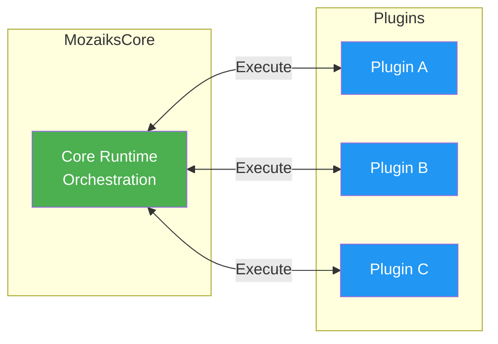

# 🔌 Plugin System
> **Doc Status:** authoritative (platform depends on this doc)

> Plugins are the **primary way to add features** to MozaiksCore apps. They're sandboxed, self-contained, and integrate via configuration.

---

## 🎯 Philosophy



**Design Principles:**

1. ✅ **Self-contained** — Plugins don't depend on each other
2. ✅ **Config-driven** — Register via JSON, not code changes
3. ✅ **Sandboxed** — Each plugin has isolated state
4. ✅ **Async-first** — All operations are async
5. ✅ **Error-safe** — Return dicts, never raise exceptions

---

## 📁 Plugin Structure

```
runtime/ai/plugins/
└── my_plugin/
    ├── __init__.py           # Required (can be empty)
    ├── logic.py              # Required: Main entry point
    └── backend/              # Alternative location
        └── logic.py          # If not in root
```

**Minimum required:** `__init__.py` + `logic.py`
**Default directory:** `runtime/ai/plugins` (override with `MOZAIKS_PLUGINS_PATH`)

---

## 📝 The Execute Contract

Every plugin has a single entry point:

```python
async def execute(data: dict) -> dict:
    """Main entry point - ALL requests come here."""
```

### Runtime-Injected Fields

These are **always present** and **cannot be faked** by clients:

```python
async def execute(data: dict) -> dict:
    # ✅ ALWAYS present - injected by runtime
    user_id = data["user_id"]      # Authenticated user
    app_id = data["app_id"]        # App instance
    
    # ✅ Full context object
    context = data["_context"]
    # {
    #     "app_id": "my_app",
    #     "user_id": "user_123",
    #     "username": "john",
    #     "roles": ["user", "admin"],
    #     "is_superadmin": False
    # }
    
    # 📥 Client-provided
    action = data.get("action", "")
    # ... other fields ...
```

### Action Routing Pattern

```python
async def execute(data: dict) -> dict:
    action = data.get("action", "")
    user_id = data["user_id"]
    
    if action == "list":
        return await handle_list(user_id, data)
    elif action == "create":
        return await handle_create(user_id, data)
    elif action == "get":
        return await handle_get(user_id, data)
    elif action == "update":
        return await handle_update(user_id, data)
    elif action == "delete":
        return await handle_delete(user_id, data)
    elif action == "get_settings":
        return await handle_get_settings(user_id)
    elif action == "save_settings":
        return await handle_save_settings(user_id, data)
    else:
        return {"error": f"Unknown action: {action}"}
```

---

## 🗄️ Database Access

```python
from core.config.database import db
from bson import ObjectId
```

### CRUD Operations

```python
# Get collection
collection = db["my_plugin_items"]

# 📖 READ - Always scope by user_id!
items = await collection.find({"user_id": user_id}).to_list(100)
item = await collection.find_one({"_id": ObjectId(id), "user_id": user_id})

# ✏️ CREATE
result = await collection.insert_one({
    "user_id": user_id,
    "title": "New Item",
    "created_at": datetime.utcnow().isoformat()
})
new_id = str(result.inserted_id)

# 🔄 UPDATE
await collection.update_one(
    {"_id": ObjectId(id), "user_id": user_id},
    {"$set": {"title": "Updated"}}
)

# 🗑️ DELETE
await collection.delete_one({"_id": ObjectId(id), "user_id": user_id})
```

### ⚠️ Critical Rules

```python
# ✅ CORRECT - Always include user_id
items = await collection.find({"user_id": user_id}).to_list(100)

# ❌ WRONG - Leaks data from other users!
items = await collection.find({}).to_list(100)

# ✅ CORRECT - Convert ObjectId for JSON
item["_id"] = str(item["_id"])

# ❌ WRONG - ObjectId is not JSON serializable
return {"item": item}  # Crashes if _id is ObjectId
```

---

## 📡 Core Integrations

### Event Bus

```python
from core.event_bus import event_bus

# Publish event after action
event_bus.publish("my_plugin:item_created", {
    "user_id": user_id,
    "item_id": item_id
})
```

**Naming convention:** `{plugin_name}:{action_past_tense}`

### WebSocket (Real-time)

```python
from core.websocket_manager import websocket_manager

# Push update to user's connected clients
await websocket_manager.send_to_user(user_id, {
    "type": "my_plugin_update",
    "action": "created",
    "data": {"item_id": item_id}
})
```

### Notifications

```python
from core.notifications_manager import notifications_manager

await notifications_manager.create_notification(
    user_id=user_id,
    notification_type="my_plugin_alert",
    title="Action Complete",
    message="Your item was created successfully",
    metadata={"item_id": item_id}
)
```

### Settings

```python
from core.settings_manager import settings_manager

# Get user's plugin settings
settings = await settings_manager.get_plugin_settings(user_id, "my_plugin")

# Save settings
await settings_manager.save_plugin_settings(user_id, "my_plugin", {
    "theme": "dark",
    "notifications": True
})
```

---

## ❌ Error Handling

**Never raise exceptions** — always return error dicts:

```python
# ❌ WRONG
async def execute(data: dict) -> dict:
    raise ValueError("Something went wrong")  # Causes 500 error

# ✅ CORRECT
async def execute(data: dict) -> dict:
    return {"error": "Something went wrong"}
```

### Error Response Formats

```python
# Simple error
return {"error": "Item not found"}

# With error code (for frontend handling)
return {
    "error": "Item not found",
    "error_code": "NOT_FOUND"
}

# With details
return {
    "error": "Validation failed",
    "error_code": "VALIDATION_ERROR",
    "details": {"field": "title", "message": "Required"}
}
```

### Try-Except Pattern

```python
async def execute(data: dict) -> dict:
    try:
        # Your logic
        return {"success": True, "data": result}
    except ValueError as e:
        logger.warning(f"Validation error: {e}")
        return {"error": str(e), "error_code": "VALIDATION_ERROR"}
    except Exception as e:
        logger.error(f"Unexpected error: {e}", exc_info=True)
        return {"error": "An unexpected error occurred"}
```

---

## 📋 Complete Template

```python
# plugins/my_plugin/logic.py
"""
My Plugin - Description of what this plugin does.

Actions:
  - list: List all items
  - create: Create a new item
  - get: Get single item
  - update: Update item
  - delete: Delete item
  - get_settings: Get plugin settings
  - save_settings: Save plugin settings
"""
import logging
from datetime import datetime
from bson import ObjectId

from core.config.database import db
from core.event_bus import event_bus
from core.websocket_manager import websocket_manager
from core.settings_manager import settings_manager

logger = logging.getLogger("mozaiks_plugins.my_plugin")
COLLECTION = "my_plugin_items"


async def execute(data: dict) -> dict:
    """Main entry point."""
    action = data.get("action", "")
    user_id = data["user_id"]
    
    logger.info(f"Action '{action}' for user {user_id}")
    
    try:
        if action == "list":
            return await handle_list(user_id, data)
        elif action == "create":
            return await handle_create(user_id, data)
        elif action == "get":
            return await handle_get(user_id, data)
        elif action == "update":
            return await handle_update(user_id, data)
        elif action == "delete":
            return await handle_delete(user_id, data)
        elif action == "get_settings":
            return await handle_get_settings(user_id)
        elif action == "save_settings":
            return await handle_save_settings(user_id, data)
        else:
            return {"error": f"Unknown action: {action}"}
    except Exception as e:
        logger.error(f"Error: {e}", exc_info=True)
        return {"error": "An unexpected error occurred"}


async def handle_list(user_id: str, data: dict) -> dict:
    """List items with pagination."""
    collection = db[COLLECTION]
    skip = data.get("skip", 0)
    limit = min(data.get("limit", 50), 100)
    
    items = await collection.find(
        {"user_id": user_id}
    ).skip(skip).limit(limit).to_list(limit)
    
    for item in items:
        item["_id"] = str(item["_id"])
    
    total = await collection.count_documents({"user_id": user_id})
    
    return {"items": items, "count": len(items), "total": total}


async def handle_create(user_id: str, data: dict) -> dict:
    """Create new item."""
    collection = db[COLLECTION]
    
    title = data.get("title", "").strip()
    if not title:
        return {"error": "Title is required", "error_code": "VALIDATION_ERROR"}
    
    doc = {
        "user_id": user_id,
        "title": title,
        "created_at": datetime.utcnow().isoformat(),
        "updated_at": datetime.utcnow().isoformat()
    }
    
    result = await collection.insert_one(doc)
    item_id = str(result.inserted_id)
    
    # Publish event
    event_bus.publish("my_plugin:item_created", {
        "user_id": user_id,
        "item_id": item_id
    })
    
    # Real-time update
    await websocket_manager.send_to_user(user_id, {
        "type": "my_plugin_update",
        "action": "created",
        "data": {"item_id": item_id, "title": title}
    })
    
    return {"success": True, "id": item_id}


async def handle_get(user_id: str, data: dict) -> dict:
    """Get single item."""
    collection = db[COLLECTION]
    item_id = data.get("item_id")
    
    if not item_id:
        return {"error": "item_id is required"}
    
    try:
        item = await collection.find_one({
            "_id": ObjectId(item_id),
            "user_id": user_id
        })
    except Exception:
        return {"error": "Invalid item_id"}
    
    if not item:
        return {"error": "Item not found", "error_code": "NOT_FOUND"}
    
    item["_id"] = str(item["_id"])
    return {"item": item}


async def handle_update(user_id: str, data: dict) -> dict:
    """Update item."""
    collection = db[COLLECTION]
    item_id = data.get("item_id")
    
    if not item_id:
        return {"error": "item_id is required"}
    
    updates = {}
    if "title" in data:
        updates["title"] = data["title"].strip()
    
    if not updates:
        return {"error": "No fields to update"}
    
    updates["updated_at"] = datetime.utcnow().isoformat()
    
    result = await collection.update_one(
        {"_id": ObjectId(item_id), "user_id": user_id},
        {"$set": updates}
    )
    
    if result.matched_count == 0:
        return {"error": "Item not found", "error_code": "NOT_FOUND"}
    
    return {"success": True}


async def handle_delete(user_id: str, data: dict) -> dict:
    """Delete item."""
    collection = db[COLLECTION]
    item_id = data.get("item_id")
    
    if not item_id:
        return {"error": "item_id is required"}
    
    result = await collection.delete_one({
        "_id": ObjectId(item_id),
        "user_id": user_id
    })
    
    if result.deleted_count == 0:
        return {"error": "Item not found", "error_code": "NOT_FOUND"}
    
    event_bus.publish("my_plugin:item_deleted", {
        "user_id": user_id,
        "item_id": item_id
    })
    
    return {"success": True}


async def handle_get_settings(user_id: str) -> dict:
    """Get plugin settings."""
    settings = await settings_manager.get_plugin_settings(user_id, "my_plugin")
    defaults = {"notifications": True, "theme": "auto"}
    return {"settings": {**defaults, **(settings or {})}}


async def handle_save_settings(user_id: str, data: dict) -> dict:
    """Save plugin settings."""
    settings = data.get("settings", {})
    if not isinstance(settings, dict):
        return {"error": "Invalid settings format"}
    
    await settings_manager.save_plugin_settings(user_id, "my_plugin", settings)
    return {"success": True}
```

---

## 🔗 API Endpoint

Plugins are called via:

```
POST /api/execute/{plugin_name}
Authorization: Bearer {jwt_token}
Content-Type: application/json

{
    "action": "list",
    ... action-specific fields ...
}
```

---

## ✅ Checklist

Before deploying your plugin:

- [ ] `logic.py` has `async def execute(data: dict) -> dict`
- [ ] Uses `data["user_id"]` (not `data.get("user_id")`)
- [ ] All DB queries include `user_id` filter
- [ ] ObjectIds converted to strings
- [ ] Returns error dicts, never raises exceptions
- [ ] Proper logging with `mozaiks_plugins.{name}` logger
- [ ] Settings actions implemented (if needed)

---

## 🔗 Next Steps

- 🗄️ [Database](./database.md) — Collections and query patterns
- 📡 [Events](./events.md) — Event bus in depth
- 🔔 [Notifications](./notifications.md) — Multi-channel notifications
- 📡 [WebSockets](./websockets.md) — Real-time updates

