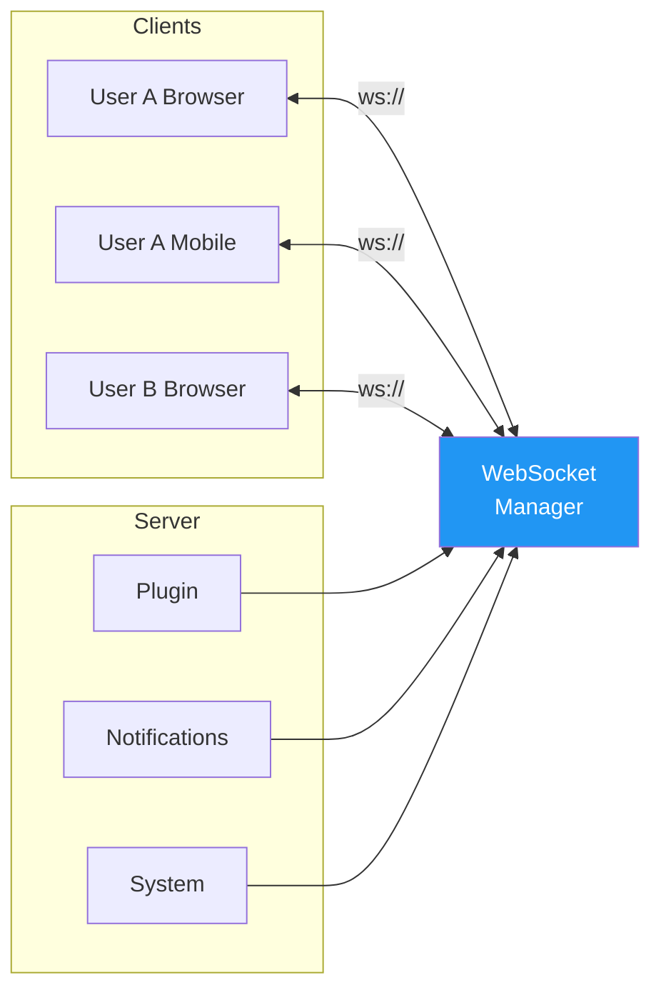
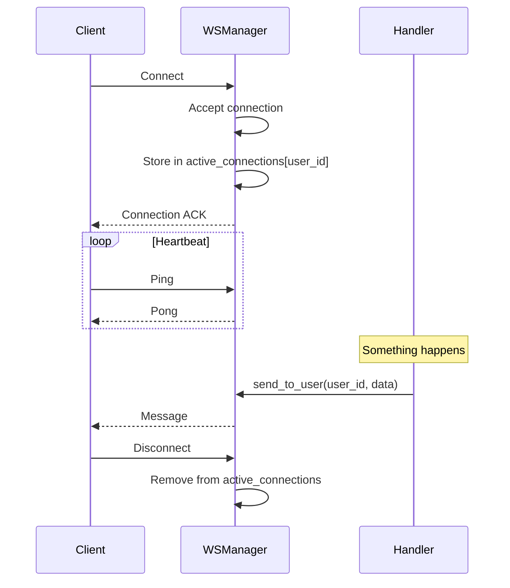
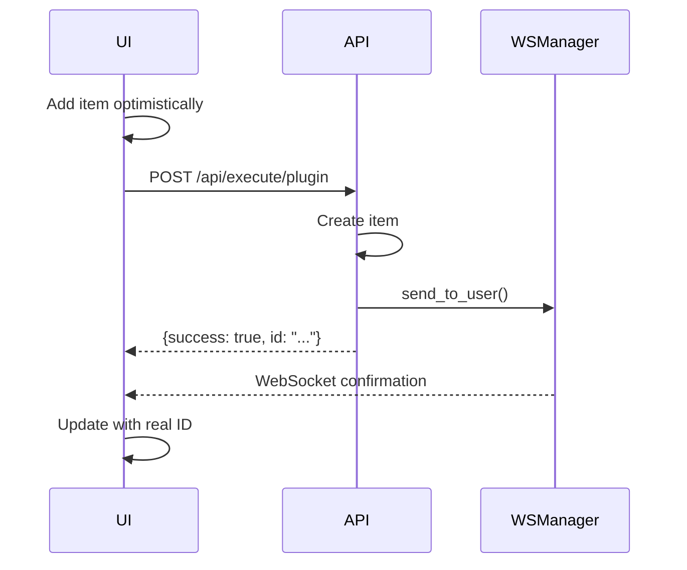

# 📡 WebSockets

> Real-time bidirectional communication between server and clients.

---

## 🎯 Overview



**Use Cases:**
- 🔔 Real-time notifications
- 🔄 Live data updates
- 💬 Chat messages
- 📊 Dashboard refreshes

---

## 🔌 WebSocket Endpoints

### Notifications Channel

```
ws://localhost:8000/ws/notifications/{user_id}
```

Receives:
- New notifications
- System announcements
- Plugin updates

### AI Chat Channel

```
ws://localhost:8000/ws/{workflow}/{app_id}/{chat_id}/{user_id}
```

Receives:
- Agent messages
- Tool outputs
- Streaming tokens

---

## 📤 Sending Messages (Server)

```python
from core.websocket_manager import websocket_manager
```

### Send to Specific User

```python
# Send to all of user's connected clients
await websocket_manager.send_to_user(user_id, {
    "type": "task_update",
    "action": "created",
    "data": {
        "task_id": "abc123",
        "title": "New Task"
    }
})
```

### Broadcast to All Users

```python
# Send to everyone connected
await websocket_manager.broadcast({
    "type": "system_announcement",
    "message": "Scheduled maintenance in 10 minutes"
})
```

---

## 📥 Receiving Messages (Client)

### JavaScript Example

```javascript
class WebSocketClient {
    constructor(userId) {
        this.userId = userId;
        this.ws = null;
        this.reconnectAttempts = 0;
        this.maxReconnectAttempts = 5;
    }
    
    connect() {
        const url = `ws://localhost:8000/ws/notifications/${this.userId}`;
        this.ws = new WebSocket(url);
        
        this.ws.onopen = () => {
            console.log('✅ WebSocket connected');
            this.reconnectAttempts = 0;
        };
        
        this.ws.onmessage = (event) => {
            const message = JSON.parse(event.data);
            this.handleMessage(message);
        };
        
        this.ws.onclose = () => {
            console.log('❌ WebSocket disconnected');
            this.attemptReconnect();
        };
        
        this.ws.onerror = (error) => {
            console.error('WebSocket error:', error);
        };
    }
    
    handleMessage(message) {
        switch (message.type) {
            case 'notification':
                this.showNotification(message.data);
                break;
            case 'task_update':
                this.refreshTaskList();
                break;
            case 'system_announcement':
                this.showAnnouncement(message.message);
                break;
            default:
                console.log('Unknown message type:', message.type);
        }
    }
    
    attemptReconnect() {
        if (this.reconnectAttempts < this.maxReconnectAttempts) {
            this.reconnectAttempts++;
            const delay = Math.min(1000 * Math.pow(2, this.reconnectAttempts), 30000);
            console.log(`Reconnecting in ${delay}ms...`);
            setTimeout(() => this.connect(), delay);
        }
    }
    
    disconnect() {
        if (this.ws) {
            this.ws.close();
        }
    }
}

// Usage
const wsClient = new WebSocketClient('user_123');
wsClient.connect();
```

### React Hook Example

```jsx
import { useEffect, useState, useCallback } from 'react';

function useWebSocket(userId) {
    const [isConnected, setIsConnected] = useState(false);
    const [lastMessage, setLastMessage] = useState(null);
    
    useEffect(() => {
        const ws = new WebSocket(`ws://localhost:8000/ws/notifications/${userId}`);
        
        ws.onopen = () => setIsConnected(true);
        ws.onclose = () => setIsConnected(false);
        ws.onmessage = (event) => {
            setLastMessage(JSON.parse(event.data));
        };
        
        return () => ws.close();
    }, [userId]);
    
    return { isConnected, lastMessage };
}

// Usage in component
function NotificationBell() {
    const { isConnected, lastMessage } = useWebSocket(userId);
    const [count, setCount] = useState(0);
    
    useEffect(() => {
        if (lastMessage?.type === 'notification') {
            setCount(c => c + 1);
            showToast(lastMessage.data.title);
        }
    }, [lastMessage]);
    
    return (
        <div className="notification-bell">
            🔔 {count > 0 && <span className="badge">{count}</span>}
            {!isConnected && <span className="offline">●</span>}
        </div>
    );
}
```

---

## 📝 Message Format

### Standard Message Structure

```json
{
    "type": "event_type",
    "action": "specific_action",
    "data": {
        "...payload..."
    },
    "timestamp": "2025-10-15T10:30:00Z"
}
```

### Common Message Types

| Type | Description | Example Data |
|------|-------------|--------------|
| `notification` | New notification | `{title, message, id}` |
| `task_update` | Task changed | `{task_id, action}` |
| `chat_message` | AI chat message | `{content, agent}` |
| `system_announcement` | System-wide message | `{message}` |
| `connection_ack` | Connection confirmed | `{user_id}` |

---

## 🔄 Connection Lifecycle



---

## 🎨 Plugin Integration

### Sending Updates from Plugins

```python
# In your plugin's logic.py
from core.websocket_manager import websocket_manager

async def handle_create(user_id: str, data: dict) -> dict:
    # Create the item
    result = await collection.insert_one({...})
    item_id = str(result.inserted_id)
    
    # Push real-time update
    await websocket_manager.send_to_user(user_id, {
        "type": "my_plugin_update",
        "action": "created",
        "data": {
            "item_id": item_id,
            "title": data.get("title")
        }
    })
    
    return {"success": True, "id": item_id}
```

### Pattern: Optimistic UI



---

## ⚙️ Server Implementation

```python
# core/websocket_manager.py

from fastapi import WebSocket
from typing import Dict, List

class WebSocketManager:
    def __init__(self):
        # user_id -> list of WebSocket connections
        self.active_connections: Dict[str, List[WebSocket]] = {}
    
    async def connect(self, user_id: str, websocket: WebSocket):
        """Accept and register a WebSocket connection."""
        await websocket.accept()
        
        if user_id not in self.active_connections:
            self.active_connections[user_id] = []
        
        self.active_connections[user_id].append(websocket)
        logger.info(f"User {user_id} connected. Total: {len(self.active_connections[user_id])}")
    
    def disconnect(self, user_id: str, websocket: WebSocket):
        """Remove a WebSocket connection."""
        if user_id in self.active_connections:
            self.active_connections[user_id].remove(websocket)
            
            if not self.active_connections[user_id]:
                del self.active_connections[user_id]
    
    async def send_to_user(self, user_id: str, message: dict):
        """Send message to all of user's connections."""
        connections = self.active_connections.get(user_id, [])
        
        for connection in connections:
            try:
                await connection.send_json(message)
            except Exception as e:
                logger.error(f"Error sending to {user_id}: {e}")
    
    async def broadcast(self, message: dict):
        """Send message to all connected users."""
        for user_id in self.active_connections:
            await self.send_to_user(user_id, message)

# Singleton instance
websocket_manager = WebSocketManager()
```

---

## ⚠️ Best Practices

### ✅ Do

- Implement reconnection logic on client
- Use heartbeats to detect stale connections
- Handle connection errors gracefully
- Keep messages small (< 1MB)
- Authenticate connections

### ❌ Don't

- Send sensitive data without auth
- Keep connections open indefinitely without heartbeat
- Assume messages always arrive
- Send large binary data via WebSocket

---

## 🔗 Related

- 🔔 [Notifications](./notifications.md) — Notification delivery
- 📡 [Events](./events.md) — Server-side events
- 🤖 [AI Runtime Architecture](../ai-runtime/architecture.md) — AI streaming
