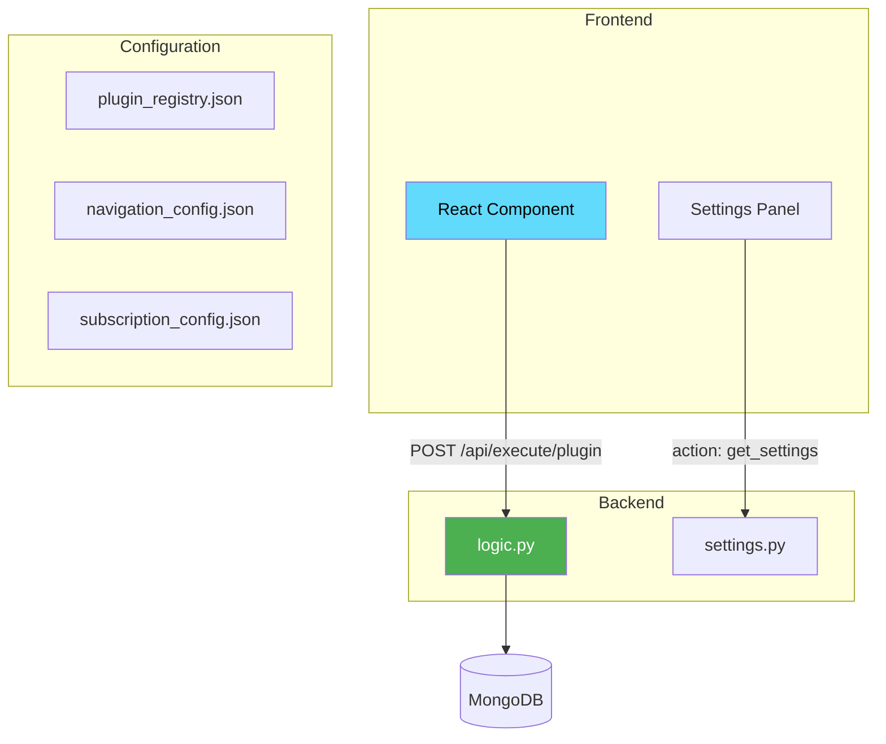

# 🔌 Creating Plugins

> Step-by-step guide to building a plugin for MozaiksCore.

---

## 🎯 What You'll Build

A complete plugin with:
- ✅ Backend logic (Python)
- ✅ Frontend UI (React)
- ✅ Settings panel
- ✅ Navigation integration

---

## 📐 Plugin Architecture



---

## 🛠️ Step 1: Backend

### Create Plugin Directory

```
runtime/ai/plugins/
└── task_manager/
    ├── __init__.py      # Empty, required
    ├── logic.py         # Main entry point
    └── settings.py      # Settings handler
```

### logic.py

```python
"""
Task Manager Plugin
==================

A simple task management plugin demonstrating the plugin contract.
"""
import logging
from datetime import datetime
from bson import ObjectId
from core.config.database import db

logger = logging.getLogger("mozaiks_plugins.task_manager")


async def execute(data: dict) -> dict:
    """
    Main entry point for all plugin requests.
    
    Args:
        data: Request data containing:
            - action: str - The operation to perform
            - user_id: str - Current user (injected by runtime)
            - app_id: str - Current app (injected by runtime)
            - ... other action-specific fields
    
    Returns:
        dict: Response data
    """
    action = data.get("action", "")
    user_id = data.get("user_id", "")
    
    logger.info(f"Task manager action: {action} for user: {user_id}")
    
    # Route to appropriate handler
    handlers = {
        "list": handle_list,
        "create": handle_create,
        "update": handle_update,
        "delete": handle_delete,
        "get_settings": handle_get_settings,
        "save_settings": handle_save_settings,
    }
    
    handler = handlers.get(action)
    if handler:
        return await handler(data, user_id)
    
    return {"error": f"Unknown action: {action}"}


async def handle_list(data: dict, user_id: str) -> dict:
    """List all tasks for the user."""
    collection = db["task_manager_tasks"]
    
    # Optional filters
    status = data.get("status")
    query = {"user_id": user_id}
    if status:
        query["status"] = status
    
    tasks = await collection.find(query).sort("created_at", -1).to_list(100)
    
    # Convert ObjectId to string for JSON
    for task in tasks:
        task["_id"] = str(task["_id"])
    
    return {"tasks": tasks, "count": len(tasks)}


async def handle_create(data: dict, user_id: str) -> dict:
    """Create a new task."""
    collection = db["task_manager_tasks"]
    
    # Validate required fields
    title = data.get("title", "").strip()
    if not title:
        return {"error": "Title is required"}
    
    task = {
        "user_id": user_id,
        "title": title,
        "description": data.get("description", ""),
        "status": "pending",
        "priority": data.get("priority", "medium"),
        "due_date": data.get("due_date"),
        "created_at": datetime.utcnow(),
        "updated_at": datetime.utcnow(),
    }
    
    result = await collection.insert_one(task)
    task["_id"] = str(result.inserted_id)
    
    logger.info(f"Created task {task['_id']} for user {user_id}")
    
    return {"success": True, "task": task}


async def handle_update(data: dict, user_id: str) -> dict:
    """Update an existing task."""
    collection = db["task_manager_tasks"]
    
    task_id = data.get("task_id")
    if not task_id:
        return {"error": "task_id is required"}
    
    # Build update document
    update_fields = {}
    allowed_fields = ["title", "description", "status", "priority", "due_date"]
    
    for field in allowed_fields:
        if field in data:
            update_fields[field] = data[field]
    
    if not update_fields:
        return {"error": "No fields to update"}
    
    update_fields["updated_at"] = datetime.utcnow()
    
    result = await collection.update_one(
        {"_id": ObjectId(task_id), "user_id": user_id},
        {"$set": update_fields}
    )
    
    if result.modified_count == 0:
        return {"error": "Task not found or not modified"}
    
    return {"success": True, "modified": result.modified_count}


async def handle_delete(data: dict, user_id: str) -> dict:
    """Delete a task."""
    collection = db["task_manager_tasks"]
    
    task_id = data.get("task_id")
    if not task_id:
        return {"error": "task_id is required"}
    
    result = await collection.delete_one({
        "_id": ObjectId(task_id),
        "user_id": user_id  # Ensure user owns the task
    })
    
    if result.deleted_count == 0:
        return {"error": "Task not found"}
    
    return {"success": True, "deleted": result.deleted_count}


async def handle_get_settings(data: dict, user_id: str) -> dict:
    """Get plugin settings."""
    from . import settings
    return await settings.get_settings(user_id, data)


async def handle_save_settings(data: dict, user_id: str) -> dict:
    """Save plugin settings."""
    from . import settings
    return await settings.save_settings(user_id, data)
```

### settings.py

```python
"""Task Manager Settings"""
from typing import Dict, Any


async def get_default_settings() -> Dict[str, Any]:
    """Default settings for new users."""
    return {
        "default_priority": "medium",
        "show_completed": True,
        "notifications_enabled": True,
        "reminder_hours": 24,
    }


async def get_settings(user_id: str, data: Dict[str, Any]) -> Dict[str, Any]:
    """Get user's plugin settings."""
    settings_manager = data.get("settings_manager")
    
    if settings_manager:
        saved = await settings_manager.get_plugin_settings(
            user_id, "task_manager"
        )
        if saved:
            return saved
    
    return await get_default_settings()


async def save_settings(user_id: str, data: Dict[str, Any]) -> Dict[str, Any]:
    """Save user's plugin settings."""
    settings_manager = data.get("settings_manager")
    new_settings = data.get("settings", {})
    
    if not settings_manager:
        return {"success": False, "error": "Settings manager unavailable"}
    
    await settings_manager.save_plugin_settings(
        user_id, "task_manager", new_settings
    )
    
    return {"success": True}
```

---

## 🎨 Step 2: Frontend

### Create Plugin Directory

```
runtime/packages/shell/src/plugins/
└── task_manager/
    ├── register.js        # Plugin metadata
    ├── index.jsx          # Main component
    └── settings/
        └── SettingsPanel.jsx
```

### register.js

```javascript
export default {
  name: "task_manager",
  displayName: "Task Manager",
  description: "Manage your tasks and to-dos",
  version: "1.0.0",
  icon: "check-square"
};
```

### index.jsx

```jsx
import React, { useState, useEffect, useCallback } from 'react';
import { useAuth } from '../../core/auth/AuthContext';

const TaskManager = () => {
  const { token } = useAuth();
  const [tasks, setTasks] = useState([]);
  const [loading, setLoading] = useState(true);
  const [newTitle, setNewTitle] = useState('');
  const [filter, setFilter] = useState('all');

  // Fetch tasks
  const fetchTasks = useCallback(async () => {
    try {
      const body = { action: 'list' };
      if (filter !== 'all') {
        body.status = filter;
      }

      const response = await fetch('/api/execute/task_manager', {
        method: 'POST',
        headers: {
          'Content-Type': 'application/json',
          'Authorization': `Bearer ${token}`
        },
        body: JSON.stringify(body)
      });

      const data = await response.json();
      setTasks(data.tasks || []);
    } catch (error) {
      console.error('Failed to fetch tasks:', error);
    } finally {
      setLoading(false);
    }
  }, [token, filter]);

  useEffect(() => {
    fetchTasks();
  }, [fetchTasks]);

  // Create task
  const createTask = async (e) => {
    e.preventDefault();
    if (!newTitle.trim()) return;

    try {
      const response = await fetch('/api/execute/task_manager', {
        method: 'POST',
        headers: {
          'Content-Type': 'application/json',
          'Authorization': `Bearer ${token}`
        },
        body: JSON.stringify({
          action: 'create',
          title: newTitle
        })
      });

      if (response.ok) {
        setNewTitle('');
        fetchTasks();
      }
    } catch (error) {
      console.error('Failed to create task:', error);
    }
  };

  // Toggle task status
  const toggleStatus = async (task) => {
    const newStatus = task.status === 'completed' ? 'pending' : 'completed';

    try {
      await fetch('/api/execute/task_manager', {
        method: 'POST',
        headers: {
          'Content-Type': 'application/json',
          'Authorization': `Bearer ${token}`
        },
        body: JSON.stringify({
          action: 'update',
          task_id: task._id,
          status: newStatus
        })
      });
      fetchTasks();
    } catch (error) {
      console.error('Failed to update task:', error);
    }
  };

  // Delete task
  const deleteTask = async (taskId) => {
    try {
      await fetch('/api/execute/task_manager', {
        method: 'POST',
        headers: {
          'Content-Type': 'application/json',
          'Authorization': `Bearer ${token}`
        },
        body: JSON.stringify({
          action: 'delete',
          task_id: taskId
        })
      });
      fetchTasks();
    } catch (error) {
      console.error('Failed to delete task:', error);
    }
  };

  if (loading) {
    return (
      <div className="p-6 flex items-center justify-center">
        <div className="animate-spin h-8 w-8 border-4 border-accent 
                        border-t-transparent rounded-full"></div>
      </div>
    );
  }

  return (
    <div className="p-6 max-w-4xl mx-auto">
      <h1 className="text-2xl font-bold mb-6">📋 Task Manager</h1>

      {/* Create Form */}
      <form onSubmit={createTask} className="mb-6 flex gap-2">
        <input
          type="text"
          value={newTitle}
          onChange={(e) => setNewTitle(e.target.value)}
          placeholder="Add a new task..."
          className="flex-1 px-4 py-2 bg-secondary border border-border 
                     rounded-lg focus:outline-none focus:ring-2 
                     focus:ring-accent"
        />
        <button
          type="submit"
          className="px-6 py-2 bg-accent text-white rounded-lg 
                     hover:bg-accent-hover transition"
        >
          Add
        </button>
      </form>

      {/* Filters */}
      <div className="mb-4 flex gap-2">
        {['all', 'pending', 'completed'].map((f) => (
          <button
            key={f}
            onClick={() => setFilter(f)}
            className={`px-4 py-1 rounded-full text-sm transition
              ${filter === f 
                ? 'bg-accent text-white' 
                : 'bg-secondary hover:bg-border'}`}
          >
            {f.charAt(0).toUpperCase() + f.slice(1)}
          </button>
        ))}
      </div>

      {/* Task List */}
      <div className="space-y-2">
        {tasks.length === 0 ? (
          <p className="text-text-secondary text-center py-8">
            No tasks yet. Add one above!
          </p>
        ) : (
          tasks.map((task) => (
            <div
              key={task._id}
              className="flex items-center gap-3 p-4 bg-secondary 
                         rounded-lg group"
            >
              <button
                onClick={() => toggleStatus(task)}
                className={`w-6 h-6 rounded-full border-2 flex 
                           items-center justify-center transition
                  ${task.status === 'completed'
                    ? 'bg-green-500 border-green-500 text-white'
                    : 'border-border hover:border-accent'}`}
              >
                {task.status === 'completed' && '✓'}
              </button>

              <span className={`flex-1 ${
                task.status === 'completed' 
                  ? 'line-through text-text-secondary' 
                  : ''
              }`}>
                {task.title}
              </span>

              <button
                onClick={() => deleteTask(task._id)}
                className="opacity-0 group-hover:opacity-100 text-red-500 
                           hover:text-red-700 transition"
              >
                🗑️
              </button>
            </div>
          ))
        )}
      </div>
    </div>
  );
};

export default TaskManager;
```

### settings/SettingsPanel.jsx

```jsx
import React, { useState, useEffect } from 'react';

const SettingsPanel = ({ currentSettings, onSettingsChange }) => {
  const [settings, setSettings] = useState({
    default_priority: 'medium',
    show_completed: true,
    notifications_enabled: true,
    reminder_hours: 24,
  });

  useEffect(() => {
    if (currentSettings) {
      setSettings({ ...settings, ...currentSettings });
    }
  }, [currentSettings]);

  const handleSubmit = (e) => {
    e.preventDefault();
    onSettingsChange(settings);
  };

  return (
    <form onSubmit={handleSubmit} className="space-y-6">
      {/* Default Priority */}
      <div>
        <label className="block text-sm font-medium mb-2">
          Default Priority
        </label>
        <select
          value={settings.default_priority}
          onChange={(e) => setSettings({ 
            ...settings, 
            default_priority: e.target.value 
          })}
          className="w-full px-4 py-2 bg-secondary border border-border 
                     rounded-lg"
        >
          <option value="low">Low</option>
          <option value="medium">Medium</option>
          <option value="high">High</option>
        </select>
      </div>

      {/* Show Completed */}
      <label className="flex items-center gap-3">
        <input
          type="checkbox"
          checked={settings.show_completed}
          onChange={(e) => setSettings({ 
            ...settings, 
            show_completed: e.target.checked 
          })}
          className="w-5 h-5 rounded"
        />
        <span>Show completed tasks in list</span>
      </label>

      {/* Notifications */}
      <label className="flex items-center gap-3">
        <input
          type="checkbox"
          checked={settings.notifications_enabled}
          onChange={(e) => setSettings({ 
            ...settings, 
            notifications_enabled: e.target.checked 
          })}
          className="w-5 h-5 rounded"
        />
        <span>Enable task reminders</span>
      </label>

      {/* Reminder Hours */}
      {settings.notifications_enabled && (
        <div>
          <label className="block text-sm font-medium mb-2">
            Remind me before due date (hours)
          </label>
          <input
            type="number"
            value={settings.reminder_hours}
            onChange={(e) => setSettings({ 
              ...settings, 
              reminder_hours: parseInt(e.target.value) || 24 
            })}
            min="1"
            max="168"
            className="w-full px-4 py-2 bg-secondary border border-border 
                       rounded-lg"
          />
        </div>
      )}

      {/* Save Button */}
      <button
        type="submit"
        className="w-full px-6 py-3 bg-accent text-white rounded-lg 
                   hover:bg-accent-hover transition font-medium"
      >
        Save Settings
      </button>
    </form>
  );
};

export default SettingsPanel;
```

---

## ⚙️ Step 3: Configuration

### plugin_registry.json

```json
{
  "name": "task_manager",
  "display_name": "Task Manager",
  "description": "Manage your tasks and to-dos",
  "version": "1.0.0",
  "enabled": true,
  "backend": "plugins.task_manager.logic"
}
```

### navigation_config.json

```json
{
  "plugin_name": "task_manager",
  "label": "Tasks",
  "path": "/plugins/task_manager",
  "icon": "check-square"
}
```

### subscription_config.json

Add to appropriate tier:

```json
{
  "name": "starter",
  "plugins_unlocked": ["task_manager"]
}
```

---

## ✅ Testing Checklist

- [ ] Backend loads without errors
- [ ] List tasks returns empty array initially
- [ ] Create task works
- [ ] Update task status works
- [ ] Delete task works
- [ ] Settings save and load correctly
- [ ] Navigation item appears in sidebar
- [ ] UI handles loading/error states

---

## 🔗 Related

- 📖 [Plugin System](../core/plugins.md)
- 📖 [Core Events](../core/events.md)
- 📖 [Database Patterns](../core/database.md)
