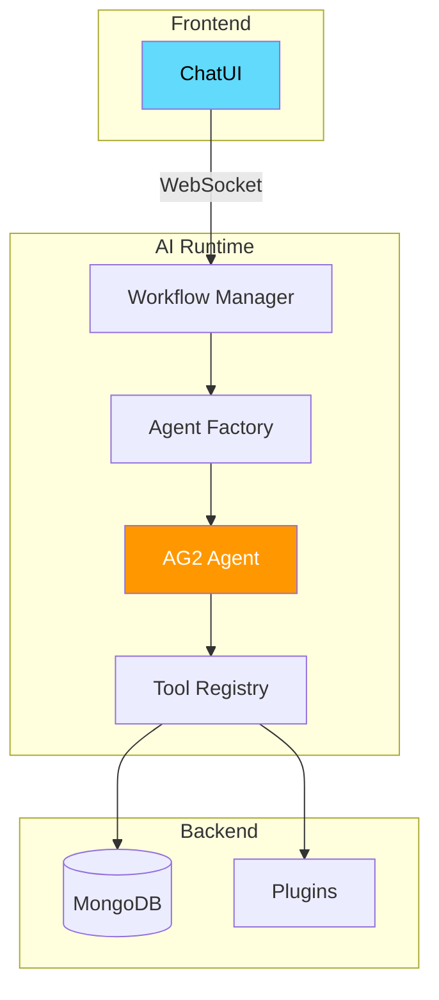

# 🤖 Creating AI Workflows

> Build AI-powered features using the MozaiksCore AI Runtime.

---

## 🎯 What You'll Build

An AI workflow with:
- ✅ Custom agent with personality
- ✅ Tools for database access
- ✅ Chat UI integration
- ✅ Streaming responses

---

## 📐 Workflow Architecture



---

## 🛠️ Step 1: Define Workflow

### Create Workflow File

```
runtime/ai/workflows/
└── task_assistant/
    ├── __init__.py
    ├── workflow.py
    └── tools.py
```

### workflow.py

```python
"""
Task Assistant Workflow
======================

An AI assistant that helps users manage their tasks.
"""
from typing import Any
from core.ai_runtime.workflow.base import BaseWorkflow, WorkflowConfig
from core.ai_runtime.workflow.agent_factory import AgentFactory


class TaskAssistantWorkflow(BaseWorkflow):
    """
    Task management AI assistant.
    
    Capabilities:
    - List, create, update tasks
    - Prioritize and organize
    - Set reminders
    - Provide productivity tips
    """
    
    @classmethod
    def get_config(cls) -> WorkflowConfig:
        return WorkflowConfig(
            name="task_assistant",
            display_name="Task Assistant",
            description="AI-powered task management assistant",
            version="1.0.0",
            system_prompt=cls._get_system_prompt(),
            tools=["list_tasks", "create_task", "update_task", "delete_task"],
            model="gpt-4o-mini",  # Or your preferred model
            temperature=0.7,
            max_tokens=1000,
        )
    
    @staticmethod
    def _get_system_prompt() -> str:
        return """You are a helpful task management assistant. Your job is to help users organize their tasks and boost productivity.

**Personality:**
- Friendly and encouraging
- Concise but thorough
- Proactive with suggestions

**Capabilities:**
- View and search tasks
- Create new tasks with priorities
- Update task status and details
- Delete completed tasks
- Provide productivity tips

**Guidelines:**
1. Always confirm before deleting tasks
2. Suggest priorities when creating tasks
3. Celebrate when users complete tasks
4. Offer to set reminders for important tasks

When users ask about tasks, use the available tools to help them."""

    async def on_start(self, context: dict[str, Any]) -> str:
        """Called when workflow starts."""
        user_name = context.get("user_name", "there")
        return f"👋 Hi {user_name}! I'm your task assistant. How can I help you manage your tasks today?"
    
    async def on_message(
        self, 
        message: str, 
        context: dict[str, Any]
    ) -> str:
        """Process user message and return response."""
        # The base class handles agent orchestration
        # Just override for custom preprocessing
        return await super().on_message(message, context)
```

### tools.py

```python
"""
Task Assistant Tools
===================

Tools available to the Task Assistant agent.
"""
from typing import Any, Optional
from core.ai_runtime.tools.base import BaseTool, tool_function
from core.config.database import db
from bson import ObjectId
from datetime import datetime


class ListTasksTool(BaseTool):
    """Tool to list user's tasks."""
    
    name = "list_tasks"
    description = "List all tasks for the user. Can filter by status."
    
    @tool_function
    async def execute(
        self,
        status: Optional[str] = None,
        limit: int = 10,
        context: dict[str, Any] = None
    ) -> dict[str, Any]:
        """
        List tasks with optional filtering.
        
        Args:
            status: Filter by status ('pending', 'completed', or None for all)
            limit: Maximum number of tasks to return
            context: Execution context with user_id
        
        Returns:
            Dict with tasks list and count
        """
        user_id = context.get("user_id")
        if not user_id:
            return {"error": "User not authenticated"}
        
        collection = db["task_manager_tasks"]
        
        query = {"user_id": user_id}
        if status:
            query["status"] = status
        
        tasks = await collection.find(query).sort(
            "created_at", -1
        ).limit(limit).to_list(limit)
        
        # Format for agent
        formatted = []
        for task in tasks:
            formatted.append({
                "id": str(task["_id"]),
                "title": task["title"],
                "status": task["status"],
                "priority": task.get("priority", "medium"),
                "due_date": task.get("due_date"),
            })
        
        return {
            "tasks": formatted,
            "count": len(formatted),
            "message": f"Found {len(formatted)} tasks"
        }


class CreateTaskTool(BaseTool):
    """Tool to create a new task."""
    
    name = "create_task"
    description = "Create a new task for the user."
    
    @tool_function
    async def execute(
        self,
        title: str,
        description: str = "",
        priority: str = "medium",
        due_date: Optional[str] = None,
        context: dict[str, Any] = None
    ) -> dict[str, Any]:
        """
        Create a new task.
        
        Args:
            title: Task title (required)
            description: Task description
            priority: 'low', 'medium', or 'high'
            due_date: Optional due date (ISO format)
            context: Execution context with user_id
        
        Returns:
            Created task details
        """
        user_id = context.get("user_id")
        if not user_id:
            return {"error": "User not authenticated"}
        
        if not title:
            return {"error": "Task title is required"}
        
        collection = db["task_manager_tasks"]
        
        task = {
            "user_id": user_id,
            "title": title,
            "description": description,
            "status": "pending",
            "priority": priority,
            "due_date": due_date,
            "created_at": datetime.utcnow(),
            "updated_at": datetime.utcnow(),
        }
        
        result = await collection.insert_one(task)
        
        return {
            "success": True,
            "task_id": str(result.inserted_id),
            "title": title,
            "priority": priority,
            "message": f"✅ Created task: {title}"
        }


class UpdateTaskTool(BaseTool):
    """Tool to update an existing task."""
    
    name = "update_task"
    description = "Update a task's status, title, or other fields."
    
    @tool_function
    async def execute(
        self,
        task_id: str,
        status: Optional[str] = None,
        title: Optional[str] = None,
        priority: Optional[str] = None,
        context: dict[str, Any] = None
    ) -> dict[str, Any]:
        """
        Update an existing task.
        
        Args:
            task_id: The task ID to update
            status: New status ('pending', 'completed')
            title: New title
            priority: New priority ('low', 'medium', 'high')
            context: Execution context with user_id
        
        Returns:
            Update result
        """
        user_id = context.get("user_id")
        if not user_id:
            return {"error": "User not authenticated"}
        
        collection = db["task_manager_tasks"]
        
        update_fields = {"updated_at": datetime.utcnow()}
        if status:
            update_fields["status"] = status
        if title:
            update_fields["title"] = title
        if priority:
            update_fields["priority"] = priority
        
        result = await collection.update_one(
            {"_id": ObjectId(task_id), "user_id": user_id},
            {"$set": update_fields}
        )
        
        if result.modified_count == 0:
            return {"error": "Task not found or no changes made"}
        
        emoji = "🎉" if status == "completed" else "✏️"
        return {
            "success": True,
            "message": f"{emoji} Task updated successfully"
        }


class DeleteTaskTool(BaseTool):
    """Tool to delete a task."""
    
    name = "delete_task"
    description = "Delete a task. Use with caution - confirm with user first."
    
    @tool_function
    async def execute(
        self,
        task_id: str,
        context: dict[str, Any] = None
    ) -> dict[str, Any]:
        """
        Delete a task.
        
        Args:
            task_id: The task ID to delete
            context: Execution context with user_id
        
        Returns:
            Deletion result
        """
        user_id = context.get("user_id")
        if not user_id:
            return {"error": "User not authenticated"}
        
        collection = db["task_manager_tasks"]
        
        result = await collection.delete_one({
            "_id": ObjectId(task_id),
            "user_id": user_id
        })
        
        if result.deleted_count == 0:
            return {"error": "Task not found"}
        
        return {
            "success": True,
            "message": "🗑️ Task deleted successfully"
        }


# Export all tools
TOOLS = [
    ListTasksTool,
    CreateTaskTool,
    UpdateTaskTool,
    DeleteTaskTool,
]
```

---

## ⚙️ Step 2: Register Workflow

### Update Workflow Registry

```python
# runtime/ai/core/workflow/registry.py
from workflows.task_assistant.workflow import TaskAssistantWorkflow


WORKFLOW_REGISTRY = {
    "task_assistant": TaskAssistantWorkflow,
    # ... other workflows
}
```

### Register Tools

```python
# runtime/ai/core/tools/registry.py
from workflows.task_assistant.tools import TOOLS as TASK_TOOLS


def register_workflow_tools():
    for tool_class in TASK_TOOLS:
        ToolRegistry.register(tool_class)
```

---

## 🎨 Step 3: Frontend Integration

### Add Chat Button

```jsx
// In your plugin or page component
import { useChatUI } from '../../chat/context/ChatUIContext';

const TaskManagerPage = () => {
  const { openChat, setWorkflow } = useChatUI();

  const openAssistant = () => {
    setWorkflow('task_assistant');
    openChat();
  };

  return (
    <div className="p-6">
      <button
        onClick={openAssistant}
        className="fixed bottom-6 right-6 p-4 bg-accent text-white 
                   rounded-full shadow-lg hover:bg-accent-hover"
      >
        🤖 Ask Assistant
      </button>
      {/* Rest of your UI */}
    </div>
  );
};
```

### Custom Chat Component

```jsx
// For embedded chat
import { ChatWindow } from '../../chat/components/ChatWindow';

const EmbeddedAssistant = () => {
  return (
    <div className="h-96 border rounded-lg overflow-hidden">
      <ChatWindow
        workflow="task_assistant"
        placeholder="Ask me about your tasks..."
        showHeader={true}
      />
    </div>
  );
};
```

---

## 🔄 Step 4: Testing

### Unit Test Tools

```python
# tests/workflows/test_task_assistant.py
import pytest
from workflows.task_assistant.tools import ListTasksTool, CreateTaskTool


@pytest.mark.asyncio
async def test_create_task():
    tool = CreateTaskTool()
    
    result = await tool.execute(
        title="Test Task",
        priority="high",
        context={"user_id": "test_user"}
    )
    
    assert result["success"] is True
    assert "task_id" in result


@pytest.mark.asyncio
async def test_list_tasks_empty():
    tool = ListTasksTool()
    
    result = await tool.execute(
        context={"user_id": "new_user"}
    )
    
    assert result["tasks"] == []
    assert result["count"] == 0
```

### Integration Test

```python
@pytest.mark.asyncio
async def test_workflow_conversation():
    workflow = TaskAssistantWorkflow()
    context = {"user_id": "test_user", "user_name": "Test"}
    
    # Start conversation
    greeting = await workflow.on_start(context)
    assert "Hi Test" in greeting
    
    # Ask to create task
    response = await workflow.on_message(
        "Create a task called 'Buy groceries' with high priority",
        context
    )
    assert "created" in response.lower() or "buy groceries" in response.lower()
```

---

## 📊 Monitoring

### Tool Execution Logging

```python
# Automatic logging in base tool
{
    "event": "tool_execution",
    "tool": "create_task",
    "user_id": "abc123",
    "duration_ms": 45,
    "success": true,
    "workflow": "task_assistant"
}
```

### Chat Metrics

| Metric | Description |
|--------|-------------|
| `chat_messages_total` | Total messages processed |
| `tool_calls_total` | Tool invocations |
| `response_time_seconds` | Agent response latency |
| `tokens_used_total` | LLM token usage |

---

## ✅ Workflow Checklist

- [ ] Workflow class with `get_config()`
- [ ] System prompt defines personality
- [ ] Tools registered with descriptions
- [ ] Tools validate user_id
- [ ] Frontend integration working
- [ ] Unit tests passing
- [ ] Tool errors handled gracefully
- [ ] Streaming responses work

---

## 🔗 Related

- 🤖 [AI Runtime Architecture](../ai-runtime/architecture.md)
- 🔌 [Plugin System](../core/plugins.md)
- 💬 [WebSocket System](../core/websockets.md)
