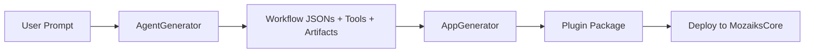
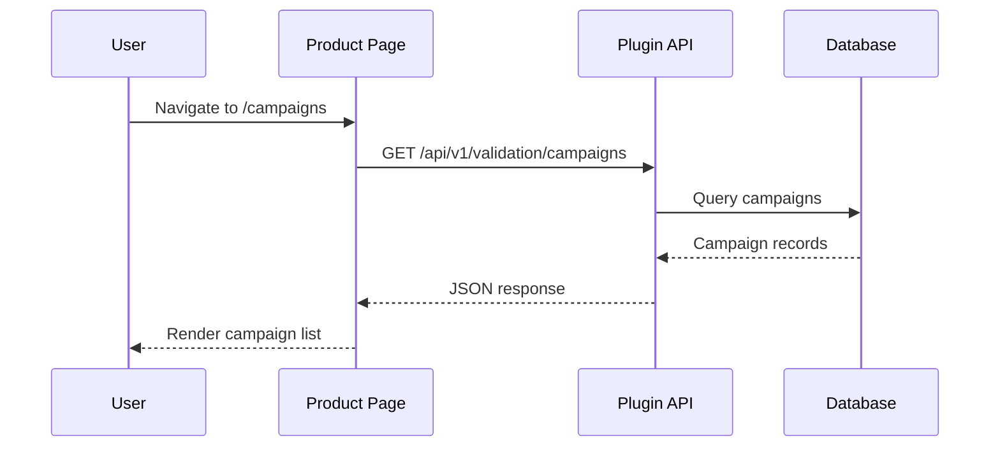
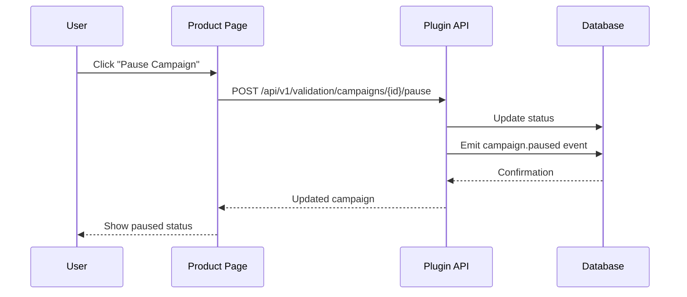
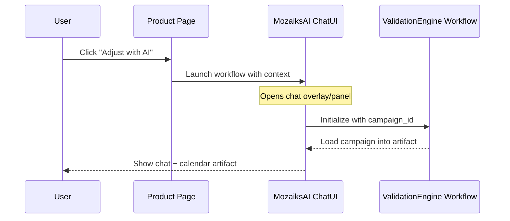

# AppGenerator Workflow Specification

> **Version:** 1.0.0  
> **Status:** Draft  
> **Last Updated:** 2025-12-24  
> **Author:** MozaiksAI Platform Team  
> **Prerequisite:** AgentGenerator workflow must be completed first

---

## Table of Contents

1. [Overview](#overview)
2. [Relationship to AgentGenerator](#relationship-to-agentgenerator)
3. [MozaiksCore Integration](#mozaikscore-integration)
4. [Generation Scope](#generation-scope)
5. [Plugin Architecture Output](#plugin-architecture-output)
6. [Data Flow](#data-flow)
7. [Agent Tools Specification](#agent-tools-specification)
8. [Conversation Flow](#conversation-flow)
9. [Generated Artifacts](#generated-artifacts)
10. [ValidationEngine Example](#validationengine-example)
11. [Implementation Notes](#implementation-notes)

---

## Overview

The **AppGenerator** workflow produces the **product-native UI and backend components** for a Mozaiks app. It runs *after* the AgentGenerator has defined the AI-powered workflows and generates everything that exists *outside* of the chat experience.

### What AppGenerator Creates

| Category | Examples |
|----------|----------|
| **Pages/Routes** | Dashboard, settings, lists, detail views, forms |
| **API Endpoints** | CRUD operations, analytics queries, integration webhooks |
| **Plugin Structure** | Self-contained MozaiksCore plugin with manifest, routes, components |
| **Navigation** | Sidebar entries, breadcrumbs, deep links |
| **Configurations** | Feature flags, permissions, subscription tier gating |

### What AppGenerator Does NOT Create

| Category | Owner |
|----------|-------|
| AI agent definitions | AgentGenerator |
| Workflow orchestration | AgentGenerator |
| Chat artifacts/workspaces | AgentGenerator |
| Tool implementations (for agents) | AgentGenerator |
| Core auth/billing/theming | MozaiksCore (pre-built) |

---

## Relationship to AgentGenerator

The two generators form a complete app when combined:

```
┌─────────────────────────────────────────────────────────────────────────┐
│                           USER'S APP                                    │
│  ┌─────────────────────────────────────────────────────────────────┐   │
│  │                    MozaiksCore (Foundation)                      │   │
│  │  • Auth/Identity    • Subscriptions    • Plugin Host            │   │
│  │  • Theming          • Notifications    • Settings               │   │
│  └─────────────────────────────────────────────────────────────────┘   │
│                                                                         │
│  ┌─────────────────────────┐    ┌─────────────────────────────────┐   │
│  │  AgentGenerator Output  │    │    AppGenerator Output          │   │
│  │  (Chat-Native)          │    │    (Product-Native)             │   │
│  │                         │    │                                 │   │
│  │  • Workflows JSON       │    │  • Plugin manifest              │   │
│  │  • Agent definitions    │    │  • Routes & pages               │   │
│  │  • Tool stubs           │    │  • API controllers              │   │
│  │  • Artifact components  │    │  • List/detail components       │   │
│  │  • Handoff rules        │    │  • Dashboard widgets            │   │
│  │                         │    │  • Navigation config            │   │
│  │  Lives in: workflows/   │    │  Lives in: plugins/             │   │
│  └─────────────────────────┘    └─────────────────────────────────┘   │
│                                                                         │
│  ┌─────────────────────────────────────────────────────────────────┐   │
│  │                     Integration Points                           │   │
│  │                                                                  │   │
│  │  • "Adjust with AI" buttons launch AgentGenerator workflows     │   │
│  │  • Agent tools call AppGenerator APIs                           │   │
│  │  • Both read/write same data models                             │   │
│  └─────────────────────────────────────────────────────────────────┘   │
└─────────────────────────────────────────────────────────────────────────┘
```

### Sequencing



The AppGenerator receives context from AgentGenerator:
- What data models exist (from tool schemas)
- What workflows are available (for "launch AI" buttons)
- What the domain vocabulary is (for consistent naming)

---

## MozaiksCore Integration

MozaiksCore provides the stable foundation. AppGenerator produces plugins that slot into it.

### MozaiksCore Capabilities (Pre-Built)

| Capability | What It Provides | Plugin Access |
|------------|------------------|---------------|
| **Authentication** | JWT, sessions, OAuth, SSO | `useAuth()`, `AuthGuard`, `@Authenticated` |
| **Subscriptions** | Plans, trials, feature flags | `useSubscription()`, `@RequiresPlan("pro")` |
| **Plugin Host** | Module loading, lifecycle | `registerPlugin()`, manifest schema |
| **Real-time** | WebSocket connections | `useSocket()`, `emit()`, `subscribe()` |
| **Theming** | Runtime theme switching | `useTheme()`, CSS variables |
| **Settings** | User/org preferences | `useSettings()`, settings schema |
| **Notifications** | In-app + email | `notify()`, notification preferences |

### Plugin Contract

Every AppGenerator output is a valid MozaiksCore plugin:

```typescript
// plugins/{plugin-name}/manifest.json
{
  "id": "validation-engine",
  "name": "ValidationEngine",
  "version": "1.0.0",
  "description": "AI-powered marketing campaigns and content calendar",
  
  // MozaiksCore integration
  "entryPoint": "./index.ts",
  "permissions": ["campaigns:read", "campaigns:write", "integrations:manage"],
  "requiredPlans": ["pro", "enterprise"],
  
  // Navigation
  "navigation": {
    "sidebar": [
      { "label": "Campaigns", "icon": "megaphone", "route": "/campaigns" },
      { "label": "Calendar", "icon": "calendar", "route": "/calendar" },
      { "label": "Analytics", "icon": "chart", "route": "/analytics" },
      { "label": "Integrations", "icon": "plug", "route": "/integrations" }
    ]
  },
  
  // Settings schema (renders in MozaiksCore settings UI)
  "settings": {
    "schema": "./settings.schema.json"
  },
  
  // Workflows this plugin can launch
  "workflows": ["ValidationEngine"],
  
  // API routes
  "api": {
    "prefix": "/api/v1/validation",
    "routes": "./routes/index.ts"
  }
}
```

---

## Generation Scope

### Input: What AppGenerator Receives

1. **AgentGenerator Output** (required)
   - Workflow definitions (what AI capabilities exist)
   - Tool schemas (data models, API shapes)
   - Artifact definitions (what chat-native UIs exist)

2. **User Requirements** (via conversation)
   - What pages/views are needed
   - What data should be browsable/searchable
   - What actions can happen without AI assistance
   - Permission/role requirements
   - Subscription tier gating

3. **Domain Context**
   - Entity names (Campaign, Entry, Integration, etc.)
   - Relationships between entities
   - Status enums and lifecycles

### Output: What AppGenerator Produces

```
plugins/{plugin-name}/
├── manifest.json              # Plugin registration
├── index.ts                   # Entry point
├── settings.schema.json       # Plugin settings definition
│
├── api/
│   ├── index.ts               # Route aggregator
│   ├── campaigns.ts           # Campaign CRUD + queries
│   ├── calendar.ts            # Calendar entry queries
│   ├── analytics.ts           # Metrics/dashboard data
│   └── integrations.ts        # Platform connection management
│
├── pages/
│   ├── index.ts               # Page exports
│   ├── CampaignListPage.tsx   # List view
│   ├── CampaignDetailPage.tsx # Detail view
│   ├── CalendarPage.tsx       # Calendar view (read-only)
│   ├── AnalyticsPage.tsx      # Dashboard
│   └── IntegrationsPage.tsx   # Connection management
│
├── components/
│   ├── index.ts               # Component exports
│   ├── CampaignCard.tsx       # List item
│   ├── CampaignStatusBadge.tsx
│   ├── MetricWidget.tsx       # Dashboard widget
│   ├── IntegrationCard.tsx    # Platform connector
│   └── LaunchAIButton.tsx     # "Adjust with AI" trigger
│
├── hooks/
│   ├── useCampaigns.ts        # Data fetching
│   ├── useAnalytics.ts
│   └── useIntegrations.ts
│
├── types/
│   └── index.ts               # TypeScript interfaces
│
└── config/
    ├── routes.ts              # Route definitions
    ├── permissions.ts         # Permission mappings
    └── feature-flags.ts       # Tier-gated features
```

---

## Data Flow

### Read Path (Product Pages)



### Write Path (Direct Actions)



### AI Handoff Path



---

## Agent Tools Specification

The AppGenerator workflow uses these tools to create plugin packages.

### Tool 1: `get_agent_generator_context`

**Purpose**: Retrieve the output from AgentGenerator to understand what AI capabilities exist.

**When to call**: At start of conversation, to understand the domain.

#### Request Schema

```json
{
  "app_id": "string (required)",
  "workflow_name": "string (optional)"
}
```

#### Response Schema

```json
{
  "workflows": [
    {
      "name": "ValidationEngine",
      "description": "AI-powered marketing campaigns",
      "tools": [
        {
          "name": "get_validation_context",
          "input_schema": { ... },
          "output_schema": { ... }
        },
        {
          "name": "submit_campaign_plan",
          "input_schema": { ... },
          "output_schema": { ... }
        }
      ],
      "artifacts": [
        {
          "type": "content_calendar",
          "schema": { ... }
        }
      ],
      "entities": ["Campaign", "CalendarEntry", "Creative", "Integration"]
    }
  ],
  "data_models": {
    "Campaign": {
      "fields": { ... },
      "statuses": ["DRAFT", "ACTIVE", "PAUSED", "COMPLETED"],
      "relationships": ["has_many CalendarEntry", "belongs_to App"]
    }
  }
}
```

---

### Tool 2: `generate_plugin_manifest`

**Purpose**: Create the plugin manifest that registers with MozaiksCore.

**When to call**: After understanding requirements, to scaffold the plugin.

#### Request Schema

```json
{
  "plugin_id": "validation-engine",
  "name": "ValidationEngine",
  "description": "AI-powered marketing campaigns and content calendar",
  "required_plans": ["pro", "enterprise"],
  "permissions": ["campaigns:read", "campaigns:write"],
  "navigation": [
    { "label": "Campaigns", "icon": "megaphone", "route": "/campaigns" }
  ],
  "workflows": ["ValidationEngine"],
  "settings_schema": { ... }
}
```

#### Response Schema

```json
{
  "status": "success",
  "manifest_path": "plugins/validation-engine/manifest.json",
  "manifest": { ... }
}
```

---

### Tool 3: `generate_api_routes`

**Purpose**: Generate backend API routes for the plugin.

**When to call**: When defining what data operations the product pages need.

#### Request Schema

```json
{
  "plugin_id": "validation-engine",
  "routes": [
    {
      "method": "GET",
      "path": "/campaigns",
      "description": "List campaigns with filtering and pagination",
      "query_params": ["status", "page", "limit", "sort"],
      "response_type": "CampaignListResponse",
      "permissions": ["campaigns:read"],
      "rate_limit": "100/min"
    },
    {
      "method": "GET",
      "path": "/campaigns/:id",
      "description": "Get campaign details",
      "response_type": "Campaign",
      "permissions": ["campaigns:read"]
    },
    {
      "method": "POST",
      "path": "/campaigns/:id/pause",
      "description": "Pause an active campaign",
      "permissions": ["campaigns:write"],
      "emits_event": "campaign.paused"
    }
  ]
}
```

#### Response Schema

```json
{
  "status": "success",
  "files_generated": [
    "plugins/validation-engine/api/campaigns.ts",
    "plugins/validation-engine/api/index.ts"
  ],
  "routes_registered": 3
}
```

---

### Tool 4: `generate_page`

**Purpose**: Generate a product page with components and data fetching.

**When to call**: For each page the user wants in their product UI.

#### Request Schema

```json
{
  "plugin_id": "validation-engine",
  "page": {
    "name": "CampaignListPage",
    "route": "/campaigns",
    "type": "list",
    "entity": "Campaign",
    "features": {
      "search": true,
      "filters": ["status", "platform", "dateRange"],
      "sorting": ["created_at", "name", "spend"],
      "pagination": true,
      "bulk_actions": ["pause", "archive"]
    },
    "row_actions": [
      { "label": "View", "route": "/campaigns/:id" },
      { "label": "Analytics", "route": "/campaigns/:id/analytics" },
      { "label": "Adjust with AI", "launches_workflow": "ValidationEngine", "context": { "campaign_id": ":id" } }
    ],
    "empty_state": {
      "title": "No campaigns yet",
      "description": "Create your first campaign to start growing.",
      "action": { "label": "Create Campaign", "launches_workflow": "ValidationEngine" }
    }
  }
}
```

#### Response Schema

```json
{
  "status": "success",
  "files_generated": [
    "plugins/validation-engine/pages/CampaignListPage.tsx",
    "plugins/validation-engine/hooks/useCampaigns.ts",
    "plugins/validation-engine/components/CampaignCard.tsx"
  ]
}
```

---

### Tool 5: `generate_dashboard`

**Purpose**: Generate an analytics/dashboard page with widgets.

**When to call**: When user needs overview/metrics pages.

#### Request Schema

```json
{
  "plugin_id": "validation-engine",
  "dashboard": {
    "name": "AnalyticsPage",
    "route": "/analytics",
    "widgets": [
      {
        "type": "metric",
        "title": "Total Spend",
        "metric": "total_spend",
        "format": "currency",
        "comparison": "previous_period"
      },
      {
        "type": "chart",
        "title": "Spend Over Time",
        "chart_type": "line",
        "data_source": "/api/v1/validation/analytics/spend-timeline",
        "dimensions": ["date"],
        "measures": ["spend", "conversions"]
      },
      {
        "type": "table",
        "title": "Top Campaigns",
        "data_source": "/api/v1/validation/analytics/top-campaigns",
        "columns": ["name", "spend", "conversions", "roas"],
        "limit": 5
      }
    ],
    "date_range_filter": true,
    "export_options": ["csv", "pdf"]
  }
}
```

---

### Tool 6: `generate_integration_page`

**Purpose**: Generate platform connector management UI.

**When to call**: When the app needs OAuth/integration management.

#### Request Schema

```json
{
  "plugin_id": "validation-engine",
  "integrations": [
    {
      "platform": "META",
      "display_name": "Meta Ads",
      "icon": "meta",
      "oauth_flow": true,
      "required_scopes": ["ads_management", "ads_read"],
      "status_check_endpoint": "/api/v1/validation/integrations/meta/status",
      "connect_endpoint": "/api/v1/validation/integrations/meta/connect",
      "disconnect_endpoint": "/api/v1/validation/integrations/meta/disconnect"
    },
    {
      "platform": "GOOGLE",
      "display_name": "Google Ads",
      "icon": "google",
      "oauth_flow": true,
      "required_scopes": ["https://www.googleapis.com/auth/adwords"]
    }
  ]
}
```

---

### Tool 7: `finalize_plugin`

**Purpose**: Validate and package the complete plugin.

**When to call**: After all pages/routes are generated, to finalize.

#### Request Schema

```json
{
  "plugin_id": "validation-engine",
  "validate": true,
  "generate_tests": true,
  "generate_docs": true
}
```

#### Response Schema

```json
{
  "status": "success",
  "plugin_path": "plugins/validation-engine/",
  "validation": {
    "manifest_valid": true,
    "routes_valid": true,
    "pages_valid": true,
    "typescript_compiles": true
  },
  "files_generated": 24,
  "ready_for_deployment": true
}
```

---

## Conversation Flow

### Phase 1: Context Loading

```
Agent: "I'll load the AgentGenerator output to understand what AI 
        capabilities exist for your app..."
        
        [Calls get_agent_generator_context]
        
Agent: "I see you have a ValidationEngine workflow with these capabilities:
        
        • AI Tools: get_validation_context, submit_campaign_plan, 
          submit_content_entry, get_campaign_status
        • Artifacts: Content Calendar
        • Entities: Campaign, CalendarEntry, Creative, Integration
        
        Now let's build the product pages around this. What views do 
        your users need outside of the AI chat experience?"
```

### Phase 2: Requirements Gathering

```
User: "I need a campaign list, a way to view analytics, manage 
       platform connections, and see a calendar view"

Agent: "Got it. Let me map that out:
        
        📋 Campaign List Page
           - Browse all campaigns
           - Filter by status, platform
           - Quick actions (pause, view details)
           - 'Adjust with AI' button → launches ValidationEngine workflow
        
        📊 Analytics Dashboard
           - Spend metrics, conversion tracking
           - Performance charts
           - Top campaigns table
        
        🔌 Integrations Page
           - Connect Meta, Google, Reddit, etc.
           - Show connection status
           - Manage OAuth tokens
        
        📅 Calendar Page (read-only)
           - View scheduled content across campaigns
           - Click entry to see details
           - 'Edit with AI' → launches workflow with context
        
        Does this match what you need? Any pages to add or modify?"
```

### Phase 3: Generation

```
User: "Yes, that's perfect"

Agent: "Great! I'll generate the plugin now..."

        [Calls generate_plugin_manifest]
        ✓ Created manifest.json
        
        [Calls generate_api_routes]
        ✓ Created API routes (12 endpoints)
        
        [Calls generate_page for each page]
        ✓ CampaignListPage
        ✓ CampaignDetailPage
        ✓ AnalyticsPage
        ✓ CalendarPage
        ✓ IntegrationsPage
        
        [Calls finalize_plugin]
        ✓ Validated plugin structure
        ✓ Generated TypeScript types
        ✓ Created test stubs
        
Agent: "Your ValidationEngine plugin is ready! Here's the structure:
        
        plugins/validation-engine/
        ├── manifest.json
        ├── api/ (12 endpoints)
        ├── pages/ (5 pages)
        ├── components/ (15 components)
        ├── hooks/ (6 hooks)
        └── types/
        
        To deploy:
        1. Copy to your MozaiksCore plugins/ directory
        2. Run 'npm run plugins:register'
        3. The navigation will appear automatically
        
        The 'Adjust with AI' buttons are wired to launch your 
        ValidationEngine workflow with the relevant context."
```

---

## Generated Artifacts

### Example: CampaignListPage.tsx

```tsx
import { useState } from 'react';
import { useNavigate } from 'react-router-dom';
import { useCampaigns } from '../hooks/useCampaigns';
import { useWorkflowLauncher } from '@mozaiks/core';
import { CampaignCard } from '../components/CampaignCard';
import { CampaignFilters } from '../components/CampaignFilters';
import { LaunchAIButton } from '../components/LaunchAIButton';
import { EmptyState, PageHeader, Pagination } from '@mozaiks/ui';

export function CampaignListPage() {
  const navigate = useNavigate();
  const { launchWorkflow } = useWorkflowLauncher();
  const [filters, setFilters] = useState({ status: 'all', page: 1 });
  
  const { campaigns, total, isLoading } = useCampaigns(filters);
  
  const handleAdjust = (campaignId: string) => {
    launchWorkflow('ValidationEngine', { 
      context: { campaign_id: campaignId },
      mode: 'adjust'
    });
  };
  
  const handleCreate = () => {
    launchWorkflow('ValidationEngine', { mode: 'create' });
  };
  
  if (!isLoading && campaigns.length === 0) {
    return (
      <EmptyState
        icon="megaphone"
        title="No campaigns yet"
        description="Create your first campaign to start growing."
        action={{ label: "Create Campaign", onClick: handleCreate }}
      />
    );
  }
  
  return (
    <div className="campaign-list-page">
      <PageHeader 
        title="Campaigns"
        action={
          <LaunchAIButton 
            workflow="ValidationEngine"
            label="Create Campaign"
          />
        }
      />
      
      <CampaignFilters 
        filters={filters} 
        onChange={setFilters} 
      />
      
      <div className="campaign-grid">
        {campaigns.map(campaign => (
          <CampaignCard
            key={campaign.id}
            campaign={campaign}
            onView={() => navigate(`/campaigns/${campaign.id}`)}
            onAdjust={() => handleAdjust(campaign.id)}
          />
        ))}
      </div>
      
      <Pagination
        total={total}
        page={filters.page}
        onChange={(page) => setFilters({ ...filters, page })}
      />
    </div>
  );
}
```

### Example: LaunchAIButton.tsx

```tsx
import { useWorkflowLauncher } from '@mozaiks/core';
import { Button } from '@mozaiks/ui';
import { Sparkles } from 'lucide-react';

interface LaunchAIButtonProps {
  workflow: string;
  label?: string;
  context?: Record<string, any>;
  variant?: 'primary' | 'secondary' | 'ghost';
}

export function LaunchAIButton({ 
  workflow, 
  label = 'Adjust with AI',
  context = {},
  variant = 'secondary'
}: LaunchAIButtonProps) {
  const { launchWorkflow, isLaunching } = useWorkflowLauncher();
  
  return (
    <Button
      variant={variant}
      onClick={() => launchWorkflow(workflow, { context })}
      disabled={isLaunching}
    >
      <Sparkles className="w-4 h-4 mr-2" />
      {label}
    </Button>
  );
}
```

### Example: API Route (campaigns.ts)

```typescript
import { Router } from 'express';
import { authenticated, requirePermission, rateLimit } from '@mozaiks/core';
import { CampaignService } from '../services/CampaignService';
import { emitEvent } from '@mozaiks/events';

const router = Router();
const campaignService = new CampaignService();

// GET /api/v1/validation/campaigns
router.get('/',
  authenticated(),
  requirePermission('campaigns:read'),
  rateLimit('100/min'),
  async (req, res) => {
    const { status, platform, page = 1, limit = 20, sort = 'created_at' } = req.query;
    const { app_id } = req.auth;
    
    const result = await campaignService.list({
      app_id,
      status,
      platform,
      page: Number(page),
      limit: Number(limit),
      sort: String(sort)
    });
    
    res.json(result);
  }
);

// GET /api/v1/validation/campaigns/:id
router.get('/:id',
  authenticated(),
  requirePermission('campaigns:read'),
  async (req, res) => {
    const { id } = req.params;
    const { app_id } = req.auth;
    
    const campaign = await campaignService.get(id, app_id);
    
    if (!campaign) {
      return res.status(404).json({ error: 'Campaign not found' });
    }
    
    res.json(campaign);
  }
);

// POST /api/v1/validation/campaigns/:id/pause
router.post('/:id/pause',
  authenticated(),
  requirePermission('campaigns:write'),
  async (req, res) => {
    const { id } = req.params;
    const { app_id, user_id } = req.auth;
    
    const campaign = await campaignService.pause(id, app_id);
    
    await emitEvent('campaign.paused', {
      campaign_id: id,
      app_id,
      actor: { actor_type: 'user', actor_id: user_id }
    });
    
    res.json(campaign);
  }
);

export default router;
```

---

## ValidationEngine Example

Here's the complete plugin structure for ValidationEngine:

```
plugins/validation-engine/
├── manifest.json
├── index.ts
├── settings.schema.json
│
├── api/
│   ├── index.ts
│   ├── campaigns.ts          # Campaign CRUD
│   ├── calendar.ts           # Calendar queries
│   ├── analytics.ts          # Metrics & dashboards
│   ├── integrations.ts       # Platform connections
│   └── approvals.ts          # Budget approvals
│
├── pages/
│   ├── index.ts
│   ├── CampaignListPage.tsx
│   ├── CampaignDetailPage.tsx
│   ├── CalendarPage.tsx
│   ├── AnalyticsPage.tsx
│   ├── IntegrationsPage.tsx
│   └── ApprovalsPage.tsx
│
├── components/
│   ├── index.ts
│   ├── CampaignCard.tsx
│   ├── CampaignStatusBadge.tsx
│   ├── CampaignMetrics.tsx
│   ├── CalendarView.tsx
│   ├── CalendarEntry.tsx
│   ├── MetricWidget.tsx
│   ├── SpendChart.tsx
│   ├── IntegrationCard.tsx
│   ├── IntegrationStatus.tsx
│   ├── ApprovalCard.tsx
│   ├── LaunchAIButton.tsx
│   ├── CampaignFilters.tsx
│   └── DateRangePicker.tsx
│
├── hooks/
│   ├── useCampaigns.ts
│   ├── useCampaign.ts
│   ├── useCalendar.ts
│   ├── useAnalytics.ts
│   ├── useIntegrations.ts
│   └── useApprovals.ts
│
├── services/
│   ├── CampaignService.ts
│   ├── CalendarService.ts
│   ├── AnalyticsService.ts
│   └── IntegrationService.ts
│
├── types/
│   ├── index.ts
│   ├── campaign.ts
│   ├── calendar.ts
│   └── integration.ts
│
└── config/
    ├── routes.ts
    ├── permissions.ts
    └── navigation.ts
```

### Navigation Config

```typescript
// config/navigation.ts
export const navigation = {
  sidebar: [
    {
      id: 'growth',
      label: 'Growth',
      icon: 'trending-up',
      children: [
        { label: 'Campaigns', route: '/campaigns', icon: 'megaphone' },
        { label: 'Calendar', route: '/calendar', icon: 'calendar' },
        { label: 'Analytics', route: '/analytics', icon: 'bar-chart' },
        { label: 'Integrations', route: '/integrations', icon: 'plug' },
        { label: 'Approvals', route: '/approvals', icon: 'check-circle', badge: 'pending_count' }
      ]
    }
  ]
};
```

### Permissions Config

```typescript
// config/permissions.ts
export const permissions = {
  'campaigns:read': {
    description: 'View campaigns and calendar',
    default_roles: ['viewer', 'editor', 'admin']
  },
  'campaigns:write': {
    description: 'Create and modify campaigns',
    default_roles: ['editor', 'admin']
  },
  'integrations:manage': {
    description: 'Connect and disconnect ad platforms',
    default_roles: ['admin']
  },
  'approvals:manage': {
    description: 'Approve or reject budget requests',
    default_roles: ['admin']
  }
};
```

---

## Implementation Notes

### MozaiksAI Workflow Files

```
workflows/AppGenerator/
├── orchestrator.json
├── agents.json
├── handoffs.json
├── tools.json
├── structured_outputs.json
├── context_variables.json
├── hooks.json
└── tools/
    ├── get_agent_generator_context.py
    ├── generate_plugin_manifest.py
    ├── generate_api_routes.py
    ├── generate_page.py
    ├── generate_dashboard.py
    ├── generate_integration_page.py
    └── finalize_plugin.py
```

### Key Integration Points

1. **AgentGenerator Context**: AppGenerator must read AgentGenerator output to understand data models and available workflows.

2. **Workflow Launcher**: Generated components use `useWorkflowLauncher()` hook from MozaiksCore to launch AI workflows.

3. **Event Emission**: API routes emit events to the economic protocol for audit/analytics.

4. **Permission System**: All routes and UI elements respect MozaiksCore's permission model.

5. **Subscription Gating**: Features can be gated by subscription tier via `requiredPlans` in manifest.

### UI Component Library

Generated pages use MozaiksCore's component library (`@mozaiks/ui`):
- Layout components (PageHeader, Sidebar, Card)
- Data display (Table, List, Badge, Chart)
- Forms (Input, Select, DatePicker)
- Feedback (Toast, Modal, EmptyState)
- Navigation (Tabs, Breadcrumbs, Pagination)

---

## Appendix: Page Type Templates

| Page Type | Use Case | Key Features |
|-----------|----------|--------------|
| `list` | Browse entities | Filters, sorting, pagination, bulk actions |
| `detail` | View single entity | Tabs, related data, actions |
| `dashboard` | Metrics overview | Widgets, charts, date ranges |
| `form` | Create/edit entity | Validation, steps, preview |
| `settings` | Configuration | Sections, toggles, save/cancel |
| `integration` | External connections | OAuth, status, disconnect |

---

*This specification defines how AppGenerator produces MozaiksCore-compatible plugins that complement AgentGenerator workflows.*
