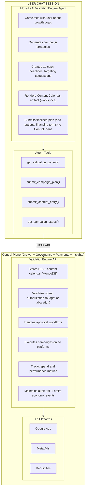
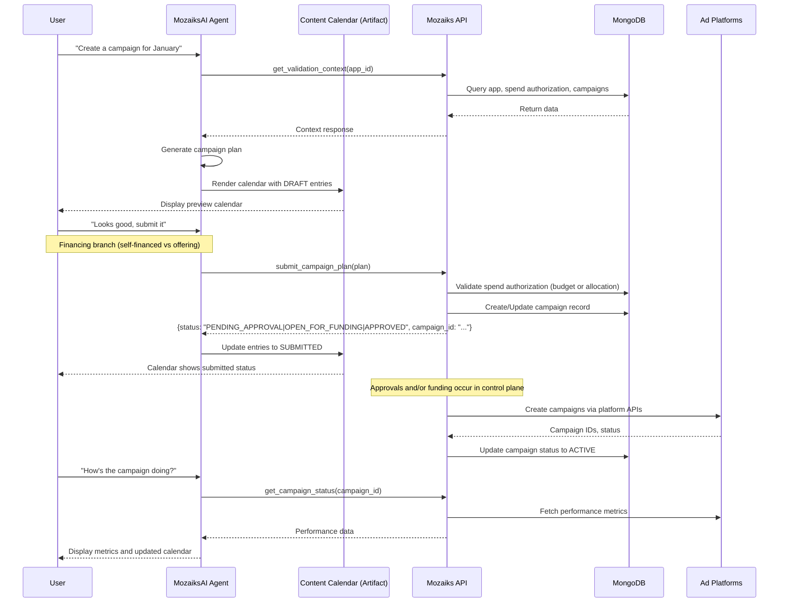
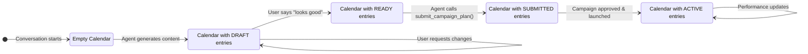
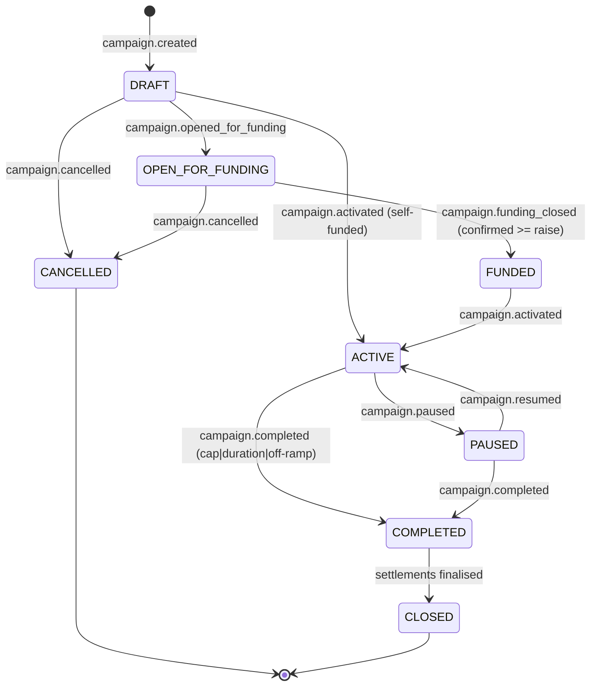
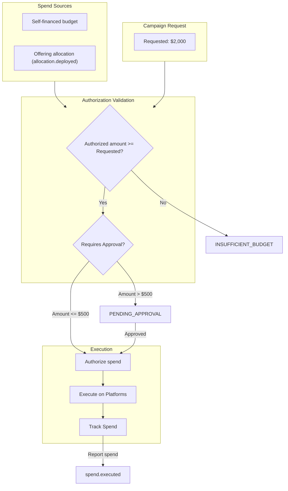

# ValidationEngine Workflow Architecture Specification

> **Version:** 1.0.0  
> **Status:** Draft  
> **Last Updated:** 2025-12-13  
> **Author:** MozaiksAI Platform Team

## Table of Contents

1. [Overview](#overview)
2. [System Architecture](#system-architecture)
3. [Data Flow](#data-flow)
4. [Mock vs Real Calendar](#mock-vs-real-calendar)
5. [Agent Tools Specification](#agent-tools-specification)
6. [Mock Calendar Artifact](#mock-calendar-artifact-specification)
7. [Campaign Lifecycle](#campaign-lifecycle-state-machine)
8. [Budget Allocation](#budget-allocation-flow)
9. [Conversation Flow Examples](#conversation-flow-examples)
10. [Enums Reference](#enums-reference)
11. [Error Handling](#error-handling)
12. [Implementation Notes](#implementation-notes)

---

## Overview

The **ValidationEngine** workflow enables apps and communities to grow through AI-generated marketing campaigns and a content calendar workspace.

ValidationEngine supports both:
- **Non-paid (organic)** campaigns (calendar + content + distribution plan)
- **Paid acquisition** campaigns (calendar + creatives + targeting + spend)

Paid campaigns can be run in two financing modes:
- **Self-financed:** spend is authorized from an app’s available budget.
- **Offering/financed:** the user configures a Campaign Contract (raise/share/cap/duration/off-ramps), funding is raised, then spend is authorized.

Money-moving decisions (funding, allocations, ledger accrual, settlement) are handled by a **deterministic control plane** via a versioned event protocol.
See: `docs/economic_protocol.md`

### Key Capabilities

- **Conversational Campaign Planning**: Natural language interface for defining growth goals
- **AI-Generated Content**: Headlines, ad copy, and targeting suggestions
- **Multi-Platform Support**: Google, Meta, Reddit, Twitter, LinkedIn, TikTok
- **Spend Authorization**: Budget validation + approvals (control plane)
- **Content Calendar**: Visual preview and scheduling interface
- **Performance Tracking**: Real-time campaign metrics and optimization suggestions

### Two-System Architecture

The ValidationEngine operates across distinct systems:

| System | Responsibility | Data Persistence |
|--------|---------------|------------------|
| **MozaiksAI Workflow (ChatUI)** | Conversation + agent decisions; renders the content calendar artifact workspace | Chat session (Mongo via runtime) + UI state |
| **Control Plane / Validation API** | Campaign execution, approvals, spend authorization, ad platform orchestration, audit trail; emits/consumes economic events | MongoDB (permanent) + event stream |

---

## System Architecture



### Component Responsibilities

#### MozaiksAI Agent (This Workflow)
- **Stateless conversation**: Each session is independent
- **Content generation**: AI creates campaign strategies and copy
- **Workspace rendering**: Content calendar artifact for user review + iteration
- **API orchestration**: Calls control plane tools (plan submission, status fetch, etc.)

#### Control Plane / Validation API (External)
- **Persistent storage**: MongoDB for campaigns, calendar, metrics
- **Spend authorization**: Validates budget/allocation and enforces approvals
- **Platform execution**: Creates and manages ads via platform APIs
- **Economic protocol**: Emits/consumes signed, versioned events (funding, allocation, spend, KPI, revenue, ledger)
- **Audit trail**: Complete history of actions and approvals

---

## Data Flow



---

## Mock vs Real Calendar

```mermaid
flowchart LR
    subgraph MockCalendar["Calendar Workspace (ChatUI Artifact)"]
        M1["Rendered in chat UI"]
        M2["Real-time updates during conversation"]
      M3["Preview + iterate"]
      M4["Chat-scoped; can be reconciled with real calendar"]
        M5["JSON/React component"]
    end
    
    subgraph RealCalendar["REAL Calendar (Microservice)"]
        R1["Stored in MongoDB"]
        R2["Source of truth"]
        R3["Linked to ad platforms"]
        R4["Tracks execution & spend"]
        R5["Persists across sessions"]
    end
    
    MockCalendar -->|"User confirms"| Submit["submit_campaign_plan()"]
    Submit -->|"Creates records"| RealCalendar
```



### Key Distinction

| Aspect | Mock Calendar (Agent) | Real Calendar (Microservice) |
|--------|----------------------|------------------------------|
| **Storage** | In-memory, session-scoped | MongoDB, permanent |
| **Purpose** | Preview & iterate | Execute & track |
| **Editable** | Yes, via conversation | Via approval workflow |
| **Status values** | DRAFT, READY | SUBMITTED → ACTIVE → COMPLETED |
| **Budget impact** | None (preview) | Spend authorization and execution (control plane) |

---

## Agent Tools Specification

### Tool 1: `get_validation_context`

**Purpose**: Fetch app data, spend authorization context, existing campaigns, and assets from the control plane.

**When to call**: 
- At start of conversation
- When user asks about current state
- Before generating campaign suggestions

#### Request Schema

```json
{
  "app_id": "string (required)",
  "include": ["spend_authorization", "campaigns", "calendar", "assets"]
}
```

| Field | Type | Required | Description |
|-------|------|----------|-------------|
| `app_id` | string | ✅ | App/community identifier |
| `include` | string[] | ❌ | Data sections to include (default: all) |

#### Response Schema

```json
{
  "app": {
    "id": "ent-123",
    "name": "TechStartup DAO",
    "website": "https://techstartup.io",
    "industry": "SaaS/Technology",
    "description": "Productivity tools for small businesses",
    "brand_guidelines": {
      "voice": "Professional but friendly",
      "colors": ["#4F46E5", "#10B981"],
      "logo_url": "https://..."
    }
  },
  "spend_authorization": {
    "currency": "USD",
    "requires_approval_above": 500.00,
    "sources": [
      {
        "type": "SELF_FINANCED_BUDGET",
        "allocated": 5000.00,
        "spent": 1234.56,
        "available": 3765.44
      }
    ]
  },
  "active_campaigns": [
    {
      "id": "camp-456",
      "name": "Q4 Awareness Campaign",
      "status": "ACTIVE",
      "platforms": ["META"],
      "budget": 1000.00,
      "spent": 456.78,
      "start_date": "2025-12-01",
      "end_date": "2025-12-31",
      "performance": {
        "impressions": 45000,
        "clicks": 890,
        "ctr": 1.98,
        "conversions": 23
      }
    }
  ],
  "content_calendar": [
    {
      "id": "entry-789",
      "scheduled_date": "2025-12-15",
      "platform": "META",
      "content_type": "IMAGE_AD",
      "headline": "Boost Your Productivity",
      "status": "SCHEDULED",
      "campaign_id": "camp-456"
    }
  ],
  "creative_assets": [
    {
      "id": "asset-001",
      "type": "IMAGE",
      "url": "https://...",
      "dimensions": "1200x628",
      "description": "Product hero shot"
    }
  ]
}
```

---

### Tool 2: `submit_campaign_plan`

**Purpose**: Submit AI-generated campaign plan to Mozaiks for validation, approval, and execution.

**When to call**: After user reviews mock calendar and explicitly approves the plan.

#### Request Schema

```json
{
  "app_id": "ent-123",
  "campaign": {
    "name": "Q1 2026 Growth Campaign",
    "objective": "TRAFFIC",
    "platforms": ["META", "REDDIT"],
    "budget": {
      "total": 2000.00,
      "daily_cap": 100.00,
      "currency": "USD"
    },
    "schedule": {
      "start_date": "2026-01-01",
      "end_date": "2026-01-31"
    },
    "targeting": {
      "countries": ["US", "CA"],
      "age_min": 25,
      "age_max": 45,
      "interests": ["small business", "productivity", "entrepreneurship"],
      "exclude_existing_customers": true
    },
    "creatives": [
      {
        "type": "IMAGE",
        "platform": "META",
        "headline": "Work Smarter, Not Harder",
        "primary_text": "Join 10,000+ businesses saving 10 hours per week.",
        "description": "Start your free trial today",
        "call_to_action": "LEARN_MORE",
        "landing_url": "https://techstartup.io/trial",
        "asset_id": "asset-001"
      },
      {
        "type": "TEXT",
        "platform": "REDDIT",
        "headline": "Finally, a productivity tool that actually works",
        "primary_text": "We built this because we were tired of bloated software...",
        "subreddits": ["r/productivity", "r/smallbusiness", "r/entrepreneur"],
        "landing_url": "https://techstartup.io/trial"
      }
    ]
  },
  "content_calendar_entries": [
    {
      "scheduled_date": "2026-01-01",
      "platform": "META",
      "creative_index": 0,
      "notes": "Campaign launch day"
    },
    {
      "scheduled_date": "2026-01-01",
      "platform": "REDDIT",
      "creative_index": 1,
      "notes": "Reddit launch - morning post"
    }
  ],
  "approval_request": {
    "auto_approve": false,
    "message": "Q1 growth campaign focusing on trial signups"
  }
}
```

#### Response Schema

```json
{
  "status": "PENDING_APPROVAL",
  "campaign_id": "camp-789",
  "message": "Campaign submitted for approval. An authorized approver will review.",
  "estimated_reach": {
    "meta": { "impressions": "50K-100K", "clicks": "1K-2K" },
    "reddit": { "impressions": "20K-40K", "clicks": "500-1K" }
  },
  "budget_validation": {
    "requested": 2000.00,
    "available": 3765.44,
    "approved": true
  },
  "requires_approval_from": ["app_admin", "finance_approver"],
  "approval_url": "https://app.mozaiks.io/app/ent-123/campaigns/camp-789/approve"
}
```

---

### Tool 3: `submit_content_entry`

**Purpose**: Add individual content items to the calendar (for organic/non-paid content).

**When to call**: When user wants to schedule organic posts outside of paid campaigns.

#### Request Schema

```json
{
  "app_id": "ent-123",
  "entry": {
    "scheduled_date": "2026-01-05",
    "scheduled_time": "10:00",
    "timezone": "America/New_York",
    "platform": "TWITTER",
    "content_type": "ORGANIC_POST",
    "content": {
      "text": "🚀 New feature alert! We just shipped...",
      "media_urls": ["https://..."],
      "hashtags": ["#productivity", "#startup"]
    },
    "auto_post": false,
    "notes": "Announce new feature"
  }
}
```

#### Response Schema

```json
{
  "status": "SCHEDULED",
  "entry_id": "entry-890",
  "message": "Content scheduled for 2026-01-05 at 10:00 AM EST",
  "auto_post": false,
  "reminder_set": true
}
```

---

### Tool 4: `get_campaign_status`

**Purpose**: Check status and performance of submitted campaigns.

**When to call**: When user asks about campaign performance or status.

#### Request Schema

```json
{
  "campaign_id": "camp-789"
}
```

#### Response Schema

```json
{
  "campaign_id": "camp-789",
  "name": "Q1 2026 Growth Campaign",
  "status": "ACTIVE",
  "approval": {
    "status": "APPROVED",
    "approved_by": "user-456",
    "approved_at": "2025-12-20T10:30:00Z"
  },
  "budget": {
    "total": 2000.00,
    "spent": 567.89,
    "remaining": 1432.11
  },
  "performance": {
    "impressions": 78000,
    "clicks": 1560,
    "ctr": 2.0,
    "conversions": 45,
    "cost_per_click": 0.36,
    "cost_per_conversion": 12.62
  },
  "platform_breakdown": {
    "META": {
      "status": "ACTIVE",
      "spent": 400.00,
      "impressions": 55000,
      "clicks": 1100
    },
    "REDDIT": {
      "status": "ACTIVE",
      "spent": 167.89,
      "impressions": 23000,
      "clicks": 460
    }
  }
}
```

---

## Mock Calendar Artifact Specification

### Artifact Schema

```json
{
  "artifact_type": "content_calendar",
  "artifact_id": "calendar-session-xyz",
  "title": "Growth Campaign Calendar",
  "data": {
    "view": "month",
    "current_month": "2026-01",
    "entries": [
      {
        "id": "temp-001",
        "date": "2026-01-01",
        "time": "09:00",
        "platform": "META",
        "platform_icon": "facebook",
        "type": "PAID_AD",
        "title": "Campaign Launch",
        "preview": "Work Smarter, Not Harder...",
        "status": "DRAFT",
        "budget": 100.00,
        "color": "#1877F2"
      },
      {
        "id": "temp-002",
        "date": "2026-01-01",
        "time": "10:00",
        "platform": "REDDIT",
        "platform_icon": "reddit",
        "type": "PAID_AD",
        "title": "Reddit Launch",
        "preview": "Finally, a productivity tool...",
        "status": "DRAFT",
        "budget": 50.00,
        "color": "#FF4500"
      }
    ],
    "summary": {
      "total_entries": 2,
      "paid_ads": 2,
      "organic_posts": 0,
      "total_budget": 150.00,
      "platforms": ["META", "REDDIT"]
    }
  }
}
```

### Platform Colors

| Platform | Color | Icon |
|----------|-------|------|
| META | `#1877F2` | facebook |
| REDDIT | `#FF4500` | reddit |
| GOOGLE | `#4285F4` | google |
| TWITTER | `#1DA1F2` | twitter |
| LINKEDIN | `#0A66C2` | linkedin |
| TIKTOK | `#000000` | tiktok |

### Artifact State Transitions



---

## Campaign Lifecycle State Machine

This section describes the **control-plane campaign lifecycle**. The chat-side plan lifecycle (DRAFT/READY) is separate from the economic lifecycle.
For the canonical economic state machine and event taxonomy, see: `docs/economic_protocol.md`

Important: approval is a **control-plane gate** (policy/workflow), not a different economic protocol. If you require moderation or budget approvals, model those as:
- a precondition to emitting `campaign.activated`, and/or
- separate approval records/events in the owning service,
while keeping the economic lifecycle transitions driven by `campaign.*` events.



Mapping note (offering path): `round.opened` / `round.closed` remain the canonical **round lifecycle** events, but the campaign's fundraising transitions should still emit `campaign.opened_for_funding` / `campaign.funding_closed` so the campaign timeline is replayable without inferring state from round events.

---

## Data Moat (Minimum Capture for Optimization)

To make "refine campaigns over time" a true product advantage, ValidationEngine should emit structured, replay-safe facts (no raw PII) that let us learn:
- which creatives/targets/channels work for which app categories,
- what pacing decisions improved outcomes,
- and how spend translated into downstream revenue (via attribution + revenue events).

Minimum capture (v1) aligned to `docs/economic_protocol.md` Tier 2:
- `creative.generated` / `creative.launched`: include stable IDs + descriptors (format, hook, CTA, offer framing, landing page type), and the **experiment/variant id**.
- `spend.executed` (and `spend.refunded`): include platform, campaign/adset/ad identifiers, currency, amount, and timestamp windows.
- `kpi.reported`: batch snapshots with impressions, clicks, conversions, spend, CTR, CPC/CPA (computed ok), plus segmentation labels (country/age bucket/device/channel) but **no user-level identifiers**.
- Pacing decisions: emit or attach a `pacing_decision_id` with fields like objective, constraints, and why it changed (e.g., "shift_budget_to_meta", "pause_low_ctr_creative").
- Experiment bookkeeping: every creative/targeting change should carry an `experiment_id` + `variant_id` so outcomes can be compared and learned.

Guardrails:
- Avoid raw PII in payloads (emails, names, IPs, ad audience lists). Prefer stable IDs + coarse segments.
- Keep payloads versioned and idempotent; emit corrections as new events rather than mutating history.

### State Descriptions

| State | Description | Agent Actions |
|-------|-------------|---------------|
| `DRAFT` | Plan exists only in agent session | Can modify freely |
| `READY` | User has approved the preview | Can submit or modify |
| `SUBMITTED` | Sent to microservice | Awaiting validation |
| `PENDING_APPROVAL` | Requested spend exceeds auto-approve threshold | Notify user of approval status |
| `APPROVED` | Budget validated, ready for execution | Update artifact status |
| `SCHEDULED` | Campaigns created on platforms | Show scheduled entries |
| `ACTIVE` | Currently running | Show performance metrics |
| `PAUSED` | Temporarily stopped | Offer resume option |
| `COMPLETED` | Finished execution | Show final metrics |
| `REJECTED` | Approval denied | Show rejection reason, offer revision |

---

## Budget Allocation Flow

This section describes **spend authorization**.
- For self-financed campaigns, authorization draws from an app budget.
- For offering/financed campaigns, authorization draws from an allocation created by the control plane.



### Budget Rules

1. **Authorization**: campaigns require an authorized spend source (self-financed budget or offering allocation)
2. **Threshold**: campaigns above an approval threshold require manual approval
3. **Validation**: cannot exceed the authorized amount
4. **Tracking**: spend is tracked from ad platforms and reported as facts (`spend.executed`)
5. **Reconciliation**: reconcile platform spend and refunds (`spend.refunded`) in the control plane

---

## Conversation Flow Examples

### Phase 1: Discovery

```
Agent: "Hi! I'm your ValidationEngine assistant. Let me check your current 
  authorized growth budget and any active campaigns..."
        
        [Calls get_validation_context()]
        
Agent: "Here's what I found:
        
  📊 **Authorized Growth Budget**
        • Available: $3,765.44
        • Spent this month: $1,234.56
        
        📈 **Active Campaigns**
        • Q4 Awareness Campaign (Meta)
          - Status: Active
          - Performance: 1.98% CTR, 23 conversions
        
        What are your growth goals for the upcoming period?"
```

### Phase 2: Strategy Development

```
User: "I want to launch a campaign in January to drive trial signups"

Agent: "Great goal! Based on your industry (SaaS/Technology) and past 
        performance, I recommend:
        
        **Suggested Strategy**
        • Platforms: Meta + Reddit
        • Budget: $2,000 over 30 days (~$67/day)
        • Objective: Traffic → Trial Signups
        • Expected reach: 70K-140K impressions
        
        Your available budget ($3,765) covers this comfortably.
        
        Shall I draft the campaign with specific ad copy and targeting?"
```

### Phase 3: Content Generation

```
User: "Yes, let's see it"

Agent: "I've created a campaign plan with a content calendar preview:"

        [Renders Content Calendar Artifact with DRAFT entries]
        
        **Campaign: Q1 2026 Growth Campaign**
        
        📅 **Calendar Preview** (see artifact →)
        
        **Ad Creatives:**
        
        1️⃣ **Meta Ad**
        • Headline: "Work Smarter, Not Harder"
        • Text: "Join 10,000+ businesses saving 10 hours per week."
        • CTA: Learn More
        
        2️⃣ **Reddit Ad**
        • Headline: "Finally, a productivity tool that actually works"
        • Subreddits: r/productivity, r/smallbusiness, r/entrepreneur
        
        **Targeting:**
        • Countries: US, Canada
        • Age: 25-45
        • Interests: Small business, productivity, entrepreneurship
        
        Would you like to adjust anything?"
```

### Phase 4: Iteration

```
User: "Can we also target the UK and increase the budget to $2,500?"

Agent: "Done! I've updated the plan:
        
        ✏️ **Changes:**
        • Added UK to targeting
        • Increased budget to $2,500 ($83/day)
        
        [Updates Calendar Artifact]
        
        This is still within your available budget ($3,765).
        Ready to submit, or any other changes?"
```

### Phase 5: Submission

```
User: "Looks great, submit it"

Agent: [Calls submit_campaign_plan()]

        "✅ **Campaign Submitted!**
        
        • Campaign ID: camp-789
        • Status: Pending Approval
        • Budget: $2,500
        
        Since this exceeds your auto-approve threshold ($500), 
        an authorized approver will need to approve it.
        
        📧 Approval request sent to:
        • App Admin
        • Finance / Budget Approver
        
        I'll notify you when it's approved!"
        
        [Updates Calendar Artifact - entries show SUBMITTED status]
```

### Phase 6: Performance Check

```
User: "How's the campaign doing?"

Agent: [Calls get_campaign_status()]

        "📊 **Q1 2026 Growth Campaign - Performance Update**
        
        **Status:** Active ✅
        **Duration:** 15 days in (15 days remaining)
        
        **Budget:**
        • Spent: $567.89 / $2,500 (23%)
        • Daily average: $37.86
        
        **Performance:**
        | Metric | Meta | Reddit | Total |
        |--------|------|--------|-------|
        | Impressions | 55K | 23K | 78K |
        | Clicks | 1,100 | 460 | 1,560 |
        | CTR | 2.0% | 2.0% | 2.0% |
        | Conversions | 32 | 13 | 45 |
        | CPC | $0.36 | $0.37 | $0.36 |
        
        **Analysis:**
        🎯 Your cost per conversion ($12.62) is excellent for SaaS!
        📈 Meta is outperforming Reddit on volume
        💡 Consider increasing Meta budget allocation
        
        Want me to suggest optimizations?"
```

---

## Enums Reference

### Campaign Objectives

| Value | Description | Best For |
|-------|-------------|----------|
| `TRAFFIC` | Drive website visits | Awareness, content |
| `CONVERSIONS` | Drive specific actions | Signups, purchases |
| `AWARENESS` | Maximize reach | Brand building |
| `LEADS` | Collect lead forms | B2B, services |
| `APP_INSTALLS` | Mobile app downloads | Mobile apps |
| `ENGAGEMENT` | Likes, comments, shares | Community building |
| `VIDEO_VIEWS` | Video watch time | Video content |

### Platforms

| Value | Description | Ad Types |
|-------|-------------|----------|
| `GOOGLE` | Google Search & Display | Search, Display, YouTube |
| `META` | Facebook & Instagram | Image, Video, Carousel |
| `REDDIT` | Reddit Ads | Text, Image, Video |
| `TWITTER` | Twitter/X Ads | Promoted tweets, trends |
| `LINKEDIN` | LinkedIn Ads | Sponsored content, InMail |
| `TIKTOK` | TikTok Ads | Video, Spark ads |

### Entry Statuses

| Value | Description | Location |
|-------|-------------|----------|
| `DRAFT` | In planning (mock only) | Agent artifact |
| `READY` | Finalized, ready to submit | Agent artifact |
| `SUBMITTED` | Awaiting approval | Microservice |
| `APPROVED` | Approved, awaiting execution | Microservice |
| `SCHEDULED` | Scheduled on platform | Microservice + Platform |
| `ACTIVE` | Currently running | Platform |
| `PAUSED` | Temporarily paused | Platform |
| `COMPLETED` | Finished | Platform |
| `REJECTED` | Approval denied | Microservice |

### Content Types

| Value | Description |
|-------|-------------|
| `PAID_AD` | Paid advertisement |
| `ORGANIC_POST` | Non-paid social post |
| `BOOSTED_POST` | Organic post with paid promotion |
| `STORY` | Platform story format |
| `REEL` | Short-form video |
| `CAROUSEL` | Multi-image/video format |

### Call-to-Action Options

| Value | Best For |
|-------|----------|
| `LEARN_MORE` | General awareness |
| `SHOP_NOW` | E-commerce |
| `SIGN_UP` | Lead generation |
| `DOWNLOAD` | App installs |
| `CONTACT_US` | Services |
| `GET_QUOTE` | High-value leads |
| `SUBSCRIBE` | SaaS/newsletters |
| `BOOK_NOW` | Appointments |

---

## Error Handling

### Insufficient Budget

```json
{
  "status": "INSUFFICIENT_BUDGET",
  "error_code": "ERR_BUDGET_001",
  "message": "Requested $2,000 but only $500 available",
  "details": {
    "requested": 2000.00,
    "available": 500.00,
    "shortfall": 1500.00
  },
  "suggestions": [
    "Scale down campaign budget to $500",
    "Request additional authorization or allocation from the control plane",
    "Focus on organic content instead"
  ]
}
```

**Agent Response:**
```
"⚠️ Budget Issue: Your campaign requires $2,000 but only $500 is available 
in your authorized budget.

Options:
1. Scale down to $500 campaign
2. Request additional authorization/allocation from an approver
3. Start with organic posts (no budget required)

What would you like to do?"
```

### Platform Not Connected

```json
{
  "status": "PLATFORM_NOT_CONNECTED",
  "error_code": "ERR_PLATFORM_001",
  "platform": "REDDIT",
  "message": "Reddit Ads account not connected",
  "action_required": "App admin must connect Reddit Ads in settings",
  "settings_url": "https://app.mozaiks.io/app/ent-123/integrations"
}
```

**Agent Response:**
```
"⚠️ Reddit Ads isn't connected to your account yet.

Your app admin needs to connect it in settings:
→ Settings > Integrations > Reddit Ads

Want me to:
1. Remove Reddit from this campaign and proceed with Meta only?
2. Save this as a draft until Reddit is connected?"
```

### Approval Rejected

```json
{
  "status": "REJECTED",
  "error_code": "ERR_APPROVAL_001",
  "rejected_by": "user-456",
  "rejected_at": "2025-12-21T14:00:00Z",
  "reason": "Budget too high for Q1, please reduce to $1000",
  "campaign_id": "camp-789"
}
```

**Agent Response:**
```
"❌ Campaign Rejected

Your campaign was reviewed and rejected by the admin.

**Reason:** Budget too high for Q1, please reduce to $1000

Would you like me to:
1. Revise the campaign with a $1,000 budget?
2. Create a new smaller campaign?
3. Appeal with justification?"
```

### Rate Limit Exceeded

```json
{
  "status": "RATE_LIMITED",
  "error_code": "ERR_RATE_001",
  "message": "Too many requests, please wait",
  "retry_after": 60
}
```

### Platform API Error

```json
{
  "status": "PLATFORM_ERROR",
  "error_code": "ERR_PLATFORM_002",
  "platform": "META",
  "message": "Meta Ads API returned an error",
  "platform_error": {
    "code": 190,
    "message": "Access token has expired"
  },
  "action_required": "Re-authenticate Meta Ads connection"
}
```

---

## Implementation Notes

### MozaiksAI Workflow Files

When building this workflow, create the following files:

```
workflows/ValidationEngine/
├── orchestrator.json       # Workflow configuration
├── agents.json             # Agent definitions
├── handoffs.json           # Agent handoff rules
├── tools.json              # Tool declarations
├── structured_outputs.json # Response schemas
├── context_variables.json  # Session state
├── hooks.json              # Lifecycle hooks
└── tools/
    ├── get_validation_context.py
    ├── submit_campaign_plan.py
    ├── submit_content_entry.py
    └── get_campaign_status.py
```

### UI Components

```
ChatUI/src/workflows/ValidationEngine/
└── components/
    ├── index.js
    ├── ContentCalendar.js      # Calendar artifact
    ├── CampaignPreview.js      # Campaign details card
    └── PerformanceMetrics.js   # Performance dashboard
```

### Key Integration Points

1. **Authentication**: Tools must pass `app_id` from session context
2. **API Base URL**: Configurable via environment variable `Mozaiks_API_URL`
3. **Error Mapping**: Map microservice errors to user-friendly messages
4. **Artifact Updates**: Use `ui_tool` pattern for calendar rendering

### Security Considerations

- Validate `app_id` matches authenticated user's app
- Never expose API keys or platform tokens to frontend
- Audit log all campaign submissions
- Rate limit tool calls per session

---

## Appendix: API Endpoint Summary

| Tool | HTTP Method | Endpoint |
|------|-------------|----------|
| `get_validation_context` | GET | `/api/v1/validation/{app_id}/context` |
| `submit_campaign_plan` | POST | `/api/v1/validation/{app_id}/campaigns` |
| `submit_content_entry` | POST | `/api/v1/validation/{app_id}/calendar` |
| `get_campaign_status` | GET | `/api/v1/validation/campaigns/{campaign_id}` |

---

*This specification is the source of truth for ValidationEngine workflow development. All implementation should align with these definitions.*
