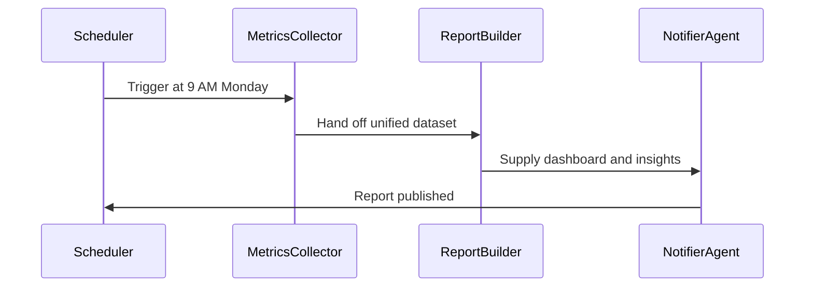
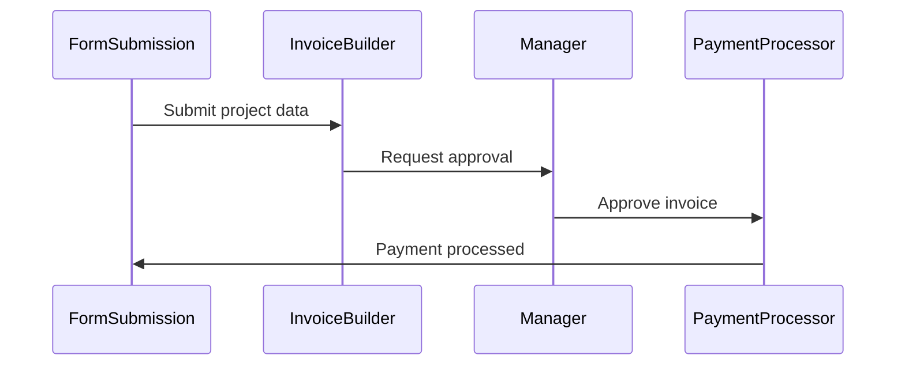
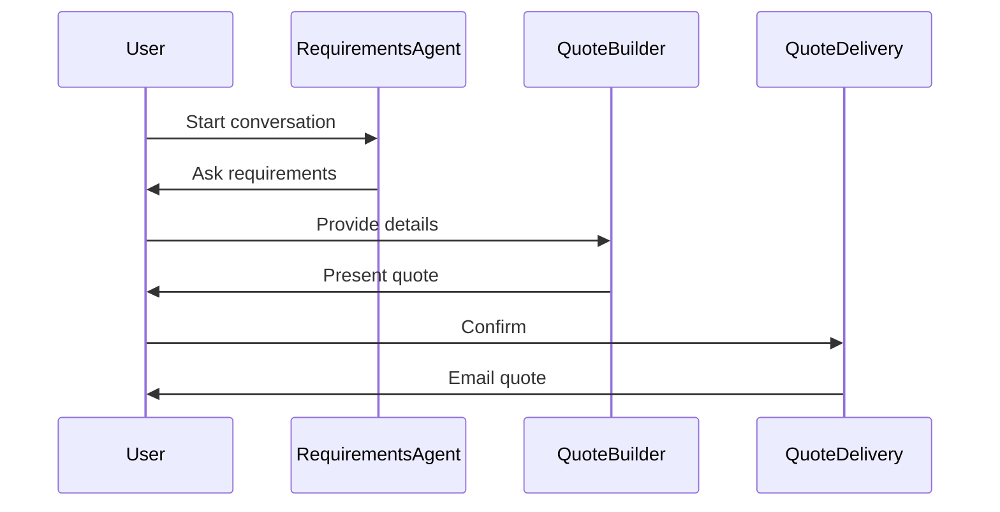

# MozaiksAI Workflow Semantic Model

> ⚠️ **PARTIALLY OUTDATED**: The "Generator Workflow Architecture" section references legacy agent names (e.g., ActionPlanArchitect).
> For current agent registry and schema definitions, see:
> - **Source of Truth**: `docs/ACTION_PLAN_SOURCE_OF_TRUTH.md`
> - **Schema Definitions**: `workflows/Generator/structured_outputs.json` (registry section)
> 
> The semantic model concepts (trigger_type, initiated_by, interaction_mode) remain valid.

## Overview

MozaiksAI uses an automation-first semantic model for workflow definitions. Every workflow is described using three orthogonal dimensions that separate **who/what initiates** the workflow from **how it starts** from **how humans interact** during execution.

This model enables:
- ✅ Fully autonomous scheduled workflows (no user involvement)
- ✅ Event-driven workflows triggered by external systems
- ✅ Form-based workflows that start with pre-collected data
- ✅ Conversational workflows with multi-turn user dialogue
- ✅ Approval workflows with specific checkpoint gates

## Core Concepts

### Workflow Initiation (Three Orthogonal Dimensions)

Every workflow must specify exactly one value for each of these three fields:

#### 1. `initiated_by` - Who/What Starts the Workflow

Determines the actor or system that begins workflow execution.

| Value | Description | Example Use Cases |
|-------|-------------|-------------------|
| `user` | A human explicitly starts the workflow | User clicks "Generate Report" button, User submits invoice form, User starts chat |
| `system` | The platform automatically starts the workflow | Cron job runs Monday at 9 AM, Database monitor detects overdue invoice |
| `external_event` | An external service/system triggers the workflow | HubSpot sends lead webhook, Stripe sends payment webhook, GitHub sends PR webhook |

**Key Insight:** This field answers *"Who or what is the initiator?"*

#### 2. `trigger_type` - How the Workflow Starts

Specifies the exact mechanism that initiates execution.

| Value | Description | When to Use | Data Context |
|-------|-------------|-------------|--------------|
| `form_submit` | User fills out and submits a web form | Data collection already completed via form UI | Form field data (client details, project info, etc.) |
| `chat_start` | User initiates a conversational session | Multi-turn dialogue needed to gather requirements | Initial user message or empty context |
| `cron_schedule` | Time-based trigger (daily, weekly, monthly) | Regular recurring tasks | Current timestamp, schedule metadata |
| `webhook` | External service sends HTTP POST to platform | React to external system events | Webhook payload from third-party service |
| `database_condition` | Internal database state meets trigger criteria | Monitor and react to data changes | Database record(s) that met condition |

**Key Insight:** This field answers *"What is the specific trigger mechanism?"*

**Common Combinations:**
- `initiated_by="user"` + `trigger_type="form_submit"` → User submits form with pre-filled data
- `initiated_by="user"` + `trigger_type="chat_start"` → User starts conversation to define workflow interactively
- `initiated_by="system"` + `trigger_type="cron_schedule"` → Scheduled automation (no user involvement)
- `initiated_by="external_event"` + `trigger_type="webhook"` → External system pushes event to platform

#### 3. `interaction_mode` - Human Involvement During Execution

Defines how humans participate after the workflow has started.

| Value | Description | When to Use | User Experience |
|-------|-------------|-------------|-----------------|
| `autonomous` | Fully automated, no human input during execution | Background processing, scheduled reports, automated sync | User may review final output, but workflow doesn't pause |
| `checkpoint_approval` | Autonomous execution with specific approval gates | Financial workflows, compliance reviews, manager sign-offs | Workflow pauses at agents with `requires_approval=true` |
| `conversational` | Multi-turn dialogue with user throughout | Interactive quote building, requirement gathering, consulting | User provides input at MULTIPLE points, not just approval |

**Key Insight:** This field answers *"How do humans participate during execution?"*

**Important Distinctions:**
- **autonomous** ≠ no user trigger → User can submit a form (`initiated_by="user"`), then workflow runs autonomously
- **checkpoint_approval** → ONLY specific agents pause for approval (marked with `requires_approval=true`)
- **conversational** → User is active participant in multi-turn dialogue (not just yes/no approval)

### Agent Tool Categorization

Each agent in a workflow specifies its tooling through three fields:

#### 1. `requires_approval` (boolean)

Agent-level flag indicating if THIS specific agent needs human confirmation before proceeding.

| Value | Meaning | Example Agents | Execution Behavior |
|-------|---------|----------------|-------------------|
| `true` | Agent pauses for human approval | ApprovalAgent, ReviewAgent, ManagerSignOff | Workflow execution STOPS until human provides approval/rejection |
| `false` | Agent executes autonomously | InvoiceBuilder, DataCollector, ReportGenerator | Agent runs immediately, no human gate |

**AG2 Alignment:** This is an agent-level concept in AG2, not a phase-level concept. Only agents that explicitly handle approval logic should set this to `true`.

**Usage Rule:** Set `true` ONLY for agents whose primary responsibility is routing decisions to humans. Most agents should be `false`.

#### 2. `integrations` (list of strings, PascalCase)

External third-party APIs and services this agent interacts with.

**Examples:**
```json
{
  "integrations": ["GoogleAnalytics", "Slack", "MozaiksPay"]
}
```

**What to Include:**
- ✅ Third-party SaaS APIs (Salesforce, HubSpot, Stripe)
- ✅ External communication platforms (Slack, Discord, Email services)
- ✅ Cloud storage providers (GoogleDrive, Notion, Dropbox)
- ✅ Analytics platforms (GoogleAnalytics, Mixpanel)
- ✅ MozaiksPay (platform's native payment processor)

**What NOT to Include:**
- ❌ Platform database access (that's infrastructure, not integration)
- ❌ Internal workflow logic (use `operations` instead)
- ❌ Python standard library modules

**Naming Convention:** PascalCase (e.g., `GoogleSheets`, not `google_sheets`)

#### 3. `operations` (list of strings, snake_case)

Internal workflow logic and platform-level operations this agent executes.

**Examples:**
```json
{
  "operations": ["calculate_taxes", "validate_email", "format_report", "merge_datasets"]
}
```

**What to Include:**
- ✅ Calculations and computations (`calculate_taxes`, `compute_discount`)
- ✅ Data validation (`validate_email`, `check_required_fields`)
- ✅ Data transformations (`format_invoice`, `normalize_metrics`, `parse_response`)
- ✅ Business logic (`apply_discount_rules`, `determine_eligibility`)
- ✅ Platform database operations (querying/writing to MozaiksAI DB)

**What NOT to Include:**
- ❌ Third-party API calls (use `integrations` instead)
- ❌ Generic verbs without context (`process`, `handle`, `do_work`)

**Naming Convention:** snake_case (e.g., `calculate_taxes`, not `calculateTaxes`)

### Workflow Description Requirements

Every workflow must include a **paragraph-length description (400-600 characters)** that follows this structure:

**Format:** `[Trigger Context] + [What It Does] + [Business Value]`

#### Trigger-Specific Patterns

Each `trigger_type` has a specific description pattern:

**`form_submit`:**
```
"When users submit [form type], this workflow automatically [action sequence]. 
This ensures [business outcome]."
```
*Example:* "When users submit client project details via form, this workflow automatically generates itemized invoices with tax calculations, routes them to the finance manager for approval, and processes secure payments through MozaiksPay upon confirmation. This eliminates manual invoice creation while maintaining financial oversight and compliance controls."

**`chat_start`:**
```
"Through an interactive conversation, this workflow guides users through [process], 
then automatically [action sequence]. This delivers [business outcome]."
```

**`cron_schedule`:**
```
"Every [frequency], this workflow automatically [action sequence], 
ensuring [business outcome] without manual intervention."
```
*Example:* "Every Monday at 9 AM, this workflow automatically compiles KPIs from Google Analytics, Salesforce, and MozaiksPay, generates interactive executive dashboards with trend analysis and anomaly detection, and distributes insights across Slack channels and Notion workspaces. This gives leadership teams real-time visibility into business performance without manual reporting overhead."

**`webhook`:**
```
"When [external system/event] triggers this workflow via webhook, 
it instantly [action sequence], enabling [business outcome]."
```

**`database_condition`:**
```
"When [DB condition] is detected, this workflow automatically [action sequence], 
preventing [problem] and ensuring [outcome]."
```

**Key Requirements:**
- ✅ 400-600 characters (full paragraph, not single sentence)
- ✅ Explicitly state WHEN the workflow runs
- ✅ Describe WHAT actions occur in sequence
- ✅ Explain WHY it matters (business value)
- ❌ Do NOT use generic descriptions or placeholders

## Mermaid Diagram Generation Rules

The ProjectOverviewAgent generates Mermaid sequence diagrams that accurately represent workflow execution flow. The diagram adapts based on the workflow's semantic model.

### First Participant Selection

The **first participant** in the diagram is determined by combining `initiated_by` + `trigger_type`:

| initiated_by | trigger_type | First Participant | Meaning |
|--------------|--------------|-------------------|---------|
| `user` | `form_submit` | **FormSubmission** or **IntakeForm** | User already submitted form data |
| `user` | `chat_start` | **User** | User is conversational participant |
| `system` | `cron_schedule` | **Scheduler** or **CronJob** | Time-based automation |
| `system` | `database_condition` | **DatabaseTrigger** or **SystemMonitor** | Database condition monitor |
| `external_event` | `webhook` | **ExternalWebhook** or specific system name | External service (e.g., "HubSpotWebhook") |

**Critical Rule:** For `form_submit` workflows, **do NOT show User participant** — the form UI already collected the data. The workflow starts with `FormSubmission` participant.

### Human Participant Logic

Whether and how humans appear in the diagram depends on `interaction_mode`:

| interaction_mode | Human Participants | When They Appear |
|------------------|-------------------|------------------|
| `autonomous` | **None** | No User or Approver participants (system-to-system only) |
| `checkpoint_approval` | **Manager** or **Approver** | ONLY at agents where `requires_approval=true` |
| `conversational` | **User** | Throughout the entire diagram (multi-turn dialogue) |

### Approval Checkpoint Rendering

For workflows with `interaction_mode="checkpoint_approval"`:

1. **Scan all agents** for `requires_approval=true`
2. **Add approval participant** with context-appropriate name:
   - Finance workflows → "Manager"
   - Review workflows → "Reviewer"
   - Sign-off workflows → "Approver"
3. **Render approval pattern:**
   ```
   Agent->>Manager: Request approval
   Manager->>NextAgent: Approve and proceed
   ```

### Integration Display

Third-party integrations from the `integrations` field appear as participants ONLY when:
- They appear in **multiple phases**, OR
- They are **central to workflow purpose** (e.g., payment processor in invoice workflow)

**Arrow patterns:**
```
Agent->>Integration: Fetch data
Integration->>Agent: Return results
```

### Visual Style Rules

- **Max participants:** 6 (for mobile/desktop readability)
- **Max arrows:** 8-12 (avoid visual complexity)
- **Participant names:** Title Case, ≤20 characters
- **Phase aliases:** P1, P2, P3... (in legend, not embedded in diagram)
- **Arrow labels:** ≤50 characters, sentence case, no punctuation
- **Progression:** Linear flow (Initiator → P1 → P2 → Final)

**Blank Line Rule:** Insert EXACTLY ONE blank line after all participant declarations, before first arrow.

## Complete Workflow Examples

### Example 1: Autonomous Scheduled Workflow

**User Request:** "I want to send weekly analytics reports every Monday"

**Workflow Definition:**
```json
{
  "ActionPlan": {
    "workflow": {
      "name": "WeeklyInsightEngine",
      "model": "gpt-4o-mini",
      "description": "Every Monday at 9 AM, this workflow automatically compiles KPIs from Google Analytics, Salesforce, and MozaiksPay, generates interactive executive dashboards with trend analysis and anomaly detection, and distributes insights across Slack channels and Notion workspaces. This gives leadership teams real-time visibility into business performance without manual reporting overhead.",
      "initiated_by": "system",
      "trigger_type": "cron_schedule",
      "interaction_mode": "autonomous",
      "phases": [
        {
          "name": "Phase 1: Data Aggregation",
          "description": "Collect analytics and CRM data into one unified dataset for reporting.",
          "agents": [
            {
              "name": "MetricsCollector",
              "description": "Fetches and merges analytics, marketing, and CRM metrics into a unified dataset.",
              "requires_approval": false,
              "integrations": ["GoogleAnalytics", "Salesforce"],
              "operations": ["merge_datasets", "normalize_metrics"]
            }
          ]
        },
        {
          "name": "Phase 2: Insight Modeling",
          "description": "Transform raw data into dashboards and actionable insights.",
          "agents": [
            {
              "name": "ReportBuilder",
              "description": "Generates interactive dashboards and concise summaries for leadership.",
              "requires_approval": false,
              "integrations": ["GoogleSheets"],
              "operations": ["generate_visuals", "summarize_insights", "detect_anomalies"]
            }
          ]
        },
        {
          "name": "Phase 3: Distribution",
          "description": "Deliver the finalized reports to teams through workspace tools.",
          "agents": [
            {
              "name": "NotifierAgent",
              "description": "Publishes insights to Notion and sends report links to Slack channels.",
              "requires_approval": false,
              "integrations": ["Notion", "Slack"],
              "operations": ["format_message", "publish_report"]
            }
          ]
        }
      ]
    }
  },
  "agent_message": "Review your automated insight workflow before launching."
}
```

**Mermaid Diagram:**


**Legend:**
- P1: Data Aggregation
- P2: Insight Modeling
- P3: Distribution

**Key Observations:**
- ✅ `initiated_by="system"` + `trigger_type="cron_schedule"` → First participant is "Scheduler"
- ✅ `interaction_mode="autonomous"` → NO User or Approver participants
- ✅ No `requires_approval=true` agents → Fully automated execution
- ✅ Description is 400+ chars and follows cron_schedule pattern

### Example 2: Form-Based Checkpoint Approval Workflow

**User Request:** "I want to automate invoice creation when users submit a form"

**Workflow Definition:**
```json
{
  "ActionPlan": {
    "workflow": {
      "name": "InvoiceAutomation",
      "model": "gpt-4o-mini",
      "description": "When users submit client project details via form, this workflow automatically generates itemized invoices with tax calculations, routes them to the finance manager for approval, and processes secure payments through MozaiksPay upon confirmation. This eliminates manual invoice creation while maintaining financial oversight and compliance controls.",
      "initiated_by": "user",
      "trigger_type": "form_submit",
      "interaction_mode": "checkpoint_approval",
      "phases": [
        {
          "name": "Phase 1: Invoice Generation",
          "description": "Generate invoice drafts from project data and prepare for manager review.",
          "agents": [
            {
              "name": "InvoiceBuilder",
              "description": "Creates itemized invoice with tax calculations and payment terms.",
              "requires_approval": false,
              "integrations": ["GoogleSheets"],
              "operations": ["calculate_taxes", "format_invoice", "validate_line_items"]
            }
          ]
        },
        {
          "name": "Phase 2: Manager Approval",
          "description": "Finance manager reviews and confirms invoice before payment processing.",
          "agents": [
            {
              "name": "ApprovalAgent",
              "description": "Routes invoice to finance manager for approval and captures decision.",
              "requires_approval": true,
              "integrations": ["Slack"],
              "operations": ["log_approval_decision", "route_to_manager"]
            }
          ]
        },
        {
          "name": "Phase 3: Payment Processing",
          "description": "Process approved invoice payment through MozaiksPay and confirm transaction.",
          "agents": [
            {
              "name": "PaymentProcessor",
              "description": "Charges client securely and reconciles transaction data.",
              "requires_approval": false,
              "integrations": ["MozaiksPay"],
              "operations": ["validate_payment_details", "reconcile_transaction"]
            }
          ]
        }
      ]
    }
  },
  "agent_message": "Review the invoice workflow before publishing to production."
}
```

**Mermaid Diagram:**


**Legend:**
- P1: Invoice Generation
- P2: Payment Processing

**Key Observations:**
- ✅ `initiated_by="user"` + `trigger_type="form_submit"` → First participant is "FormSubmission" (NOT "User")
- ✅ `interaction_mode="checkpoint_approval"` → "Manager" participant appears
- ✅ `ApprovalAgent` has `requires_approval=true` → Triggers Manager checkpoint
- ✅ Other agents have `requires_approval=false` → Execute autonomously
- ✅ Description is 400+ chars and follows form_submit pattern

### Example 3: Conversational Workflow

**User Request:** "I want to help users build custom quotes through a conversation"

**Workflow Definition:**
```json
{
  "ActionPlan": {
    "workflow": {
      "name": "CustomQuoteBuilder",
      "model": "gpt-4o-mini",
      "description": "Through an interactive conversation, this workflow guides users through service selection, pricing tiers, and customization options, then automatically generates professional quotes with itemized breakdowns and sends them via email. This delivers personalized pricing instantly while ensuring accurate quotes that match customer requirements.",
      "initiated_by": "user",
      "trigger_type": "chat_start",
      "interaction_mode": "conversational",
      "phases": [
        {
          "name": "Phase 1: Requirements Gathering",
          "description": "Engage user to understand service needs and budget constraints.",
          "agents": [
            {
              "name": "RequirementsAgent",
              "description": "Asks targeted questions to understand user's service requirements and budget.",
              "requires_approval": false,
              "integrations": [],
              "operations": ["parse_user_input", "validate_requirements"]
            }
          ]
        },
        {
          "name": "Phase 2: Quote Generation",
          "description": "Calculate pricing and create itemized quote for user review.",
          "agents": [
            {
              "name": "QuoteBuilder",
              "description": "Generates itemized quote with pricing tiers and customization options.",
              "requires_approval": false,
              "integrations": ["GoogleSheets"],
              "operations": ["calculate_pricing", "apply_discounts", "format_quote"]
            }
          ]
        },
        {
          "name": "Phase 3: Delivery",
          "description": "Send finalized quote to user via email and confirm receipt.",
          "agents": [
            {
              "name": "QuoteDelivery",
              "description": "Sends professional quote PDF to user's email address.",
              "requires_approval": false,
              "integrations": ["SendGrid"],
              "operations": ["generate_pdf", "send_email", "log_delivery"]
            }
          ]
        }
      ]
    }
  },
  "agent_message": "Review the quote building workflow before launching."
}
```

**Mermaid Diagram:**


**Legend:**
- P1: Requirements Gathering
- P2: Quote Generation
- P3: Delivery

**Key Observations:**
- ✅ `initiated_by="user"` + `trigger_type="chat_start"` → First participant is "User"
- ✅ `interaction_mode="conversational"` → User appears throughout diagram
- ✅ Multi-turn dialogue: User→Agent, Agent→User pattern
- ✅ No `requires_approval=true` agents (conversational ≠ approval)

## Schema Reference

### WorkflowSpec Model

```json
{
  "name": "str — PascalCase, ≤24 chars",
  "model": "str — LLM model (e.g., gpt-4o-mini)",
  "description": "str — PARAGRAPH (400-600 chars): trigger context + actions + business value",
  "initiated_by": "str — user | system | external_event",
  "trigger_type": "str — form_submit | chat_start | cron_schedule | webhook | database_condition",
  "interaction_mode": "str — autonomous | checkpoint_approval | conversational",
  "phases": [
    {
      "name": "str — 'Phase N: <Title>'",
      "description": "str — outcome-based description with clear handoff",
      "agents": [
        {
          "name": "str — PascalCase agent identifier",
          "description": "str — clear responsibility statement",
          "requires_approval": "bool — true if THIS agent needs human confirmation",
          "integrations": ["list of str — external APIs/services (PascalCase)"],
          "operations": ["list of str — workflow-internal logic (snake_case)"]
        }
      ]
    }
  ]
}
```

## Best Practices

### 1. Choosing `initiated_by`

**Ask:** "Who or what is the actor that starts this workflow?"

- User clicks button / submits form / sends message → `user`
- Platform scheduler / database monitor / internal system → `system`
- External service sends webhook / API call → `external_event`

### 2. Choosing `trigger_type`

**Ask:** "What is the specific mechanism?"

- Data already collected via form UI → `form_submit`
- Need multi-turn conversation to gather data → `chat_start`
- Runs on a schedule (daily, weekly) → `cron_schedule`
- External service pushes event → `webhook`
- Database query detects condition → `database_condition`

### 3. Choosing `interaction_mode`

**Ask:** "How do humans participate during execution?"

- No human involvement once started → `autonomous`
- Specific approval gates at certain agents → `checkpoint_approval`
- Active dialogue throughout workflow → `conversational`

### 4. Setting `requires_approval`

**Rule:** Set `true` ONLY for agents whose primary job is routing approval decisions.

**Examples:**
- ✅ `ApprovalAgent`, `ReviewAgent`, `ManagerSignOff` → `true`
- ❌ `InvoiceBuilder`, `DataCollector`, `EmailSender` → `false`

**Common Mistake:** Don't set all agents to `requires_approval=true` in checkpoint workflows. Only the approval agents need it.

### 5. Categorizing Tools

**integrations** (external APIs):
- ✅ Third-party SaaS services
- ✅ External APIs you don't control
- ✅ MozaiksPay (payment processor)

**operations** (internal logic):
- ✅ Calculations, validations, transformations
- ✅ Platform database queries
- ✅ Business logic execution

### 6. Writing Descriptions

**Template:** `[WHEN] this workflow [WHAT], [WHY]`

**Requirements:**
- 400-600 characters (enforce at generation time)
- Explain trigger context first
- Describe action sequence
- State business value

**Avoid:**
- Generic descriptions ("This workflow handles invoices")
- Technical jargon without context
- Missing trigger context or business value

## Common Patterns

### Pattern 1: Scheduled Background Job

```json
{
  "initiated_by": "system",
  "trigger_type": "cron_schedule",
  "interaction_mode": "autonomous"
}
```

**Use Cases:** Nightly backups, weekly reports, monthly billing cycles, data sync

### Pattern 2: User-Submitted Form with Approval

```json
{
  "initiated_by": "user",
  "trigger_type": "form_submit",
  "interaction_mode": "checkpoint_approval"
}
```

**Use Cases:** Invoice approval, expense reports, leave requests, purchase orders

### Pattern 3: Interactive Consultation

```json
{
  "initiated_by": "user",
  "trigger_type": "chat_start",
  "interaction_mode": "conversational"
}
```

**Use Cases:** Quote building, requirement gathering, customer support, consulting

### Pattern 4: Webhook-Triggered Automation

```json
{
  "initiated_by": "external_event",
  "trigger_type": "webhook",
  "interaction_mode": "autonomous"
}
```

**Use Cases:** New lead sync (HubSpot), payment confirmation (Stripe), PR merge (GitHub)

### Pattern 5: Database-Triggered Alert

```json
{
  "initiated_by": "system",
  "trigger_type": "database_condition",
  "interaction_mode": "autonomous"
}
```

**Use Cases:** Overdue invoice reminders, inventory alerts, SLA violations

## Implementation Notes

### Generator Workflow Architecture

The MozaiksAI Generator workflow uses this semantic model to create workflows:

1. **InterviewAgent**: Collects user's automation goal
2. **ActionPlanArchitect**: Generates WorkflowSpec with semantic fields
3. **ProjectOverviewAgent**: Creates Mermaid diagram using trigger-aware rules
4. **ContextVariablesAgent**: Extracts variables from `integrations`
5. **ToolsManagerAgent**: Creates tool specs from `operations` and `integrations`
6. **AgentToolsFileGenerator**: Generates Python code for agent tools
7. **StructuredOutputsAgent**: Defines Pydantic models
8. **OrchestratorAgent**: Configures AG2 runtime using `interaction_mode`

### Files & Locations

- **Agent Definitions:** `workflows/Generator/agents.json`
- **Schema Models:** `workflows/Generator/structured_outputs.json`
- **Documentation:** `WORKFLOW_SEMANTIC_MODEL.md` (this file)

---

**Last Updated:** October 2025  
**Version:** 1.0  
**Status:** Production
