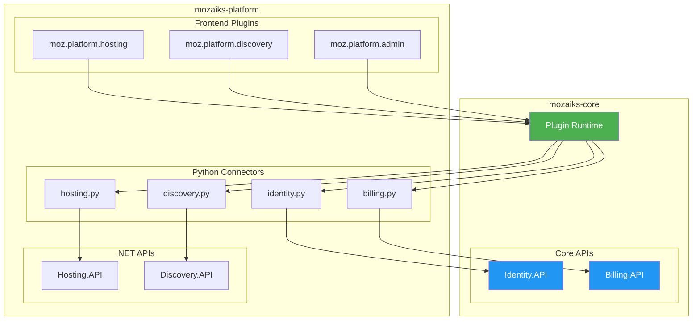
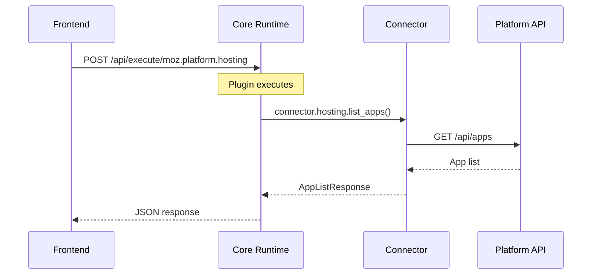

# 🌐 Platform Integration Overview

> How **mozaiks-platform** connects to and extends **mozaiks-core**.

---

## 🏗️ Architecture



---

## 🔀 Data Flow



---

## 📦 Three Layers

### Layer 1: Frontend Plugins (`plugins/moz.platform.*`)

User-facing UI components that run in the browser.

```
plugins/
├── moz.platform.hosting/    # Hosting management UI
├── moz.platform.discovery/  # App marketplace UI
├── moz.platform.admin/      # Settings, permissions
└── moz.platform.dashboard/  # Overview pages
```

**These call Core Runtime via:**
```javascript
fetch('/api/execute/moz.platform.hosting', {
    method: 'POST',
    headers: { 'Authorization': `Bearer ${token}` },
    body: JSON.stringify({ action: 'list_apps' })
});
```

### Layer 2: Python Connectors (`runtime/connectors/*.py`)

HTTP clients that call platform .NET APIs.

```
runtime/connectors/
├── base.py         # Base connector class
├── loader.py       # Connector bundle loader
├── hosting.py      # → Hosting.API
├── discovery.py    # → Discovery.API
├── social.py       # → Social.API
├── community.py    # → Community.API
├── growth.py       # → Growth.API
├── funding.py      # → Funding.API
├── identity.py     # → Core Identity.API ⭐
└── billing.py      # → Core Billing.API ⭐
```

### Layer 3: .NET APIs (`src/Services/*.API`)

Backend business logic with database access.

| API | Port | Description |
|-----|------|-------------|
| `Hosting.API` | 8050 | Deployments, domains, TLS |
| `Discovery.API` | 8030 | Marketplace, quests |
| `Social.API` | 8003 | Posts, feed, comments |
| `Community.API` | 8006 | Messaging, chat |
| `Growth.API` | 8040 | Marketing, campaigns |
| `Funding.API` | 8005 | Revenue-share funding |

---

## 🔗 Core APIs (in mozaiks-core)

Platform connectors need to call these Core APIs:

### Identity.API

User management, roles, permissions.

📖 **[Full Spec →](./identity-api.md)**

```python
# runtime/connectors/identity.py
class IdentityConnector:
    async def get_user(self, user_id: str) -> User
    async def get_user_roles(self, user_id: str) -> list[str]
    async def update_roles(self, user_id: str, roles: list[str]) -> bool
    async def check_permission(self, user_id: str, permission: str) -> bool
```

### Billing.API

Subscriptions, payment status.

📖 **[Full Spec →](./billing-api.md)**

```python
# runtime/connectors/billing.py
class BillingConnector:
    async def get_subscription_status(self, user_id: str) -> SubscriptionStatus
    async def check_feature_access(self, user_id: str, feature: str) -> bool
    async def get_usage(self, user_id: str) -> UsageMetrics
```

---

## 🔌 Writing a Connector

### Connector Structure

```python
# runtime/connectors/my_service.py
from __future__ import annotations
from dataclasses import dataclass
from typing import Protocol
from .base import PlatformHttpClient

# 1. Define response types
@dataclass
class MyItem:
    id: str
    name: str
    status: str

# 2. Define abstract connector
class MyServiceConnector(Protocol):
    async def list_items(self, *, user_jwt: str | None = None) -> list[MyItem]: ...
    async def get_item(self, item_id: str, *, user_jwt: str | None = None) -> MyItem: ...

# 3. Implement managed connector (calls real API)
class ManagedMyServiceConnector:
    def __init__(self, http: PlatformHttpClient):
        self._http = http
    
    async def list_items(self, *, user_jwt: str | None = None) -> list[MyItem]:
        response = await self._http.get(
            "/api/my-service/items",
            user_jwt=user_jwt
        )
        return [MyItem(**item) for item in response["items"]]

# 4. Implement mock connector (for self-hosted)
class MockMyServiceConnector:
    async def list_items(self, *, user_jwt: str | None = None) -> list[MyItem]:
        return [
            MyItem(id="1", name="Mock Item", status="active")
        ]
```

### Register in Loader

```python
# runtime/connectors/loader.py
from .my_service import MyServiceConnector, ManagedMyServiceConnector, MockMyServiceConnector

@dataclass
class ConnectorBundle:
    # ... existing connectors ...
    my_service: MyServiceConnector

def load_connectors() -> ConnectorBundle:
    if is_managed_mode():
        http = ManagedHttpClient(config)
        return ConnectorBundle(
            # ... existing ...
            my_service=ManagedMyServiceConnector(http)
        )
    else:
        return ConnectorBundle(
            # ... existing ...
            my_service=MockMyServiceConnector()
        )
```

---

## 🌍 Environment Variables

```env
# Platform mode
MOZAIKS_MANAGED=true
MOZAIKS_HOSTING_MODE=hosted

# Platform gateway (for connectors)
MOZAIKS_GATEWAY_BASE_URL=https://api.mozaiks.com
MOZAIKS_GATEWAY_API_KEY=app_key_xxx

# Core URLs (for identity/billing connectors)
MOZAIKS_CORE_BASE_URL=https://core.mozaiks.com
```

---

## ✅ Integration Checklist

When adding a new platform feature:

- [ ] Create .NET API (if needed)
- [ ] Create Python connector
- [ ] Register connector in `loader.py`
- [ ] Create frontend plugin
- [ ] Test with mock connector (self-hosted mode)
- [ ] Test with managed connector (platform mode)

---

## 🔗 Related

- 📖 [Identity API Spec](./identity-api.md)
- 📖 [Billing API Spec](./billing-api.md)
- 📖 [Connector Contract](./connector-contract.md)
- 🔌 [Plugin System](../core/plugins.md)
