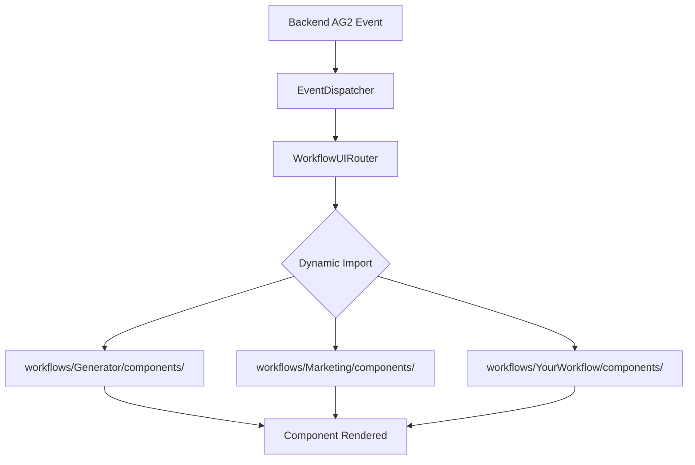
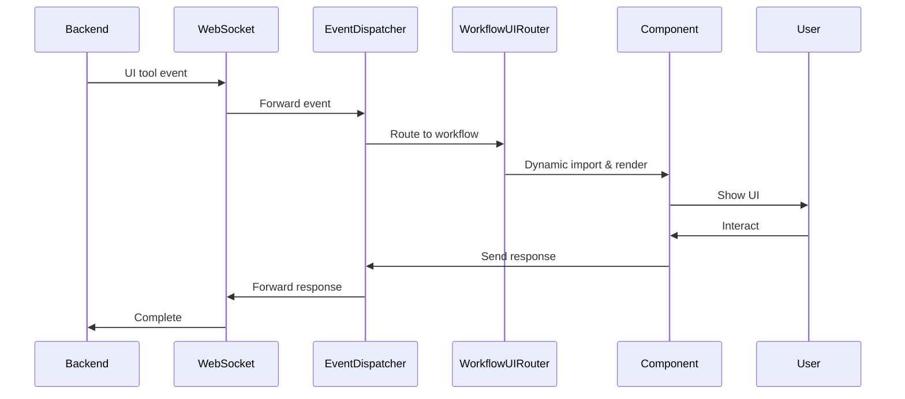

# 🚀 MozaiksAI Frontend - Clean Architecture

<div align="center">


**Next-Generation AI Workflow Frontend**  
*Modular • Scalable • Workflow-Agnostic*

[](https://reactjs.org/)
[](https://www.typescriptlang.org/)
[](https://tailwindcss.com/)
[](https://microsoft.github.io/autogen/)

</div>

---

## 📋 Table of Contents

- [🎯 Overview](#-overview)
- [🏗️ Architecture](#️-architecture)
- [🚀 Quick Start](#-quick-start)
- [📂 Project Structure](#-project-structure)
- [🔧 Core Systems](#-core-systems)
- [🎨 Adding New Workflows](#-adding-new-workflows)
- [🧩 Component System](#-component-system)
- [⚡ Development Guide](#-development-guide)
- [🔧 Configuration](#-configuration)
- [📚 API Documentation](#-api-documentation)
- [🧪 Testing](#-testing)
- [🚀 Deployment](#-deployment)

---

## 🎯 Overview

The MozaiksAI Frontend is a **completely modular, workflow-agnostic React application** that provides dynamic UI components for AI agent workflows powered by the AG2 (Autogen) framework.

### ✨ Key Features

- 🎯 **Workflow-Agnostic**: Add new AI workflows without touching core code
- 🔄 **Dynamic Component Loading**: Components discovered and loaded automatically
- 🚀 **Zero Configuration**: New workflows just work™
- 🏛️ **Clean Architecture**: Strict separation between core and workflow-specific code
- ⚡ **Real-time**: WebSocket integration for live agent communication
- 🎨 **Beautiful UI**: Modern design with Tailwind CSS
- 📱 **Responsive**: Works perfectly on all devices

### 🎭 What Makes This Special

Unlike traditional frontends that require manual registration and configuration, our architecture **automatically discovers and routes** to workflow-specific components. Just drop in a new workflow folder, and it works!

---

## 🏗️ Architecture

Our frontend follows a **revolutionary modular architecture** that eliminates the need for manual component registration:



### 🎯 Core Principles

1. **Dynamic Discovery**: No manual registration required
2. **Workflow Isolation**: Each workflow owns its components completely
3. **Zero Hardcoding**: Core system knows nothing about specific workflows
4. **Clean Separation**: Core, Workflows, and General UI are distinct layers

---

## 🚀 Quick Start

### Prerequisites

- Node.js 18+ 
- npm or yarn
- Backend MozaiksAI server running

### Installation

```bash
# Clone and navigate to ChatUI
cd ChatUI

# Install dependencies
npm install

# Start development server
npm start
```

The app will open at `http://localhost:3000` and automatically connect to your backend.

### 🎉 That's It!

No configuration needed. The system will automatically discover and load all available workflows.

---

## 📂 Project Structure

```
ChatUI/
├── src/
│   ├── core/                           # 🏛️ CORE SYSTEM (Workflow-agnostic)
│   │   ├── WorkflowUIRouter.js         # Dynamic component router
│   │   ├── eventDispatcher.js          # Event handling system
│   │   └── ui/                         # Generic UI components
│   │       ├── UIToolRenderer.js       # Core rendering engine
│   │       ├── UserInputRequest.js     # Generic input component
│   │       └── index.js                # Clean exports
│   │
│   ├── workflows/                      # 🎯 WORKFLOW-SPECIFIC
│   │   ├── index.js                    # Workflow metadata registry
│   │   └── Generator/                  # Example workflow
│   │       ├── index.js                # Workflow configuration
│   │       └── components/             # Workflow UI components
│   │           ├── AgentAPIKeyInput.js
│   │           ├── FileDownloadCenter.js
│   │           └── index.js            # Component exports
│   │
│   ├── components/                     # 🎨 GENERAL UI
│   │   ├── chat/                       # Chat interface
│   │   └── layout/                     # Layout components
│   │
│   ├── hooks/                          # 🔗 React Hooks
│   │   └── useDynamicComponents.js     # Dynamic loading hooks
│   │
│   ├── utils/                          # 🛠️ Utilities (general helpers; artifact manager removed as unused)
│   │
│   ├── pages/                          # 📄 Page Components
│   ├── services/                       # 🌐 API Services
│   └── styles/                         # 🎨 Global Styles
│
├── public/                             # Static Assets
├── package.json                        # Dependencies
└── tailwind.config.js                  # Tailwind Configuration
```

---

## 🔧 Core Systems

### 🎯 WorkflowUIRouter

The heart of our modular architecture. Automatically discovers and loads workflow components:

```javascript
// NO CONFIGURATION NEEDED!
// Just create: workflows/YourWorkflow/components/index.js
// Router will automatically find and load it!

const WorkflowUIRouter = ({ payload, onResponse }) => {
  // ✨ Dynamically imports: ../workflows/${workflow}/components/
  // ✨ Loads component: ${componentType}
  // ✨ Renders with full props
};
```

### 🔄 EventDispatcher

Handles all events from the backend AG2 framework:

```javascript
// Receives backend events
const event = {
  ui_tool_id: "api_key_input",
  workflow_name: "Generator", 
  component_type: "AgentAPIKeyInput",
  payload: { /* data */ }
};

// Routes to WorkflowUIRouter automatically
```

### 🏛️ Core UI Components

Reusable components that work across all workflows:

- `UIToolRenderer` - Core rendering system
- `UserInputRequest` - Generic user input handling
- More components as needed...

---

## 🎨 Adding New Workflows

Creating a new workflow is **incredibly simple** - just 2 files needed!

### Step 1: Create Workflow Structure

```bash
mkdir -p src/workflows/MyWorkflow/components
```

### Step 2: Create Component Exports

**`src/workflows/MyWorkflow/components/index.js`**
```javascript
import MyComponent from './MyComponent';
import AnotherComponent from './AnotherComponent';

export {
  MyComponent,
  AnotherComponent
};
```

### Step 3: Create Workflow Config (Optional)

**`src/workflows/MyWorkflow/index.js`**
```javascript
export const workflowInfo = {
  name: 'MyWorkflow',
  displayName: 'My Awesome Workflow',
  description: 'Does amazing things!',
  version: '1.0.0'
};

export default workflowInfo;
```

### 🎉 That's It!

Your workflow will be **automatically discovered** and components will be dynamically loaded when requested by the backend!

### Example Component

**`src/workflows/MyWorkflow/components/MyComponent.js`**
```javascript
import React from 'react';

const MyComponent = ({ 
  payload, 
  onResponse, 
  onCancel, 
  ui_tool_id, 
  eventId 
}) => {
  const handleSubmit = (data) => {
    onResponse({
      ui_tool_id,
      response: data,
      status: 'completed'
    });
  };

  return (
    <div className="my-component p-4 bg-white rounded-lg shadow">
      <h3>My Awesome Component</h3>
      <p>Payload: {JSON.stringify(payload, null, 2)}</p>
      <button onClick={() => handleSubmit({ success: true })}>
        Complete
      </button>
    </div>
  );
};

export default MyComponent;
```

---

## 🧩 Component System

### Component Props

All workflow components receive these standard props:

```typescript
interface WorkflowComponentProps {
  payload: object;           // Data from backend
  onResponse: (data) => void; // Send response to backend
  onCancel?: (reason) => void; // Cancel operation
  ui_tool_id: string;        // Tool identifier
  eventId: string;           // Event identifier
  workflowName: string;      // Current workflow
  componentId: string;       // Component type
}
```

### Component Lifecycle

1. **Backend Request** → Event sent to frontend
2. **Router Discovery** → Workflow and component identified
3. **Dynamic Import** → Component loaded on-demand
4. **Render** → Component rendered with props
5. **Response** → User interaction sent back to backend

### Best Practices

- ✅ Keep components focused and single-purpose
- ✅ Use the standard props interface
- ✅ Handle loading and error states
- ✅ Provide clear user feedback
- ✅ Follow consistent styling patterns

---

## ⚡ Development Guide

### 🛠️ Development Commands

```bash
# Start development server
npm start

# Build for production
npm run build

# Run tests
npm test

# Lint and format code
npm run lint
npm run format

# Type checking (if using TypeScript)
npm run type-check
```

### ♻️ Tailwind → Token Migration

To replace legacy Tailwind color utilities with the runtime theme tokens, use the codemod in `scripts/tailwind_to_tokens.mjs`:

```bash
# Preview changes without writing
node scripts/tailwind_to_tokens.mjs --dry-run src/workflows/Generator/components/ActionPlan.js

# Apply replacements to one or more files/directories
node scripts/tailwind_to_tokens.mjs src/workflows/Generator/components/ActionPlan.js src/components/chat
```

The script rewrites supported color classes (e.g., `bg-cyan-500`, `from-violet-500/10`, `shadow-amber-500/40`) to their CSS-variable-backed equivalents, ensuring app themes flow through without manual edits.

### 🔧 Key Development Files

- **`src/core/WorkflowUIRouter.js`** - Core routing system
- **`src/core/eventDispatcher.js`** - Event handling
- **`src/workflows/index.js`** - Workflow registry
- **`tailwind.config.js`** - Styling configuration

### 🎨 Styling Guidelines

We use **Tailwind CSS** for consistent, responsive styling:

```javascript
// ✅ Good - Consistent with design system
<div className="p-4 bg-white rounded-lg shadow-md border border-gray-200">
  <h3 className="text-lg font-semibold text-gray-800 mb-3">Title</h3>
  <p className="text-gray-600">Content</p>
</div>

// ❌ Avoid - Custom CSS when Tailwind classes exist
<div style={{ padding: '16px', backgroundColor: 'white' }}>
```

### 🐛 Debugging

The system provides extensive console logging:

```javascript
// Enable debug mode in development
localStorage.setItem('DEBUG_WORKFLOW_ROUTER', 'true');

// Console output will show:
// 🎯 WorkflowUIRouter: Loading Generator:AgentAPIKeyInput
// ✅ WorkflowUIRouter: Successfully loaded component
// 📤 EventDispatcher: Sending response...
```

---

## 🔧 Configuration

### Environment Variables

Create a `.env` file in the ChatUI directory:

```env
# Backend connection
REACT_APP_API_BASE_URL=http://localhost:8000
REACT_APP_WS_URL=ws://localhost:8000/ws

# Development settings
REACT_APP_DEBUG_MODE=true
REACT_APP_LOG_LEVEL=debug

# Feature flags
REACT_APP_ENABLE_WORKFLOW_DISCOVERY=true
REACT_APP_ENABLE_HOT_RELOAD=true
```

### Tailwind Configuration

Customize the design system in `tailwind.config.js`:

```javascript
module.exports = {
  content: ["./src/**/*.{js,jsx,ts,tsx}"],
  theme: {
    extend: {
      colors: {
        primary: {
          50: '#eff6ff',
          500: '#3b82f6',
          900: '#1e3a8a'
        }
      },
      fontFamily: {
        'heading': ['Oxanium', 'sans-serif'],
        'body': ['Inter', 'sans-serif']
      }
    }
  }
};
```

---

## 📚 API Documentation

### Backend Communication

The frontend communicates with the backend via:

#### WebSocket Events

```javascript
// Incoming: UI tool request
{
  event_type: "ui_tool_event",
  ui_tool_id: "api_key_input",
  workflow_name: "Generator",
  component_type: "AgentAPIKeyInput", 
  payload: { /* component data */ }
}

// Outgoing: UI tool response
{
  ui_tool_id: "api_key_input",
  response: { /* response data */ },
  status: "completed"
}
```

#### REST API Endpoints

```javascript
// Get workflow metadata
GET /api/workflows
GET /api/workflows/Generator

// Submit user responses
POST /api/user-input/submit
{
  input_request_id: "uuid",
  user_input: "response text"
}

// File downloads
GET /api/files/download/:fileId
POST /api/files/upload
```

### Event Flow



---

## 🧪 Testing

### Test Structure

```
src/
├── __tests__/                  # Global tests
├── core/__tests__/             # Core system tests
├── workflows/
│   └── Generator/
│       └── __tests__/          # Workflow-specific tests
└── components/__tests__/       # Component tests
```

### Running Tests

```bash
# Run all tests
npm test

# Run specific test suites
npm test -- --testPathPattern=core
npm test -- --testPathPattern=workflows/Generator

# Run tests in watch mode
npm test -- --watch

# Generate coverage report
npm test -- --coverage
```

### Example Test

```javascript
import { render, screen, fireEvent } from '@testing-library/react';
import WorkflowUIRouter from '../core/WorkflowUIRouter';

test('WorkflowUIRouter loads Generator components', async () => {
  const payload = {
    workflow_name: 'Generator',
    component_type: 'AgentAPIKeyInput'
  };

  render(
    <WorkflowUIRouter 
      payload={payload}
      onResponse={jest.fn()}
      ui_tool_id="test"
      eventId="test-event"
    />
  );

  // Component should load dynamically
  await screen.findByText(/API Key Input/i);
  expect(screen.getByRole('textbox')).toBeInTheDocument();
});
```

---

## 🚀 Deployment

### Production Build

```bash
# Create optimized production build
npm run build

# Preview production build locally
npx serve -s build
```

### Docker Deployment

**`Dockerfile`**
```dockerfile
FROM node:18-alpine

WORKDIR /app
COPY package*.json ./
RUN npm ci --only=production

COPY . .
RUN npm run build

FROM nginx:alpine
COPY --from=0 /app/build /usr/share/nginx/html
COPY nginx.conf /etc/nginx/nginx.conf

EXPOSE 80
CMD ["nginx", "-g", "daemon off;"]
```

### Environment-Specific Builds

```bash
# Development
REACT_APP_ENV=development npm run build

# Staging  
REACT_APP_ENV=staging npm run build

# Production
REACT_APP_ENV=production npm run build
```

### CDN Integration

For optimal performance, serve static assets via CDN:

```javascript
// In production build
const ASSET_URL = process.env.REACT_APP_CDN_URL || '';
```

---

## 🎉 Success Stories

### Before: Complex Registration

```javascript
// ❌ Old way - Manual registration required
import { registerComponent } from './registry';
registerComponent('Generator', 'APIKeyInput', APIKeyComponent);
registerComponent('Generator', 'FileDownload', FileComponent);
// Repeat for every component... 😫
```

### After: Zero Configuration

```javascript
// ✅ New way - Just export!
export { APIKeyInput, FileDownload };
// That's it! Router finds it automatically! 🎉
```

### Developer Testimonial

> *"I added a complete new workflow in 5 minutes. No core file changes needed. It just worked!"*
> 
> — Developer using MozaiksAI Frontend

---

## 🤝 Contributing

### Development Workflow

1. **Fork** the repository
2. **Create** a feature branch: `git checkout -b feature/amazing-feature`
3. **Make** your changes following our architecture principles
4. **Test** your changes: `npm test`
5. **Commit** your changes: `git commit -m 'Add amazing feature'`
6. **Push** to the branch: `git push origin feature/amazing-feature`
7. **Open** a Pull Request

### Architecture Guidelines

- 🎯 Keep core system workflow-agnostic
- 🔗 Use dynamic imports, avoid hardcoding
- 🧩 Follow component prop interfaces
- 🎨 Use Tailwind CSS for styling
- 📝 Document your changes

---

## 📄 License

This project is Intellectual Property of BlocUnited, LLC - see the [LICENSE.md](LICENSE.md) file for details.

---

<div align="center">

**Built with ❤️ by the MozaiksAI Team**

*Making AI workflows beautiful, one component at a time.*

[🌐 Website](https://mozaiks.ai) • [📧 Contact](mailto:info@blocunited.com) • [🐙 GitHub](https://github.com/BlocUnited-LLC/MozaiksAI)

</div>
